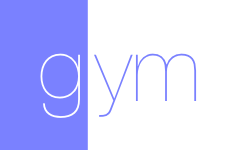

<h3 align="center">
  <a href="https://github.com/KrauseFx/fastlane">
    
    <br />
    fastlane
  </a>
</h3>
<p align="center">
  <a href="https://github.com/KrauseFx/deliver">deliver</a> &bull; 
  <a href="https://github.com/KrauseFx/snapshot">snapshot</a> &bull; 
  <a href="https://github.com/KrauseFx/frameit">frameit</a> &bull; 
  <a href="https://github.com/KrauseFx/PEM">PEM</a> &bull; 
  <a href="https://github.com/fastlane/sigh">sigh</a> &bull; 
  <a href="https://github.com/KrauseFx/produce">produce</a> &bull;
  <a href="https://github.com/KrauseFx/cert">cert</a> &bull;
  <a href="https://github.com/KrauseFx/codes">codes</a> &bull;
  <a href="https://github.com/fastlane/spaceship">spaceship</a> &bull;
  <a href="https://github.com/fastlane/pilot">pilot</a> &bull;
  <a href="https://github.com/fastlane/boarding">boarding</a> &bull;
  <b>gym</b>
</p>
-------

<p align="center">
    
</p>

gym
============

[](https://twitter.com/KrauseFx)
[](https://github.com/fastlane/gym/blob/master/LICENSE)
[](http://rubygems.org/gems/gym)
[](https://travis-ci.org/fastlane/gym)

###### Building your app has never been easier

Get in contact with the developer on Twitter: [@KrauseFx](https://twitter.com/KrauseFx)

-------
<p align="center">
    <a href="#whats-gym">Features</a> &bull; 
    <a href="#installation">Installation</a> &bull; 
    <a href="#usage">Usage</a> &bull; 
    <a href="#tips">Tips</a> &bull; 
    <a href="#need-help">Need help?</a>
</p>

-------

<h5 align="center"><code>gym</code> is part of <a href="https://fastlane.tools">fastlane</a>: connect all deployment tools into one streamlined workflow.</h5>

# What's gym?

`gym` builds and packages iOS apps for you. It takes care of all the heavy lifting and makes it super easy to generate a signed `ipa` file :muscle:

`gym` is a replacement for [shenzhen](https://github.com/nomad/shenzhen).

### Before `gym`

```
xcodebuild clean archive -archivePath build/MyApp \
                         -scheme MyApp
xcodebuild -exportArchive \
           -exportFormat ipa \
           -archivePath "build/MyApp.xcarchive" \
           -exportPath "build/MyApp.ipa" \
           -exportProvisioningProfile "ProvisioningProfileName" 
```

### With `gym`

```
gym
```

### Why `gym`?

`gym` uses the latest APIs to build and sign your application which results in much faster build times.

              |  Gym Features
--------------------------|------------------------------------------------------------
:rocket:            | `gym` builds 30% faster than other build tools like [shenzhen](https://github.com/nomad/shenzhen)
:checkered_flag: | Beautiful inline build output
:book:     | Helps you resolve common build errors like code signing issues
:mountain_cableway: | Sensible defaults: Automatically detect the project, its schemes and more
:link:  | Works perfectly with [fastlane](https://fastlane.tools) and other tools
:package: | Automatically generates an `ipa` and a compressed `dSYM` file
:bullettrain_side: | Don't remember any complicated build commands, just `gym`
:wrench:  | Easy and dynamic configuration using parameters and environment variables
:floppy_disk:   | Store common build settings in a `Gymfile` 
:outbox_tray: | All archives are stored and accessible in the Xcode Organizer
:computer: | Supports both iOS and Mac applications


-----


# Installation

This tool is still work in progress. You can already try it by cloning the repo and running

    sudo gem install gym

Make sure, you have the latest version of the Xcode command line tools installed:

    xcode-select --install

# Usage

    gym

That's all you need to build your application. If you want more control, here are some available parameters:

    gym --workspace "Example.xcworkspace" --scheme "AppName" --clean

For a list of all available parameters use

    gym --help

If you run into any issues, use the `verbose` mode to get more information


    gym --verbose

# Gymfile

Since you might want to manually trigger a new build but don't want to specify all the parameters every time, you can store your defaults in a so called `Gymfile`.

Run `gym init` to create a new configuration file. Example:

```ruby
scheme "Example"

sdk "9.0"

clean true

output_directory "./build"    # store the ipa in this folder
output_name "MyApp"           # the name of the ipa file
```

# How does it work?

`gym` uses the latest APIs to build and sign your application. The 2 main components are 

- `xcodebuild` 
- [xcpretty](https://github.com/supermarin/xcpretty)

When you run `gym` without the `--silent` mode it will print out every command it executes.

To build the archive `gym` uses the following command:

```
set -o pipefail && \
xcodebuild -scheme 'Example' \
-project './Example.xcodeproj' \
-configuration 'Release' \
-destination 'generic/platform=iOS' \
-archivePath '/Users/felixkrause/Library/Developer/Xcode/Archives/2015-08-11/ExampleProductName 2015-08-11 18.15.30.xcarchive' \
archive | xcpretty
```


After building the archive it is being checked by `gym`. If it's valid, it gets packaged up and signed into an `ipa` file.

```
/usr/bin/xcrun /path/to/PackageApplication4Gym -v \
'/Users/felixkrause/Library/Developer/Xcode/Archives/2015-08-11/ExampleProductName 2015-08-11 18.15.30.xcarchive/Products/Applications/name.app' -o \
'/Users/felixkrause/Library/Developer/Xcode/Archives/2015-08-11/ExampleProductName.ipa' \ 
--sign "identity" --embed "provProfile"
```

Note: the official PackageApplication script is replaced by a custom PackageApplication4Gym script. This script is obtained by applying a [set of patches](https://github.com/fastlane/gym/tree/master/lib/assets/package_application_patches) on the fly to fix some known issues in the official Xcode PackageApplication script.

Afterwards the `ipa` file is moved to the output folder. The `dSYM` file is compressed and moved to the output folder as well.

# Tips
## [`fastlane`](https://fastlane.tools) Toolchain

- [`fastlane`](https://fastlane.tools): Connect all deployment tools into one streamlined workflow
- [`deliver`](https://github.com/KrauseFx/deliver): Upload screenshots, metadata and your app to the App Store
- [`snapshot`](https://github.com/KrauseFx/snapshot): Automate taking localized screenshots of your iOS app on every device
- [`frameit`](https://github.com/KrauseFx/frameit): Quickly put your screenshots into the right device frames
- [`PEM`](https://github.com/KrauseFx/pem): Automatically generate and renew your push notification profiles
- [`produce`](https://github.com/KrauseFx/produce): Create new iOS apps on iTunes Connect and Dev Portal using the command line
- [`cert`](https://github.com/KrauseFx/cert): Automatically create and maintain iOS code signing certificates
- [`codes`](https://github.com/KrauseFx/codes): Create promo codes for iOS Apps using the command line
- [`spaceship`](https://github.com/fastlane/spaceship): Ruby library to access the Apple Dev Center and iTunes Connect
- [`pilot`](https://github.com/fastlane/pilot): The best way to manage your TestFlight testers and builds from your terminal
- [`boarding`](https://github.com/fastlane/boarding): The easiest way to invite your TestFlight beta testers 

##### [Like this tool? Be the first to know about updates and new fastlane tools](https://tinyletter.com/krausefx)

## Use the 'Provisioning Quicklook plugin'
Download and install the [Provisioning Plugin](https://github.com/chockenberry/Provisioning).

# Need help?
Please submit an issue on GitHub and provide information about your setup

# License
This project is licensed under the terms of the MIT license. See the LICENSE file.

> This project and all fastlane tools are in no way affiliated with Apple Inc. This project is open source under the MIT license, which means you have full access to the source code and can modify it to fit your own needs. All fastlane tools run on your own computer or server, so your credentials or other sensitive information will never leave your own computer. You are responsible for how you use fastlane tools.
