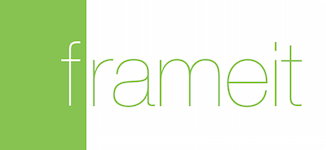

<h3 align="center">
  <a href="https://github.com/KrauseFx/fastlane">
    
    <br />
    fastlane
  </a>
</h3>
<p align="center">
  <a href="https://github.com/KrauseFx/deliver">deliver</a> &bull; 
  <a href="https://github.com/KrauseFx/snapshot">snapshot</a> &bull; 
  <b>frameit</b> &bull; 
  <a href="https://github.com/KrauseFx/PEM">PEM</a> &bull; 
  <a href="https://github.com/KrauseFx/sigh">sigh</a> &bull; 
  <a href="https://github.com/KrauseFx/produce">produce</a> &bull;
  <a href="https://github.com/KrauseFx/cert">cert</a> &bull;
  <a href="https://github.com/KrauseFx/codes">codes</a> &bull;
  <a href="https://github.com/fastlane/spaceship">spaceship</a> &bull;
  <a href="https://github.com/fastlane/pilot">pilot</a> &bull;
  <a href="https://github.com/fastlane/boarding">boarding</a> &bull;
  <a href="https://github.com/fastlane/gym">gym</a>
</p>
-------

<p align="center">
    
</p>

frameit
============

[](https://twitter.com/KrauseFx)
[](https://github.com/KrauseFx/frameit/blob/master/LICENSE)
[](http://rubygems.org/gems/frameit)
[](https://travis-ci.org/fastlane/frameit)

###### Quickly put your screenshots into the right device frames

Get in contact with the developer on Twitter: [@KrauseFx](https://twitter.com/KrauseFx)


-------
<p align="center">
    <a href="#features">Features</a> &bull; 
    <a href="#installation">Installation</a> &bull; 
    <a href="#usage">Usage</a> &bull; 
    <a href="#tips">Tips</a> &bull; 
    <a href="#need-help">Need help?</a>
</p>

-------
<h5 align="center"><code>frameit</code> is part of <a href="https://fastlane.tools">fastlane</a>: connect all deployment tools into one streamlined workflow.</h5>


# Features

Put a gorgeous device frame around your iOS screenshots just by running one simple command. Support for:
- iPhone 6 Plus, iPhone 6, iPhone 5s and iPad mini
- Portrait and Landscape
- Black and Silver devices

##### [Like this tool? Be the first to know about updates and new fastlane tools](https://tinyletter.com/krausefx)

Here is a nice gif, that shows ```frameit``` in action:


### Results


-------


-------


<h5 align="center">The <code>frameit</code> 2.0 update was kindly sponsored by <a href="https://mindnode.com/">MindNode</a>, seen in the screenshots above.

# Installation

Make sure, you have the commandline tools installed

    xcode-select --install

Install the gem

    sudo gem install frameit

Because of legal reasons, I can not pre-package the device frames with ```frameit```.

The process of adding is really easy, just run ```frameit``` and the guide will help you set it up.
You only have to do this once per computer.

- Run ```frameit```
- Press ```Enter```. The [Apple page](https://developer.apple.com/app-store/marketing/guidelines/#images) to download the images should open in your browser.
- Download the devices you want to use
- Press ```Enter```
- Unzip and move the content of the zip files to ```~/.frameit/device_frames```
- Press ```Enter```
  
# Usage

Why should you have to use Photoshop, just to add a frame around your screenshots?

Just navigate to your folder of screenshots and use the following command:

    frameit

To use the silver version of the frames:

    frameit silver
    
To run the setup process again to add new frames use:

    frameit setup

When using `frameit` without titles on top, the screenshots will have the full resolution, which means they can't be uploaded to the App Store directly. They are supposed to be used for websites, print media and emails. Check out the section below to use the screenshots for the App Store.

# Titles and Background (optional)

With `frameit` 2.0 you are now able to add a custom background, title and text colors to your screenshots.

A working example can be found in the [fastlane examples](https://github.com/fastlane/examples/tree/master/MindNode/screenshots) project.

#### `Framefile.json`

Use it to define the general information:

```json
{
  "default": {
    "keyword": {
      "font": "./fonts/MyFont-Rg.otf"
    },
    "title": {
      "font": "./fonts/MyFont-Th.otf",
      "color": "#545454"
    },
    "background": "./background.jpg",
    "padding": 50
  },

  "data": [
    {
      "filter": "Brainstorming",
      "keyword": {
        "color": "#d21559"
      }
    },
    {
      "filter": "Organizing",
      "keyword": {
        "color": "#feb909"
      }
    },
    {
      "filter": "Sharing",
      "keyword": {
        "color": "#aa4dbc"
      }
    },
    {
      "filter": "Styling",
      "keyword": {
        "color": "#31bb48"
      }
    }
  ]
}
```

The `filter` value is a part of the screenshot named for which the given option should be used. If a screenshot is named `iPhone5_Brainstorming.png` the first entry in the `data` array will be used.

You can find a more complex [configuration](https://github.com/fastlane/examples/blob/master/MindNode/screenshots/Framefile.json) to also support Chinese, Japanese and Korean languages.

The `Framefile.json` should be in the `screenshots` folder, as seen in the [example](https://github.com/fastlane/examples/tree/master/MindNode/screenshots).

#### `.strings` files

To define the title and optionally the keyword, put two `.strings` files into the language folder (e.g. [en-US in the example project](https://github.com/fastlane/examples/tree/master/MindNode/screenshots/en-US))

The `keyword.strings` and `title.strings` are standard `.strings` file you already use for your iOS apps, making it easy to use your existing translation service to get localized titles.

#### Uploading screenshots to iTC

Use [deliver](https://github.com/KrauseFx/deliver) to upload all screenshots to iTunes Connect completely automatic :rocket:

### Mac

With `frameit` 2.0 is possible to also frame Mac OS X Applications. You have to provide the following:

- The `offset` information so `frameit` knows where to put your screenshots
- A path to a `background`, which should contain both the background and the Mac
- `titleHeight`: The height in px that should be used for the title

##### Example
```json
{
  "default": {
    "title": {
      "color": "#545454"
    },
    "background": "Mac.jpg",
    "offset": {
      "offset": "+676+479",
      "titleHeight": 320
    }
  },
  "data": [
    {
      "filter": "Brainstorming",
      "keyword": {
        "color": "#d21559"
      }
    }
  ]
}
```

Check out the [MindNode example project](https://github.com/fastlane/examples/tree/master/MindNode/screenshots).

# Tips

## [`fastlane`](https://fastlane.tools) Toolchain

- [`fastlane`](https://fastlane.tools): Connect all deployment tools into one streamlined workflow
- [`deliver`](https://github.com/KrauseFx/deliver): Upload screenshots, metadata and your app to the App Store
- [`snapshot`](https://github.com/KrauseFx/snapshot): Automate taking localized screenshots of your iOS app on every device
- [`PEM`](https://github.com/KrauseFx/pem): Automatically generate and renew your push notification profiles
- [`sigh`](https://github.com/KrauseFx/sigh): Because you would rather spend your time building stuff than fighting provisioning
- [`produce`](https://github.com/KrauseFx/produce): Create new iOS apps on iTunes Connect and Dev Portal using the command line
- [`cert`](https://github.com/KrauseFx/cert): Automatically create and maintain iOS code signing certificates
- [`codes`](https://github.com/KrauseFx/codes): Create promo codes for iOS Apps using the command line
- [`spaceship`](https://github.com/fastlane/spaceship): Ruby library to access the Apple Dev Center and iTunes Connect
- [`pilot`](https://github.com/fastlane/pilot): The best way to manage your TestFlight testers and builds from your terminal
- [`boarding`](https://github.com/fastlane/boarding): The easiest way to invite your TestFlight beta testers 
- [`gym`](https://github.com/fastlane/gym): Building your iOS apps has never been easier

##### [Like this tool? Be the first to know about updates and new fastlane tools](https://tinyletter.com/krausefx)

## Generate localized screenshots
Check out [`snapshot`](https://github.com/KrauseFx/snapshot) to automatically generate screenshots using ```UI Automation```.

## White background of frames

Some stock images provided by Apple still have a white background instead of a transparent one. You'll have to edit the Photoshop file to remove the white background, delete the generated `.png` file and run `frameit` again.

## Use a clean status bar
You can use [SimulatorStatusMagic](https://github.com/shinydevelopment/SimulatorStatusMagic) to clean up the status bar.

## Uninstall
- ```sudo gem uninstall frameit```
- ```rm -rf ~/.frameit```

# Need help?
Please submit an issue on GitHub and provide information about your setup

# License
This project is licensed under the terms of the MIT license. See the LICENSE file.

> This project and all fastlane tools are in no way affiliated with Apple Inc. This project is open source under the MIT license, which means you have full access to the source code and can modify it to fit your own needs. All fastlane tools run on your own computer or server, so your credentials or other sensitive information will never leave your own computer. You are responsible for how you use fastlane tools.
