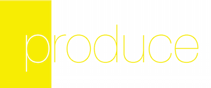

<h3 align="center">
  <a href="https://github.com/KrauseFx/fastlane">
    
    <br />
    fastlane
  </a>
</h3>
<p align="center">
  <a href="https://github.com/KrauseFx/deliver">deliver</a> &bull;
  <a href="https://github.com/KrauseFx/snapshot">snapshot</a> &bull;
  <a href="https://github.com/KrauseFx/frameit">frameit</a> &bull;
  <a href="https://github.com/KrauseFx/PEM">PEM</a> &bull;
  <a href="https://github.com/KrauseFx/sigh">sigh</a> &bull;
  <b>produce</b> &bull;
  <a href="https://github.com/KrauseFx/cert">cert</a> &bull;
  <a href="https://github.com/KrauseFx/codes">codes</a> &bull;
  <a href="https://github.com/fastlane/spaceship">spaceship</a> &bull;
  <a href="https://github.com/fastlane/pilot">pilot</a> &bull;
  <a href="https://github.com/fastlane/boarding">boarding</a>
</p>
-------

<p align="center">
    
</p>

produce
============

[](https://twitter.com/KrauseFx)
[](https://github.com/KrauseFx/produce/blob/master/LICENSE)
[](http://rubygems.org/gems/produce)

###### Create new iOS apps on iTunes Connect and Dev Portal using your command line

##### This tool was sponsored by [AppInstitute](http://appinstitute.co.uk/).

Get in contact with the developer on Twitter: [@KrauseFx](https://twitter.com/KrauseFx)


-------
<p align="center">
    <a href="#features">Features</a> &bull;
    <a href="#installation">Installation</a> &bull;
    <a href="#usage">Usage</a> &bull;
    <a href="#how-does-it-work">How does it work?</a> &bull;
    <a href="#tips">Tips</a> &bull;
    <a href="#need-help">Need help?</a>
</p>

-------

<h5 align="center"><code>produce</code> is part of <a href="https://fastlane.tools">fastlane</a>: connect all deployment tools into one streamlined workflow.</h5>


# Features

- **Create** new apps on both iTunes Connect and the Apple Developer Portal
- **Modify** Application Services on the Apple Developer Portal
- **Create** App Groups on the Apple Developer Portal
- **Associate** apps with App Groups on the Apple Developer Portal
- Support for **multiple Apple accounts**, storing your credentials securely in the Keychain

##### [Like this tool? Be the first to know about updates and new fastlane tools](https://tinyletter.com/krausefx)

# Installation
    sudo gem install produce

# Usage

## Creating a new application

    produce

To get a list of all available parameters:

    produce --help

```
    -u, --username STRING Your Apple ID Username (PRODUCE_USERNAME)
    -a, --app_identifier STRING App Identifier (Bundle ID, e.g. com.krausefx.app) (PRODUCE_APP_IDENTIFIER)
    -b, --bundle_identifier_suffix STRING App Identifier Suffix (Ignored if App Identifier does not ends with .*)
(PRODUCE_APP_IDENTIFIER_SUFFIX)
    -q, --app_name STRING App Name (PRODUCE_APP_NAME)
    -z, --app_version STRING Initial version number (e.g. '1.0') (PRODUCE_VERSION)
    -s, --sku            SKU Number (e.g. '1234') (PRODUCE_SKU)
    -m, --language STRING Primary Language (e.g. 'English', 'German') (PRODUCE_LANGUAGE)
    -c, --company_name STRING The name of your comapny. Only required if it's the first app you create
(PRODUCE_COMPANY_NAME)
    -i, --skip_itc       Skip the creation of the app on iTunes Connect (PRODUCE_SKIP_ITC)
    -d, --skip_devcenter  Skip the creation of the app on the Apple Developer Portal (PRODUCE_SKIP_DEVCENTER)
    -t, --team_id STRING The ID of your team if you're in multiple teams (PRODUCE_TEAM_ID)
    -l, --team_name STRING The name of your team if you're in multiple teams (PRODUCE_TEAM_NAME)
```

## Enabling / Disabling Application Services

If you want to enable Application Services for an App ID (HomeKit and HealthKit in this example):

    produce enable_services --homekit --healthkit

If you want to disable Application Servies for an App ID (iCloud in this case):

    produce disable_services --icloud

If you want to create a new App Group:

    produce group -g group.krausefx -n "Example App Group"

If you want to associate an app with an App Group:

    produce associate_group -a com.krausefx.app group.krausefx

# Parameters

```
    -u, --username STRING Your Apple ID Username (PRODUCE_USERNAME)
    -a, --app_identifier STRING App Identifier (Bundle ID, e.g. com.krausefx.app) (PRODUCE_APP_IDENTIFIER)
    -b, --bundle_identifier_suffix STRING App Identifier Suffix (Ignored if App Identifier does not ends with .*) (PRODUCE_APP_IDENTIFIER_SUFFIX)
    -a, --app_name STRING App Name (PRODUCE_APP_NAME)
    -v, --version STRING Initial version number (e.g. '1.0') (PRODUCE_VERSION)
    -s, --sku            SKU Number (e.g. '1234') (PRODUCE_SKU)
    -l, --language STRING Primary Language (e.g. 'English', 'German') (PRODUCE_LANGUAGE)
    -i, --skip_itc       Skip the creation of the app on iTunes Connect (PRODUCE_SKIP_ITC)
    -d, --skip_devcenter  Skip the creation of the app on the Apple Developer Portal (PRODUCE_SKIP_DEVCENTER)
    -t, --team_id STRING The ID of your team if you're in multiple teams (PRODUCE_TEAM_ID)
    -l, --team_name STRING The name of your team if you're in multiple teams (PRODUCE_TEAM_NAME)
    -h, --help           Display help documentation
    -v, --version        Display version information
```

Get a list of all available options using

    produce enable_services --help

```
    --app-group          Enable App Groups
    --associated-domains Enable Associated Domains
    --data-protection STRING Enable Data Protection, suitable values are "complete", "unlessopen" and "untilfirstauth"
    --healthkit          Enable HealthKit
    --homekit            Enable HomeKit
    --wireless-conf      Enable Wireless Accessory Configuration
    --icloud STRING      Enable iCloud, suitable values are "legacy" and "cloudkit"
    --inter-app-audio    Enable Inter-App-Audio
    --passbook           Enable Passbook
    --push-notification  Enable Push notification (only enables the service, does not configure certificates)
    --vpn-conf           Enable VPN Configuration
```

    produce disable_services --help

```
    --app-group          Disable App Groups
    --associated-domains Disable Associated Domains
    --data-protection    Disable Data Protection
    --healthkit          Disable HealthKit
    --homekit            Disable HomeKit
    --wireless-conf      Disable Wireless Accessory Configuration
    --icloud             Disable iCloud
    --inter-app-audio    Disable Inter-App-Audio
    --passbook           Disable Passbook
    --push-notification  Disable Push notifications
    --vpn-conf           Disable VPN Configuration
```

## Environment Variables
In case you want to pass more information to `produce` using environment variables:

- `PRODUCE_USERNAME` (your iTunes Connect username)
- `PRODUCE_APP_IDENTIFIER` (the bundle identifier of the new app)
- `PRODUCE_APP_NAME` (the name of the new app)
- `PRODUCE_GROUP_IDENTIFIER` (the group identifier of the new app group)
- `PRODUCE_GROUP_NAME` (the name of the new app group)
- `PRODUCE_LANGUAGE` (the language you want your app to use, e.g. `English`, `German`)
- `PRODUCE_VERSION` (the initial app version)
- `PRODUCE_SKU` (the SKU you want to use, which must be a unique number)
- `PRODUCE_SKIP_ITC` (should iTunes Connect app be created)
- `PRODUCE_SKIP_DEVCENTER` (should Apple Developer Portal app be created)
- `PRODUCE_TEAM_ID` (the Team ID, e.g. `Q2CBPK58CA`)
- `PRODUCE_TEAM_NAME` (the Team Name, e.g. `Felix Krause`)


## [`fastlane`](https://github.com/KrauseFx/fastlane) Integration

Your `Fastfile` should look like this
```ruby
lane :appstore do
  produce(
    username: 'felix@krausefx.com',
    app_identifier: 'com.krausefx.app',
    app_name: 'MyApp',
    language: 'English',
    version: '1.0',
    sku: 123,
    team_name: 'SunApps GmbH' # only necessary when in multiple teams
  )

  deliver
end
```

To use the newly generated app in `deliver`, you need to add this line to your `Deliverfile`:

```ruby
apple_id ENV['PRODUCE_APPLE_ID']
```

This will tell `deliver`, which `App ID` to use, since the app is not yet available in the App Store.

You'll still have to fill out the remaining information (like screenshots, app description and pricing). You can use [deliver](https://github.com/KrauseFx/deliver) to upload your app metadata using a CLI

## How is my password stored?
`produce` uses the [password manager](https://github.com/fastlane/CredentialsManager) from `fastlane`. Take a look the [CredentialsManager README](https://github.com/fastlane/CredentialsManager) for more information.

# Tips
## [`fastlane`](https://fastlane.tools) Toolchain

- [`fastlane`](https://fastlane.tools): Connect all deployment tools into one streamlined workflow
- [`deliver`](https://github.com/KrauseFx/deliver): Upload screenshots, metadata and your app to the App Store
- [`snapshot`](https://github.com/KrauseFx/snapshot): Automate taking localized screenshots of your iOS app on every device
- [`frameit`](https://github.com/KrauseFx/frameit): Quickly put your screenshots into the right device frames
- [`PEM`](https://github.com/KrauseFx/pem): Automatically generate and renew your push notification profiles
- [`sigh`](https://github.com/KrauseFx/sigh): Because you would rather spend your time building stuff than fighting provisioning
- [`cert`](https://github.com/KrauseFx/cert): Automatically create and maintain iOS code signing certificates
- [`codes`](https://github.com/KrauseFx/codes): Create promo codes for iOS Apps using the command line
- [`spaceship`](https://github.com/fastlane/spaceship): Ruby library to access the Apple Dev Center and iTunes Connect
- [`pilot`](https://github.com/fastlane/pilot): The best way to manage your TestFlight testers and builds from your terminal
- [`boarding`](https://github.com/fastlane/boarding): The easiest way to invite your TestFlight beta testers

##### [Like this tool? Be the first to know about updates and new fastlane tools](https://tinyletter.com/krausefx)

# Need help?
- If there is a technical problem with `produce`, submit an issue.
- I'm available for contract work - drop me an email: produce@krausefx.com

# License
This project is licensed under the terms of the MIT license. See the LICENSE file.

> This project and all fastlane tools are in no way affiliated with Apple Inc. This project is open source under the MIT license, which means you have full access to the source code and can modify it to fit your own needs. All fastlane tools run on your own computer or server, so your credentials or other sensitive information will never leave your own computer. You are responsible for how you use fastlane tools.

# Contributing

1. Create an issue to start a discussion about your idea
2. Fork it (https://github.com/KrauseFx/produce/fork)
3. Create your feature branch (`git checkout -b my-new-feature`)
4. Commit your changes (`git commit -am 'Add some feature'`)
5. Push to the branch (`git push origin my-new-feature`)
6. Create a new Pull Request
