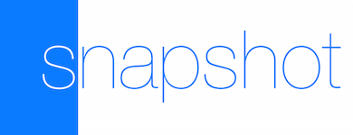
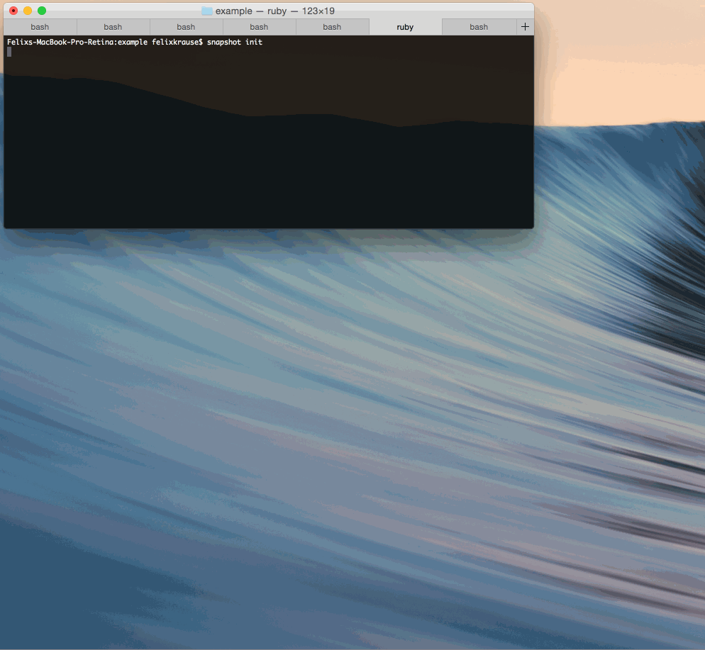

<h3 align="center">
  <a href="https://github.com/KrauseFx/fastlane">
    
    <br />
    fastlane
  </a>
</h3>
<p align="center">
  <a href="https://github.com/KrauseFx/deliver">deliver</a> &bull; 
  <b>snapshot</b> &bull; 
  <a href="https://github.com/KrauseFx/frameit">frameit</a> &bull; 
  <a href="https://github.com/KrauseFx/PEM">PEM</a> &bull; 
  <a href="https://github.com/KrauseFx/sigh">sigh</a> &bull; 
  <a href="https://github.com/KrauseFx/produce">produce</a> &bull; 
  <a href="https://github.com/KrauseFx/cert">cert</a> &bull; 
  <a href="https://github.com/KrauseFx/codes">codes</a> &bull;
  <a href="https://github.com/fastlane/spaceship">spaceship</a> &bull;
  <a href="https://github.com/fastlane/pilot">pilot</a> &bull;
  <a href="https://github.com/fastlane/boarding">boarding</a>
</p>
-------

<p align="center">
    
</p>

snapshot
============

[](https://twitter.com/KrauseFx)
[](https://github.com/KrauseFx/snapshot/blob/master/LICENSE)
[](http://rubygems.org/gems/snapshot)

###### Automate taking localized screenshots of your iOS app on every device

You have an iPhone app. You support 20 languages. You updated the design. You want to release the update to the App Store.
What's missing?

**New Screenshots**

You want them to look **perfect** and **gorgeous**. They should show the same screens on all devices in all languages.

You have to manually create 20 (languages) x 5 (devices) x 5 (screenshots) = **500 screenshots**.

It's hard to get everything right!

- New screenshots with every (design) update
- No loading indicators
- Same content / screens
- [Clean Status Bar](#use-a-clean-status-bar)
- Uploading screenshots ([```deliver```](https://github.com/KrauseFx/deliver) is your friend)

This gem solves all those problems. It will run completely in the background - you can do something else, while your computer takes the screenshots for you.

Get in contact with the developer on Twitter: [@KrauseFx](https://twitter.com/KrauseFx)

### Note: Support for UI Tests with Xcode 7

Apple announced a new version of Xcode with support for UI Tests built in right into Xcode. This technology allows `snapshot` to be even better: Instead of dealing with UI Automation Javascript code, you will be able to write the screenshot code in Swift or Objective C allowing you to use debugging features like breakpoints.

It's still work in progress and there are some technical difficulties I need to solve. 

As a result, `snapshot` will be completely rewritten from ground up without changing its public API :rocket:

**Why change to UI Tests?**

- UI Automation is deprecated
- UI Tests will evolve and support even more features in the future
- UI Tests are much easier to debug
- UI Tests are written in Swift or Objective C
- UI Tests can be executed in a much cleaner and better way

-------
<p align="center">
    <a href="#features">Features</a> &bull; 
    <a href="#installation">Installation</a> &bull; 
    <a href="#ui-automation">UI Automation</a> &bull; 
    <a href="#quick-start">Quick Start</a> &bull; 
    <a href="#usage">Usage</a> &bull; 
    <a href="#tips">Tips</a> &bull; 
    <a href="#need-help">Need help?</a>
</p>

-------

<h5 align="center"><code>snapshot</code> is part of <a href="https://fastlane.tools">fastlane</a>: connect all deployment tools into one streamlined workflow.</h5>


# Features
- Create hundreds of screenshots in multiple languages on all simulators
- Configure it once, store the configuration in git
- Do something else, while the computer takes the screenshots for you
- Integrates with [`fastlane`](https://fastlane.tools) and [`deliver`](https://github.com/KrauseFx/deliver)
- Generates a beautiful web page, which shows all screenshots on all devices. This is perfect to send to Q&A or the marketing team
- ```snapshot``` automatically waits for network requests to be finished before taking a screenshot (we don't want loading images in the App Store screenshots)
- Support for advanced configuration, like preprocess macros or [prefilling of data](#prefilling)

##### [Like this tool? Be the first to know about updates and new fastlane tools](https://tinyletter.com/krausefx)

After ```snapshot``` successfully created new screenshots, it will generate a beautiful html file to get a quick overview of all screens:


## Why?
This gem automatically switches the language and device type and runs the automation script to take all screenshots.

### Why should I automate this process?
- It takes **hours** to take screenshots
- It is an integration test: You can test for UI elements and other things inside your scripts
- Be so nice, and provide new screenshots with every App Store update. Your customers deserve it
- You realise, there is a spelling mistake in one of the screens? Well, just correct it and re-run the script
- You get a great overview of all your screens, running on all available simulators without the need to manually start it hundreds of times
- Easy verification that localizations fit into labels on all screen dimensions
- Easy verification for translators (without an iDevice) that translations do make sense in real App context

###Why use ```snapshot``` instead of....

I've been using many other solutions out there. Unfortunately none of them were perfect. The biggest issue was random timeouts of ```Instruments``` when starting the script. This problem is solved with ```snapshot```

- **UI Automation in Instruments**: Instruments can only run your app on one device in one language. You have to manually switch it.
- **[ui-screen-shooter](https://github.com/jonathanpenn/ui-screen-shooter)**: This is the best alternative out there right now. It's based on AppleScript, you can not update it properly and there are quite some hacks in there. ```snapshot``` uses a very similar technique - just in a clean and maintainable Ruby gem.
- **[Subliminal](https://github.com/inkling/Subliminal)**: A good approach to write the interaction code in Objective C. Unfortunately the project seems to be dead and doesn't work with the latest version of Xcode yet. Also, it requires modifications of your Xcode project and schemes, which might break some other things.

# Installation

Install the gem

    sudo gem install snapshot

Make sure, you have the latest version of the Xcode command line tools installed:

    xcode-select --install
    
# UI Automation

## Getting started
This project uses Apple's ```UI Automation``` under the hood. I will not go into detail on how to write scripts. 

Here a few links to get started:

- [Apple's official documentation](https://developer.apple.com/library/ios/documentation/DeveloperTools/Conceptual/InstrumentsUserGuide/UsingtheAutomationInstrument/UsingtheAutomationInstrument.html)
- [UI Automation: An Introduction (cocoamanifest.net)](http://cocoamanifest.net/articles/2011/05/uiautomation-an-introduction.html)
- [Functional Testing UI Automation (mattmccomb.com)](http://www.mattmccomb.com/blog/2013/06/02/ios-functional-testing-with-uiautomation/)
- [Cheat and use NSNotifications with HSUIAutomationCheat (github.com)](https://github.com/ConfusedVorlon/HSUIAutomationCheat)

# Quick Start

- Run ```snapshot init``` in your project folder
- Profile your app in Xcode (CMD + I), choose ```Automation``` and click the Record button on the bottom of the window.
- This will get you started. Copy the generated code into ```./snapshot.js```. Make sure, you leave the import statement on the top.
- To take a screenshot, use ```captureLocalizedScreenshot('0-name')```

Here is a nice gif, that shows ```snapshot``` in action:


You can take a look at the example project to play around with it.

## Start ```snapshot```

- ```cd [your_project_folder]```
- ```snapshot```

Your screenshots will be stored in ```./screenshots/``` by default.

From now on, you can run ```snapshot``` to create new screenshots of your app.


# Usage

```
snapshot
```

To skip cleaning the project:
```
snapshot --noclean
```

To only run tests (i.e. don't actually take any screenshots):
```
snapshot test
```


If any error occurs while running the snapshot script on a device, that device will not have any screenshots, and `snapshot` will continue with the next device or language. To stop the flow after the first error, run

```
SNAPSHOT_BREAK_ON_FIRST_ERROR=1 snapshot
```


By default, `snapshot` will re-install the app, to make sure it's in a clean state. In case you don't want this run

```
SNAPSHOT_SKIP_UNINSTALL=1 snapshot
```


Also by default, `snapshot` will open the HTML after all is done. This can be skipped with the following command

```
SNAPSHOT_SKIP_OPEN_SUMMARY=1 snapshot
```

## Snapfile

#### Why should you have to remember complicated commands and parameters?

Store your configuration in a text file to easily take screenshots from any computer.

Create a file called ```Snapfile``` in your project directory.
Once you created your configuration, just run ```snapshot```.

The ```Snapfile``` may contain the following information (all are optional):

### Simulator Types
```ruby
devices([
  "iPhone 6",
  "iPhone 6 Plus",
  "iPhone 5",
  "iPhone 4s",
  "iPad Air"
])
```

### Languages

```ruby
languages([
  "en-US",
  "de-DE",
  "es-ES",
  ["cmn-Hans", "cmn-Hans_CN"] # you can specify a locale if needed
])
```

### JavaScript file
Usually ```snapshot``` automatically finds your JavaScript file. If that's not the case, you can pass the path 
to your test file.
```ruby
js_file './path/file.js'
```

You can add a custom script for iPads: `./path/file-iPad.js` and it will automatically be used if found. Just append the `-iPad` to your existing file.

If you want to overwrite the JS path using environment variables, use `SNAPSHOT_JS_FILE`.

### Scheme
To not be asked which scheme to use, just set it like this:
```ruby
scheme "Name"
```
You can also use the environment variable ```SNAPSHOT_SCHEME```.

### Screenshots output path
All generated screenshots will be stored in the given path.
```ruby
screenshots_path './screenshots'
```
You can also use the environment variable ```SNAPSHOT_SCREENSHOTS_PATH```.

### Project Path
By default, ```snapshot``` will look for your project in the current directory. If it is located somewhere else, pass your custom path:
```ruby
project_path "./my_project/Project.xcworkspace"
```

### iOS Version
I'll try to keep the script up to date. If you need to change the iOS version, you can do it like this:

```ruby
ios_version "9.0"
```

### HTML Title

If you want to change the title of the generated HTML page, you can use:

```ruby
html_title 'Example'
```

### Custom Args for the build command
Use the ```custom_args``` directive to prepend custom statements to the build command.

Add a ```custom_build_args``` line to your ```Snapfile``` to add custom arguments to the build command.

Here is an example for adding a preprocessor macro `SNAPSHOT`:

```ruby
custom_build_args "GCC_PREPROCESSOR_DEFINITIONS='$(inherited) SNAPSHOT=1'"
```

In your Objective-C code, use the following code to detect the `snapshot` mode:

```objective-c
#ifdef SNAPSHOT
// Your Code here
#endif
```

### Custom Args for the run command
Add a ```custom_run_args``` line to your ```Snapfile``` to add custom arguments to the run command (i.e. the invocation of `instruments`. You can use this to set the value of a specific `NSUserDefaults` key, for example

```ruby
custom_run_args "-DidViewOnboarding YES"
```

### Custom Build Command
If for some reason, the default build command does not work for your project, you can pass your own build script. The script will be executed **once** before the tests are being run.

**Make sure** you are setting the output path to ```/tmp/snapshot``` or specify a custom ```build_dir``` on your ```Snapfile```.

```ruby
build_command "xcodebuild DSTROOT='/tmp/snapshot' OBJROOT='/tmp/snapshot' SYMROOT='/tmp/snapshot' ... "
```

### Custom callbacks to prepare your app
Run your own script when ```snapshot``` switches the simulator type or the language.
This can be used to
- Logout the user
- Reset all user defaults
- Pre-fill the database

The `setup_for_device_change` will be called **before** the app is installed on the simulator.

To run a shell script, just use ```system('./script.sh')```.
```ruby
setup_for_device_change do |device, udid, language|
  puts "Running #{language} on #{device}"
  system("./populateDatabase.sh")
end

teardown_device do |language, device|
  puts "Finished with #{language} on #{device}"
  system("./cleanup.sh")
end
```

### Skip alpha removal from screenshots
In case you want to skip this process, just add ```skip_alpha_removal``` to your ```Snapfile```.

### Clear old screenshots

If you add this line in your `Snapfile`, the previously generated screenshots will be deleted before generating new ones:

```ruby
clear_previous_screenshots
```

### Completely reset all simulators

You can run this command in the terminal to delete and re-create all iOS simulators:

    snapshot reset_simulators

**Warning**: This will delete **all** your simulators and replace by new ones! This is useful, if you run into weird `Instruments` problems when running `snapshot`. 

You can use the environment variable `SNAPSHOT_FORCE_DELETE` to stop asking for confirmation before deleting.


# Tips

## [`fastlane`](https://fastlane.tools) Toolchain

- [`fastlane`](https://fastlane.tools): Connect all deployment tools into one streamlined workflow
- [`deliver`](https://github.com/KrauseFx/deliver): Upload screenshots, metadata and your app to the App Store
- [`frameit`](https://github.com/KrauseFx/frameit): Quickly put your screenshots into the right device frames
- [`PEM`](https://github.com/KrauseFx/pem): Automatically generate and renew your push notification profiles
- [`sigh`](https://github.com/KrauseFx/sigh): Because you would rather spend your time building stuff than fighting provisioning
- [`produce`](https://github.com/KrauseFx/produce): Create new iOS apps on iTunes Connect and Dev Portal using the command line
- [`cert`](https://github.com/KrauseFx/cert): Automatically create and maintain iOS code signing certificates
- [`codes`](https://github.com/KrauseFx/codes): Create promo codes for iOS Apps using the command line
- [`spaceship`](https://github.com/fastlane/spaceship): Ruby library to access the Apple Dev Center and iTunes Connect
- [`pilot`](https://github.com/fastlane/pilot): The best way to manage your TestFlight testers and builds from your terminal
- [`boarding`](https://github.com/fastlane/boarding): The easiest way to invite your TestFlight beta testers 

##### [Like this tool? Be the first to know about updates and new fastlane tools](https://tinyletter.com/krausefx)

## Frame the screenshots

If you want to add frames around the screenshots and even put a title on top, check out [frameit](https://github.com/fastlane/frameit).

## Prefilling

Usually you want to mock your screenshot data to show the same content for all screenshots.

There are 2 ways of doing this:

#### Preprocessor macro
Use the preprocessor macro `SNAPSHOT` to check if `snapshot` is currently running in your code. This enables you to add checks like this:

```objective-c
#ifdef SNAPSHOT
// Your Code here
#endif
```

Open your `Snapfile` and add `custom_build_args "GCC_PREPROCESSOR_DEFINITIONS='$(inherited) SNAPSHOT=1'"` to it.

#### By pre-filling data/documents in the bundle

As used by [MindNode](https://github.com/fastlane/examples/blob/master/MindNode/Snapfile) you can fill your bundle after building with demo data using your `Snapfile` to use it on run-time.

```ruby
example_files = './ExampleDocuments'
folder_name = "ExampleDocuments"

setup_for_device_change do |device, udid, language|
  # This will make sure, all example documents are installed on the simulator

  puts "Copying example files to .app"

  app_path = "/tmp/snapshot/build/MindNode.app/"

  FileUtils.mkdir_p(File.join(app_path, folder_name))

  Dir.glob(File.join(example_files, '*.mindnode')).each do |example_path|
    puts "Copying '#{example_path}' to .app container"
    FileUtils.cp_r(example_path, File.join(app_path, folder_name)) rescue nil # in case the file already exists
  end
end
```

This is simple Ruby that gets executed **after** the app was built and **before** it is installed on the simulator.

In your `Objective-C` code you can now load the documents from your bundle and copy them over to your `Documents` folder (if necessary).

```objective-c
#ifdef SNAPSHOT
/** This method will take care of copying over the example documents from the app's bundle into the `Documents` directory */
+ (void)load
{
    static NSString *exampleFolderName = @"ExampleDocuments";
    if ([[NSBundle mainBundle] pathForResource:exampleFolderName ofType:@""]) {
        NSArray *filesToCopy = @[@"File1",
                                 @"File2"];
        NSString *documents = [NSSearchPathForDirectoriesInDomains(NSDocumentDirectory, NSUserDomainMask, YES) firstObject];
        
        for (NSString *currentFile in filesToCopy) {
            NSString *from = [[NSBundle mainBundle] pathForResource:currentFile ofType:@"filetype" inDirectory:exampleFolderName];
            if (from && documents) {
                NSError *error = nil;
                NSString *resultingFileName = [NSString stringWithFormat:@"%@.filetype", currentFile];
                [[NSFileManager defaultManager] copyItemAtPath:from
                                                        toPath:[documents stringByAppendingPathComponent:resultingFileName]
                                                         error:&error];
                
                if (error) {
                    NSLog(@"Error copying the example MindNode file: %@", error);
                }
            }
        }
    }
}

```

## Run in Continuous Integration System
If you want to run `snapshot` on your `Jenkins` machine (or any other CI-system), you might run into an `authorization` popup coming up.

You can disable this dialog, running the following command:
```
security authorizationdb read system.privilege.taskport > /tmp/system.privilege.taskport.plist
/usr/libexec/PlistBuddy -c "Set :allow-root true" /tmp/system.privilege.taskport.plist
sudo security authorizationdb write system.privilege.taskport < /tmp/system.privilege.taskport.plist
```
I found this solution in the [`Subliminal` wiki](https://github.com/inkling/Subliminal/wiki/Continuous-Integration#faq).

## Specify a custom ```Snapfile```

    snapshot --snapfile ./SpecialSnapfile

Be aware: The file will be executed from the current directory, not the location of the ```Snapfile```. That means: ```./screenshots``` will export the screenshots to the current directory of your terminal session.

## Available language codes
```ruby
["cs-CZ", "da-DK", "de-DE", "el-GR", "en-AU", "en-CA", "en-GB", "en-US", "es-ES", "es-MX", "fi-FI", "fr-CA", "fr-FR", "id-ID", "it-IT", "ja-JP", "ko-KR", "ms-MY", "nl-NL", "no-NO", "pt-BR", "pt-PT", "ru-RU", "sv-SE", "th-TH", "tr-TR", "vi-VI", "cmn-Hans", "cmn-Hant"]
```

## Use a clean status bar
You can use [SimulatorStatusMagic](https://github.com/shinydevelopment/SimulatorStatusMagic) to clean up the status bar.

## Editing the ```Snapfile```
Change syntax highlighting to *Ruby*.

## Instruments is not responding
Unfortunately ```Instruments``` sometimes decides, to not respond to anything. Which means, neither the ```Instruments``` application, nor the ```instruments``` command line work. Killing the process doesn't help.

The only way to fix this, is a restart of the Mac. 

## Use a custom build system
Using a build systems not based on Xcode –such as RubyMotion or Xamarin– is also possible.

### RubyMotion

Add to your ```Snapfile```:

```ruby
build_dir 'build/iPhoneSimulator-7.0-Development'
build_command 'rake build:simulator'
```

### Xamarin

Add to your ```Snapfile```:

```ruby
build_dir 'YourProject/bin/iPhoneSimulator'
build_command '/Applications/Xamarin\ Studio.app/Contents/MacOS/mdtool -v build "--configuration:Debug|iPhoneSimulator" YourProject.sln'
```

Unfortunately, Xamarin command line tool is only available for Business Edition licenses. For Indie licenses you can build the app using Xamarin Studio and use the ```--nobuild``` option.

### Skip building

If building via command-line doesn't work for your project or you don't want to build every time, you can run the tool with ```snapshot --nobuild``` to skip the build process and use a pre-built ```.app``` under your ```build_dir```.

### Simulator doesn't launch the application

When the app dies directly after the application is launched there might be 2 problems

- The simulator is somehow in a broken state and you need to re-create it. You can use `snapshot reset_simulators` to reset all simulators (this will remove all installed apps)
- You haven't enabled the correct architectures. Make sure you have the same architectures as in the example project of this repository. 

### Snapshot throws an `Instruments Usage Error: Timed out waiting for device to boot: ...` error 

This can happen when you launch `fastlane` or `snapshot` inside of a tool like `tmux`. Thankfully, Chris Johnsen wrote a fix to help us out, which you can find [here](https://github.com/ChrisJohnsen/tmux-MacOSX-pasteboard). Just follow the instructions at his repository, and launching the Simulator from `tmux` will work!

## Determine language in UI Automation script

To detect the currently used localization in your Javascript file, use the following code:

```javascript
var result = target.host().performTaskWithPathArgumentsTimeout("/usr/bin/printenv" , ["SNAPSHOT_LANGUAGE"], 5);
var language = result.stdout.substring(0, result.stdout.length - 1);
```

# Need help?
- If there is a technical problem with ```snapshot```, submit an issue.
- I'm available for contract work - drop me an email: snapshot@krausefx.com

# License
This project is licensed under the terms of the MIT license. See the LICENSE file.

> This project and all fastlane tools are in no way affiliated with Apple Inc. This project is open source under the MIT license, which means you have full access to the source code and can modify it to fit your own needs. All fastlane tools run on your own computer or server, so your credentials or other sensitive information will never leave your own computer. You are responsible for how you use fastlane tools.

# Contributing

1. Create an issue to discuss about your idea
2. Fork it (https://github.com/KrauseFx/snapshot/fork)
3. Create your feature branch (`git checkout -b my-new-feature`)
4. Commit your changes (`git commit -am 'Add some feature'`)
5. Push to the branch (`git push origin my-new-feature`)
6. Create a new Pull Request
