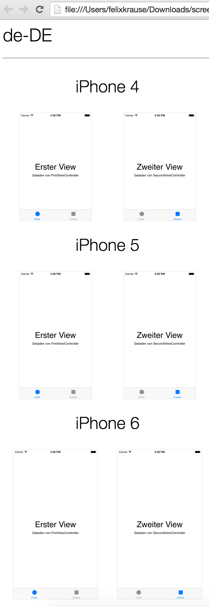

<p align="center">
<a href="https://github.com/KrauseFx/deliver">Deliver</a> &bull; 
<b>Snapshot</b> &bull; 
<a href="https://github.com/KrauseFx/frameit">FrameIt</a> &bull; 
<a href="https://github.com/KrauseFx/PEM">PEM</a>
</p>
-------

<p align="center">
    
</p>

Snapshot - Create hundreds of iOS app screenshots
============

[](https://twitter.com/KrauseFx)
[](https://github.com/KrauseFx/snapshot/blob/master/LICENSE)
[](http://rubygems.org/gems/snapshot)


You have an iPhone app. You support 20 languages. You updated the design. You want to release the update to the App Store.
What's missing?

**New Screenshots**

You want them to look **perfect** and **gorgeous**. They should show the same screens on all devices in all languages.

You have to manually create 20 (languages) x 4 (devices) x 5 (screenshots) = **400 screenshots**.

It's hard to get everything right!

- New screenshots with every (design) update
- No loading indicators
- Same content / screens
- [Clean Status Bar](#use-a-clean-status-bar)
- Uploading screenshots ([```deliver```](https://github.com/KrauseFx/deliver) is your friend)

This gem solves all those problems. It will run completely in the background - you can do something else, while your computer takes the screenshots for you.

Follow the developer on Twitter: [@KrauseFx](https://twitter.com/KrauseFx)


-------
[Features](#features) &bull;
[Installation](#installation) &bull;
[UI Automation](#ui-automation) &bull;
[Quick Start](#quick-start) &bull;
[Usage](#usage) &bull;
[Tips](#tips) &bull;
[Need help?](#need-help)

-------


# Features
- Create hundreds of screenshots in multiple languages on all simulators
- Configure it once, store the configuration in git
- Do something else, while the computer takes the screenshots for you
- Very easy to integrate with ```deliver```
- ```Snapshot``` automatically waits for network requests to be finished before taking a screenshot (we don't want loading images in the App Store screenshots)

After ```Snapshot``` successfully created new screenshots, it will generate a beautiful html file to get a quick overview of all screens:


## Why?
This gem automatically switches the language and device type and runs the automation script to take all screenshots.

### Why should I automate this process?
- It takes **hours** to take screenshots
- It is an integration test: You can test for UI elements and other things inside your scripts
- Be so nice, and provide new screenshots with every App Store update. Your customers deserve it
- You realise, there is a spelling mistake in one of the screens? Well, just correct it and re-run the script.
- You get a great overview of all your screens, running on all available simulators without the need to manually start it hundreds of times

###Why use ```snapshot``` instead of....

I've been using many other solutions out there. Unfortunately none of them were perfect. The biggest issue was random timeouts of ```Instruments``` when starting the script. This problem is solved with ```snapshot```

- **UI Automation in Instruments**: Instruments can only run your app on one device in one language. You have to manually switch it.
- **[ui-screen-shooter](https://github.com/jonathanpenn/ui-screen-shooter)**: This is the best alternative out there right now. It's based on AppleScript, you can not update it properly and there are quite some hacks in there. ```Snapshot``` uses a very similar technique - just in a clean and maintainable Ruby gem.
- **[Subliminal](https://github.com/inkling/Subliminal)**: A good approach to write the interaction code in Objective C. Unfortunately it has a lot of open issues with the latest release of Xcode. Also, it requires modifications of your Xcode project and schemes, which might break some other things.

# Installation

Install the gem

    sudo gem install snapshot

Make sure, you have the latest version of the Xcode command line tools installed:

    xcode-select --install
    
# UI Automation

## Get started
This project uses Apple's ```UI Automation``` under the hood. I will not go into detail on how to write scripts. 

Here a few links to get started:

- [Apple's official documentation](https://developer.apple.com/library/ios/documentation/DeveloperTools/Conceptual/InstrumentsUserGuide/UsingtheAutomationInstrument/UsingtheAutomationInstrument.html)
- [UI Automation: An Introduction (cocoamanifest.net)](http://cocoamanifest.net/articles/2011/05/uiautomation-an-introduction.html)
- [Functional Testing UI Automation (mattmccomb.com)](http://www.mattmccomb.com/blog/2013/06/02/ios-functional-testing-with-uiautomation/)

# Quick Start

- Run ```snapshot init``` in your project folder
- Profile your app (CMD + I), choose ```Automation``` and click the Record button on the bottom of the window.
- This will get you started. Copy the generated code into ```./snapshot.js```. Make sure, you leave the import statement on the top.
- To take a screenshot, use ```captureLocalizedScreenshot('0-name')```

Here is a nice gif, that shows ```snapshot``` in action:


You can take a look at the example project to play around with it.

## Start ```snapshot```

- ```cd [your_project_folder]```
- ```snapshot```

Your screenshots will be stored in ```./screenshots/``` by default.

From now on, you can run ```snapshot``` to create new screenshots of your app.


# Usage

Why should you have to remember complicated commands and parameters?

Store your configuration in a text file to easily take screenshots from any computer.

## Snapfile

Create a file called ```Snapfile``` in your project directory.
Once you created your configuration, just run ```snapshot```.

The ```Snapfile``` may contain the following information (all are optional):

### Simulator Types
```ruby
devices([
  "iPhone 6",
  "iPhone 6 Plus",
  "iPhone 5",
  "iPhone 4s",
  "iPad Air"
])
```

### Languages

```ruby
languages([
  "en-US",
  "de-DE",
  "es-ES"
])
```

### JavaScript file
Usually ```snapshot``` automatically finds your JavaScript file. If that's not the case, you can pass the path 
to your test file.
```ruby
js_file './path/file.js'
```

### Scheme
To not be asked which scheme to use, just set it like this:
```ruby
scheme "Name"
```
You can also use the environment variable ```SNAPSHOT_SCHEME```.

### Screenshots output path
All generated screenshots will be stored in the given path.
```ruby
screenshots_path './screenshots'
```
You can also use the environment variable ```SNAPSHOT_SCREENSHOTS_PATH```.

### Project Path
By default, ```snapshot``` will look for your project in the current directory. If it is located somewhere else, pass your custom path:
```ruby
project_path "./my_project/Project.xcworkspace"
```

### HTML Report Path
After all screenshots were created, a HTML file will be generated, to quickly get an overview of all screens on all devices. You can set a custom export path, to easily integrate the HTML report as ```Jenkins``` test result page.
```ruby
html_path "~/Desktop/screens.html"
```

### iOS Version
I'll try to keep the script up to date. If you need to change the iOS version, you can do it like this:

```ruby
ios_version "9.0"
```

### Custom Build Command
If for some reason, the default build command does not work for your project, you can pass your own build script. The script will be executed **once** before the tests are being run.

**Make sure** you are setting the output path to ```/tmp/snapshot```.

```ruby
build_command "xcodebuild DSTROOT='/tmp/snapshot' OBJROOT='/tmp/snapshot' SYMROOT='/tmp/snapshot' ... "
```

### Custom callbacks to prepare your app
Run your own script when ```snapshot``` switches the simulator type or the language. 
This can be used to 
- Logout the user
- Reset all user defaults
- Pre-fill the database

To run a shell script, just use ```system('./script.sh')```.
```ruby
setup_for_device_change do |device| 
  puts "Preparing device: #{device}"
end

setup_for_language_change do |lang, device|
  puts "Running #{lang} on #{device}"
  system("./popuplateDatabase.sh")
end

teardown_language do |lang, device|
  puts "Finished with #{lang} on #{device}"
end

teardown_device do |device|
  puts "Cleaning device #{device}"
  system("./cleanup.sh")
end
```

### Skip alpha removal from screenshots
In case you want to skip this process, just add ```skip_alpha_removal``` to your ```Snapfile```.

# Tips
## Available language codes
```ruby
["da-DK", "de-DE", "el-GR", "en-AU", "en-CA", "en-GB", "en-US", "es-ES", "es-MX", "fi-FI", "fr-CA", "fr-FR", "id-ID", "it-IT", "ja-JP", "ko-KR", "ms-MY", "nl-NL", "no-NO", "pt-BR", "pt-PT", "ru-RU", "sv-SE", "th-TH", "tr-TR", "vi-VI", "cmn-Hans", "zh_CN", "cmn-Hant"]
```

## Use a clean status bar
You can use [SimulatorStatusMagic](https://github.com/shinydevelopment/SimulatorStatusMagic) to clean up the status bar.

## Editing the ```Snapfile```
Change syntax highlighting to *Ruby*.

## Instruments is not responding
Unfortunately, from time to time, ```Instruments``` decide, to not respond to anything. Which means, neither the ```Instruments``` application, nor the ```instruments``` command line work. Killing the process doesn't help.

The only way to fix this, is a restart of the Mac. 

# Need help?
- If there is a technical problem with ```Snapshot```, submit an issue. Run ```snapshot --trace``` to get the stacktrace.
- I'm available for contract work - drop me an email: snapshot@felixkrause.at

# License
This project is licensed under the terms of the MIT license. See the LICENSE file.

# Contributing

1. Create an issue to discuss about your idea
2. Fork it (https://github.com/KrauseFx/snapshot/fork)
3. Create your feature branch (`git checkout -b my-new-feature`)
4. Commit your changes (`git commit -am 'Add some feature'`)
5. Push to the branch (`git push origin my-new-feature`)
6. Create a new Pull Request
