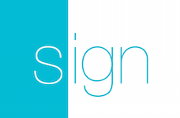

<h3 align="center">
  <a href="https://github.com/fastlane/fastlane">
    
     
    fastlane
  </a>
</h3>

  <a href="https://github.com/fastlane/deliver">deliver</a> &bull; 
  <a href="https://github.com/fastlane/snapshot">snapshot</a> &bull; 
  <a href="https://github.com/fastlane/frameit">frameit</a> &bull; 
  <a href="https://github.com/fastlane/PEM">PEM</a> &bull; 
  <a href="https://github.com/fastlane/sigh">sigh</a> &bull; 
  <a href="https://github.com/fastlane/produce">produce</a> &bull;
  <a href="https://github.com/fastlane/cert">cert</a> &bull;
  <a href="https://github.com/fastlane/spaceship">spaceship</a> &bull;
  <a href="https://github.com/fastlane/pilot">pilot</a> &bull;
  <a href="https://github.com/fastlane/boarding">boarding</a> &bull;
  <a href="https://github.com/fastlane/gym">gym</a> &bull;
  <a href="https://github.com/fastlane/scan">scan</a>

-------

  

WatchBuild
============

###### Because you would rather spend your time building stuff than fighting provisioning

WatchBuild is a simple tool that shows a notification once your newly uploaded build was successfully processed by iTunes Connect. 

As the [#iosprocessingtime](https://twitter.com/search?q=%23iosprocessingtime) varies from a few minutes to multiple hours, we sometimes forget to check iTunes Connect to see if the build is ready. WatchBuild does that for you.

Get in contact with the developer on Twitter: [@KrauseFx](https://twitter.com/KrauseFx)

-------

    <a href="#installation">Installation</a> &bull; 
    <a href="#usage">Usage</a> &bull; 
    <a href="#resign">Resign</a> &bull; 
    <a href="#how-does-it-work">How does it work?</a> &bull; 
    <a href="#tips">Tips</a> &bull; 
    <a href="#need-help">Need help?</a>

-------

# Installation
    sudo gem install watchbuild

Make sure, you have the latest version of the Xcode command line tools installed:

    xcode-select --install

# Usage

    watchbuild

You can pass your bundle identifier and username like this:

    watchbuild -a com.krausefx.app -u felix@krausefx.com

For a list of available parameters and commands run

    watchbuild --help

## How is my password stored?
`sigh` uses the [CredentialsManager](https://github.com/fastlane/credentials_manager) from `fastlane`.

# Tips
## [`fastlane`](https://fastlane.tools) Toolchain

- [`fastlane`](https://fastlane.tools): Connect all deployment tools into one streamlined workflow
- [`deliver`](https://github.com/fastlane/deliver): Upload screenshots, metadata and your app to the App Store
- [`snapshot`](https://github.com/fastlane/snapshot): Automate taking localized screenshots of your iOS app on every device
- [`frameit`](https://github.com/fastlane/frameit): Quickly put your screenshots into the right device frames
- [`PEM`](https://github.com/fastlane/PEM): Automatically generate and renew your push notification profiles
- [`sigh`](https://github.com/fastlane/sigh): Because you would rather spend your time building stuff than fighting provisioning
- [`produce`](https://github.com/fastlane/produce): Create new iOS apps on iTunes Connect and Dev Portal using the command line
- [`cert`](https://github.com/fastlane/cert): Automatically create and maintain iOS code signing certificates
- [`spaceship`](https://github.com/fastlane/spaceship): Ruby library to access the Apple Dev Center and iTunes Connect
- [`pilot`](https://github.com/fastlane/pilot): The best way to manage your TestFlight testers and builds from your terminal
- [`boarding`](https://github.com/fastlane/boarding): The easiest way to invite your TestFlight beta testers 
- [`gym`](https://github.com/fastlane/gym): Building your iOS apps has never been easier
- [`scan`](https://github.com/fastlane/scan): The easiest way to run tests of your iOS and Mac app

##### [Like this tool? Be the first to know about updates and new fastlane tools](https://tinyletter.com/krausefx)

## Use the 'Provisioning Quicklook plugin'
Download and install the [Provisioning Plugin](https://github.com/chockenberry/Provisioning).

It will show you the `mobileprovision` files like this: 

## App Identifier couldn't be found

If you also want to create a new App Identifier on the Apple Developer Portal, check out [produce](https://github.com/fastlane/produce), which does exactly that.

## What happens to my Xcode managed profiles?

`sigh` will never touch or use the profiles which are created and managed by Xcode. Instead `sigh` will manage its own set of provisioning profiles.

# Need help?
Please submit an issue on GitHub and provide information about your setup

# License
This project is licensed under the terms of the MIT license. See the LICENSE file.

> This project and all fastlane tools are in no way affiliated with Apple Inc. This project is open source under the MIT license, which means you have full access to the source code and can modify it to fit your own needs. All fastlane tools run on your own computer or server, so your credentials or other sensitive information will never leave your own computer. You are responsible for how you use fastlane tools.
