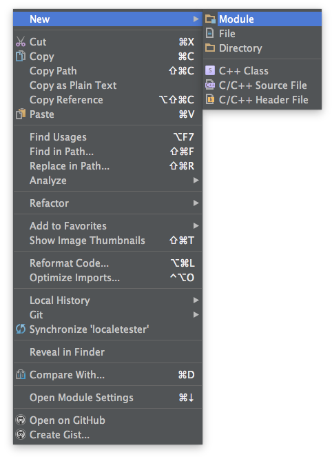
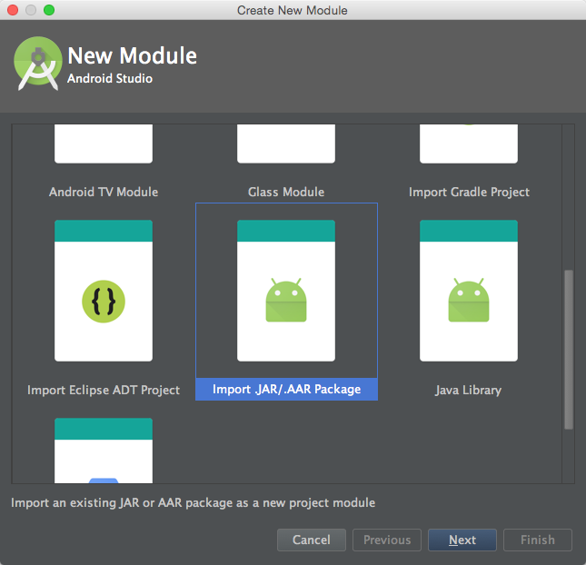

<h3 align="center">
  <a href="https://github.com/fastlane/fastlane">
    
    <br />
    fastlane
  </a>
</h3>
<p align="center">
  <a href="https://github.com/fastlane/deliver">deliver</a> &bull; 
  <b>chiizu</b> &bull; 
  <a href="https://github.com/fastlane/frameit">frameit</a> &bull; 
  <a href="https://github.com/fastlane/pem">pem</a> &bull; 
  <a href="https://github.com/fastlane/sigh">sigh</a> &bull; 
  <a href="https://github.com/fastlane/produce">produce</a> &bull;
  <a href="https://github.com/fastlane/cert">cert</a> &bull;
  <a href="https://github.com/fastlane/spaceship">spaceship</a> &bull;
  <a href="https://github.com/fastlane/pilot">pilot</a> &bull;
  <a href="https://github.com/fastlane/boarding">boarding</a> &bull;
  <a href="https://github.com/fastlane/gym">gym</a> &bull;
  <a href="https://github.com/fastlane/scan">scan</a> &bull;
  <a href="https://github.com/fastlane/match">match</a>
</p>
-------

<p align="center">
  
</p>

chiizu
============

[](https://twitter.com/fastlanetools)
[](https://github.com/fastlane/chiizu/blob/master/LICENSE)
[](http://rubygems.org/gems/chiizu)

###### Automate taking localized screenshots of your Android app

It's painful when you have to manually create screenshots for all of the locales that your app supports. It's hard to get everything right!

- New screenshots with every (design) update
- No loading indicators
- Same content / screens
- Uploading screenshots ([supply](https://github.com/fastlane/supply) is your friend)

`chiizu` runs completely in the background - you can do something else, while your computer takes the screenshots for you.

Get in contact with us on Twitter: [@FastlaneTools](https://twitter.com/FastlaneTools)

-------
<p align="center">
    <a href="#features">Features</a> &bull; 
    <a href="#installation">Installation</a> &bull; 
    <a href="#ui-tests">UI Tests</a> &bull; 
    <a href="#quick-start">Quick Start</a> &bull; 
    <a href="#usage">Usage</a> &bull; 
    <a href="#tips">Tips</a> &bull; 
    <a href="#how-does-it-work">How?</a> &bull; 
    <a href="#need-help">Need help?</a>
</p>

-------

<h5 align="center"><code>chiizu</code> is part of <a href="https://fastlane.tools">fastlane</a>: connect all deployment tools into one streamlined workflow.</h5>

# Features
- Create hundreds of screenshots in multiple languages on emulators or real devices
- Configure it once, store the configuration in git for anyone on your team to run
- Runs in the background, so you're free to do something else
- Fully integrates with [`fastlane`](https://fastlane.tools) and [`supply`](https://github.com/fastlane/supply)

##### [Like this tool? Be the first to know about updates and new fastlane tools](https://tinyletter.com/krausefx)

## Why?

This tool automatically runs UI tests to capture screenshots for every locale you support and pulls them from the device to your test machine.

### Why should I automate this process?

- It takes **hours** to take screenshots
- You get a great overview of all your screens, without the need to manually start it hundreds of times
- Easy verification for translators (without devices) to ensure translations in the context of your app make sense
- Easy verification that localizations fit into labels on all screen dimensions
- It is an integration test: You can test for UI elements and other things inside your scripts
- Keep your screenshots perfectly up-to-date with every app update. Your customers deserve it!
- Find a UI mistake after completing the process? No worries, just correct it and re-run the script!

# [ALPHA] Installation

Once this tool is officially released, the installation will be as simple as running `gem install chiizu`, and referencing a published Android AAR. For the private alpha, please follow these testing instructions:

1. Clone the repo with `git clone git@github.com:fastlane/chiizu.git`
1. `cd` into your chiizu repo directory and run `rake install`
    1. You may need to run `rbenv rehash` or similar to discover the new `chiizu` binary if you use a Ruby version manager
1. Import the Chiizu library AAR into your Android Studio project
    1. Right click on your root project and select New > Module
<p align="center">
  
</p>
    1. Select **Import .JAR/.AAR Package** from the New Module dialog
<p align="center">
  
</p>
    1. Pick `[path_to_chiizu_repo]/chiizu-lib-release/chiizu-lib-release.aar` and click **Finish**
    1. Add `androidTestCompile project(':chiizu-lib-release')` to your app's **build.gradle** dependencies

# UI Tests

The `/example` directory in the chiizu repository contains a simple Android app project that shows how to use JUnit 3 or 4 and Espresso with the chiizu Java library to capture screenshots during a UI test run.

- Check out [Testing UI for a Single App](http://developer.android.com/training/testing/ui-testing/espresso-testing.html) for an introduction to using Espresso for UI testing
- When using JUnit 3
    - Use `LocaleUtil.changeDeviceLocaleTo(LocaleUtil.getTestLocale());` in `setUp()`
    - Use `LocaleUtil.changeDeviceLocaleTo(LocaleUtil.getEndingLocale());` in `tearDown()`
    - Use `Lens.screenshot(activity, "tag");` to capture screenshots at the appropriate points in your tests
- When using JUnit 4
    - Add `@ClassRule public static final LocaleTestRule localeTestRule = new LocaleTestRule();` to your tests class to handle automatic switching of locales
    - Use `Lens.screenshot(activity, "tag");` to capture screenshots at the appropriate points in your tests

Using JUnit 4 is preferable because of its ability to perform actions before and after the entire test class is run. This means you will change the device's locale far fewer times when compared with JUnit 3 running those commands before and after each test method.

- Ensure that the following permissions exist in your debug **AndroidManifest.xml**

```xml
<!-- Allows unlocking your device and activating its screen so UI tests can succeed -->
<uses-permission android:name="android.permission.DISABLE_KEYGUARD"/>
<uses-permission android:name="android.permission.WAKE_LOCK"/>

<!-- Allows for storing and retrieving screenshots -->
<uses-permission android:name="android.permission.WRITE_EXTERNAL_STORAGE" />
<uses-permission android:name="android.permission.READ_EXTERNAL_STORAGE" />

<!-- Allows changing locales -->
<uses-permission android:name="android.permission.CHANGE_CONFIGURATION" />
```

# Quick Start

## Usage

- Create your APKs with `./gradlew assembleDebug assembleAndroidTest`
- Run `chiizu` in your app project directory
    - You will be prompted to provide any required parameters which are not in your **Chiizufile** or provided as command line arguments

## Chiizufile

You can get an example file generated by running `chiizu init`.

All of the available options can also be stored in a configuration file called the `Chiizufile`. Since most values will not change often for your project, it is recommended to store them there. 

The `Chiizufile` is written in Ruby, so you may find it helpful to use an editor that highlights Ruby syntax to modify this file.

```ruby
# remove the leading '#' to uncomment lines

# app_package_name 'your.app.package'
# use_tests_in_packages ['your.screenshot.tests.package']

# app_apk_path 'path/to/your/app.apk'
# tests_apk_path 'path/to/your/tests.apk'

locales ['en-US', 'fr-FR', 'it-IT']

# clear all previously generated screenshots in your local output directory before creating new ones
clear_previous_screenshots
```

For more information about all available options run

```
chiizu --help
```

# Tips

## [`fastlane`](https://fastlane.tools) Toolchain

- [`fastlane`](https://fastlane.tools): Connect all deployment tools into one streamlined workflow
- [`supply`](https://github.com/fastlane/supply): Upload screenshots, metadata and your app to the Play Store
- [`frameit`](https://github.com/fastlane/frameit): Quickly put your screenshots into the right device frames

##### [Like this tool? Be the first to know about updates and new fastlane tools](https://tinyletter.com/krausefx)

# Need help?
Please submit an issue on GitHub and provide information about your setup.

# License
This project is licensed under the terms of the MIT license. See the LICENSE file.

> This project is open source under the MIT license, which means you have full access to the source code and can modify it to fit your own needs. All fastlane tools run on your own computer or server, so your credentials or other sensitive information will never leave your own computer. You are responsible for how you use fastlane tools.
