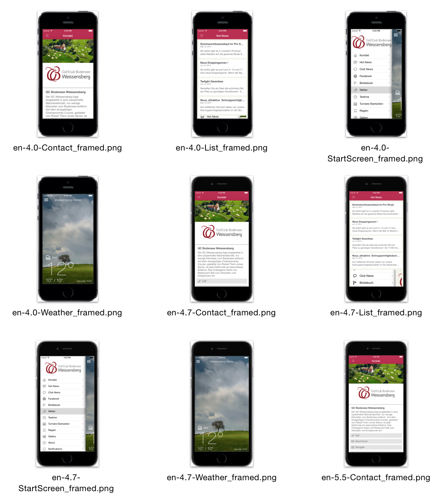

<p align="center">
  <a href="https://github.com/KrauseFx/deliver">Deliver</a> &bull; 
  <a href="https://github.com/KrauseFx/snapshot">Snapshot</a> &bull; 
  <b>FrameIt</b>
</p>
-------

<p align="center">
    
</p>

FrameIt - Add gorgeous device frames around your screenshots
============

[](https://twitter.com/KrauseFx)
[](https://github.com/KrauseFx/frameit/blob/master/LICENSE)
[](http://rubygems.org/gems/frameit)

Want a device frame around your screenshot? Do it in an instant!

Follow the developer on Twitter: [@KrauseFx](https://twitter.com/KrauseFx)


-------
[Features](#features) &bull;
[Installation](#installation) &bull;
[Usage](#usage) &bull;
[Tips](#tips) &bull;
[Need help?](#need-help)

-------


# Features

Put a gorgeous device frame around your iOS screenshots just by running one simple command. Support for:
- iPhone 6 Plus, iPhone 6, iPhone 5s and iPad Air
- Portrait and Landscape
- Black and Silver devices

Here is a nice gif, that shows ```frameit``` in action:


Here is how the result can look like


# Installation

Make sure, you have the commandline tools installed

    xcode-select --install

Install the gem

    sudo gem install frameit

Because of legal reasons, I can not pre-package the device frames with ```FrameIt```.

The process of adding is really easy, just run ```frameit``` and the guide will help you set it up.
You only have to do this once per computer.

- Run ```frameit```
- Press ```Enter```. The [Apple page](https://developer.apple.com/app-store/marketing/guidelines/#images) to download the images should open in your browser.
- Download the devices you want to use
- Press ```Enter```
- Unzip and move the content of the zip files to ```~/.frameit/device_frames```
- Press ```Enter```
  
# Usage

Why should you have to use Photoshop, just to add a frame around your screenshots?

Just navigate to your folder of screenshots and try the following:

- ```frameit```
- ```frameit silver```

# Tips

## Generate screenshots
Check out [```Snapshot```](https://github.com/KrauseFx/snapshot) to automatically generate screenshots using ```UI Automation```.

## Use a clean status bar
You can use [SimulatorStatusMagic](https://github.com/shinydevelopment/SimulatorStatusMagic) to clean up the status bar.

## Uninstall
- ```sudo gem uninstall frameit```
- ```rm -rf ~/.frameit```

# Need help?
- If there is a technical problem with ```FrameIt```, submit an issue. Run ```frameit --trace``` to get the stacktrace.
- I'm available for contract work - drop me an email: frameit@felixkrause.at

# License
This project is licensed under the terms of the MIT license. See the LICENSE file.

# Contributing

1. Create an issue to discuss about your idea
2. Fork it (https://github.com/KrauseFx/frameit/fork)
3. Create your feature branch (`git checkout -b my-new-feature`)
4. Commit your changes (`git commit -am 'Add some feature'`)
5. Push to the branch (`git push origin my-new-feature`)
6. Create a new Pull Request
