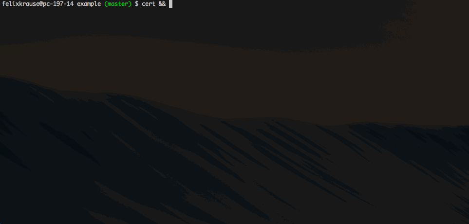

<h3 align="center">
  <a href="https://github.com/KrauseFx/fastlane">
    
    <br />
    fastlane
  </a>
</h3>
<p align="center">
  <a href="https://github.com/KrauseFx/deliver">deliver</a> &bull; 
  <a href="https://github.com/KrauseFx/snapshot">snapshot</a> &bull; 
  <a href="https://github.com/KrauseFx/frameit">frameit</a> &bull; 
  <a href="https://github.com/KrauseFx/pem">PEM</a> &bull; 
  <a href="https://github.com/KrauseFx/sigh">sigh</a> &bull; 
  <a href="https://github.com/KrauseFx/produce">produce</a> &bull;
  <b>cert</b> &bull;
  <a href="https://github.com/KrauseFx/codes">codes</a> &bull;
  <a href="https://github.com/fastlane/spaceship">spaceship</a> &bull;
  <a href="https://github.com/fastlane/pilot">pilot</a> &bull;
  <a href="https://github.com/fastlane/boarding">boarding</a>
</p>
-------

<p align="center">
    
</p>

cert
============

[](https://twitter.com/KrauseFx)
[](https://github.com/KrauseFx/cert/blob/master/LICENSE)
[](http://rubygems.org/gems/cert)

###### Automatically create and maintain iOS code signing certificates.

##### This tool was sponsored by [AppInstitute](http://appinstitute.co.uk/).

Get in contact with the developer on Twitter: [@KrauseFx](https://twitter.com/KrauseFx)

-------
<p align="center">
    <a href="#installation">Installation</a> &bull; 
    <a href="#why">Why?</a> &bull; 
    <a href="#usage">Usage</a> &bull; 
    <a href="#how-does-it-work">How does it work?</a> &bull; 
    <a href="#tips">Tips</a> &bull; 
    <a href="#need-help">Need help?</a>
</p>

-------

<h5 align="center"><code>cert</code> is part of <a href="https://fastlane.tools">fastlane</a>: connect all deployment tools into one streamlined workflow.</h5>


# Installation
    sudo gem install cert

Make sure, you have the latest version of the Xcode command line tools installed:

    xcode-select --install

# Why?

Please check out [this guide](https://github.com/KrauseFx/cert/blob/master/ManualSteps.md) which shows how to manually create an iOS code signing profile and a provisioning profile using the Apple Developer Portal.

**After** checking out the [guide](https://github.com/KrauseFx/cert/blob/master/ManualSteps.md), take a look how `cert` and [`sigh`](https://github.com/KrauseFx/sigh) do all that for you.

 

In the gif I used `cert && sigh`, which will first create an iOS code signing certificate and then a provisioning profile for your app if `cert` succeeded.

##### [Like this tool? Be the first to know about updates and new fastlane tools](https://tinyletter.com/krausefx)

# Usage

    cert

This will check if any of the available signing certificates is installed on your local machine.

Only if a new certificate needs to be created, `cert` will

- Create a new private key
- Create a new signing request
- Generate, downloads and installs the certificate
- Import all the generated files into your Keychain


```cert``` will never revoke your existing certificates. If you can't create any more certificates, `cert` will raise an exception, which means, you have to revoke one of the existing certificates to make room for a new one.


You can pass your Apple ID:

    cert -u cert@krausefx.com

For a list of available commands run

    cert --help

## Environment Variables
In case you prefer environment variables:

- ```CERT_USERNAME```
- ```CERT_TEAM_ID```
- ```CERT_KEYCHAIN_PATH``` The path to a specific Keychain if you don't want to use the default one
- ```CERT_SIGNING_REQUEST_PATH``` Path to your own signing request file
- ```FASTLANE_TEAM_NAME``` (the Team Name, e.g. `Felix Krause`)

## Use with [`sigh`](https://github.com/KrauseFx/sigh)

`cert` becomes really interesting when used in [`fastlane`](https://github.com/KrauseFx/fastlane) in combination with [`sigh`](https://github.com/KrauseFx/sigh).

Update your `Fastfile` to contain the following code:

```ruby
lane :beta do
  cert
  sigh :force
end
```

`:force` will make sure to re-generate the provisioning profile on each run.
This will result in `sigh` always using the correct signing certificate, which is installed on the local machine.


## How is my password stored?
```cert``` uses the [password manager](https://github.com/fastlane/CredentialsManager) from `fastlane`. Take a look the [CredentialsManager README](https://github.com/fastlane/CredentialsManager) for more information.

# Tips

## [`fastlane`](https://fastlane.tools) Toolchain

- [`fastlane`](https://fastlane.tools): Connect all deployment tools into one streamlined workflow
- [`deliver`](https://github.com/KrauseFx/deliver): Upload screenshots, metadata and your app to the App Store
- [`snapshot`](https://github.com/KrauseFx/snapshot): Automate taking localized screenshots of your iOS app on every device
- [`frameit`](https://github.com/KrauseFx/frameit): Quickly put your screenshots into the right device frames
- [`PEM`](https://github.com/KrauseFx/pem): Automatically generate and renew your push notification profiles
- [`sigh`](https://github.com/KrauseFx/sigh): Because you would rather spend your time building stuff than fighting provisioning
- [`produce`](https://github.com/KrauseFx/produce): Create new iOS apps on iTunes Connect and Dev Portal using the command line
- [`codes`](https://github.com/KrauseFx/codes): Create promo codes for iOS Apps using the command line
- [`spaceship`](https://github.com/fastlane/spaceship): Ruby library to access the Apple Dev Center and iTunes Connect
- [`pilot`](https://github.com/fastlane/pilot): The best way to manage your TestFlight testers and builds from your terminal
- [`boarding`](https://github.com/fastlane/boarding): The easiest way to invite your TestFlight beta testers 

##### [Like this tool? Be the first to know about updates and new fastlane tools](https://tinyletter.com/krausefx)

## Use the 'Provisioning Quicklook plugin'
Download and install the [Provisioning Plugin](https://github.com/chockenberry/Provisioning) to easily preview provisioning profile files and certificates.

# Need help?
Please submit an issue on GitHub and provide information about your setup

# License
This project is licensed under the terms of the MIT license. See the LICENSE file.

> This project and all fastlane tools are in no way affiliated with Apple Inc. This project is open source under the MIT license, which means you have full access to the source code and can modify it to fit your own needs. All fastlane tools run on your own computer or server, so your credentials or other sensitive information will never leave your own computer. You are responsible for how you use fastlane tools.


# Contributing

1. Create an issue to discuss about your idea
2. Fork it (https://github.com/KrauseFx/cert/fork)
3. Create your feature branch (`git checkout -b my-new-feature`)
4. Commit your changes (`git commit -am 'Add some feature'`)
5. Push to the branch (`git push origin my-new-feature`)
6. Create a new Pull Request
