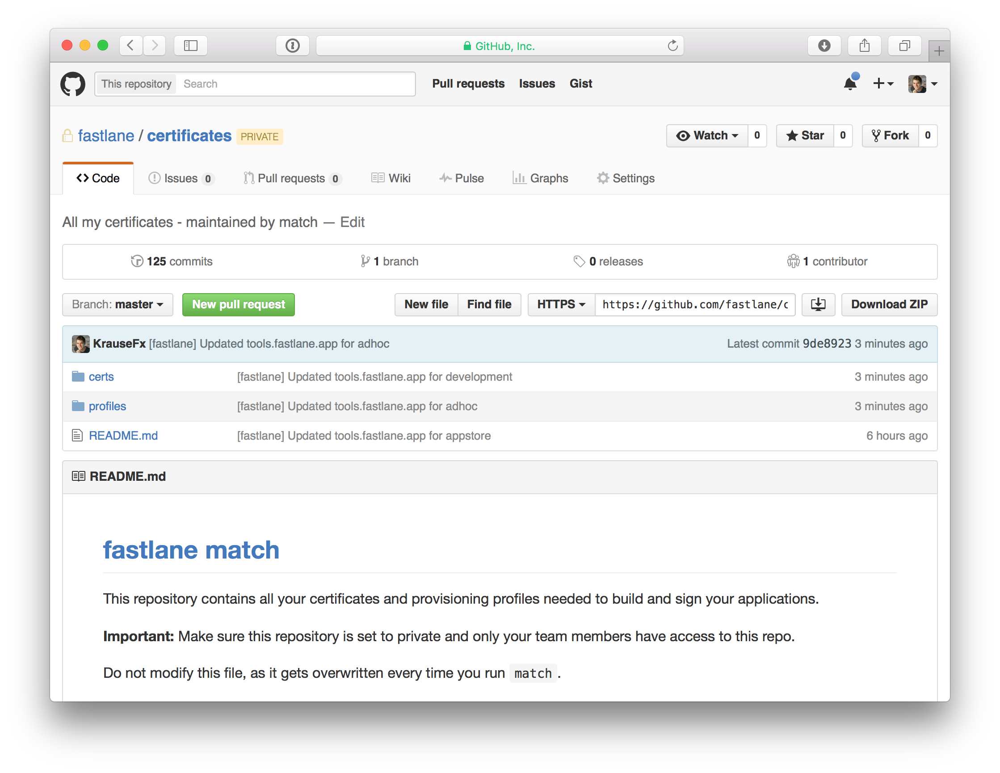
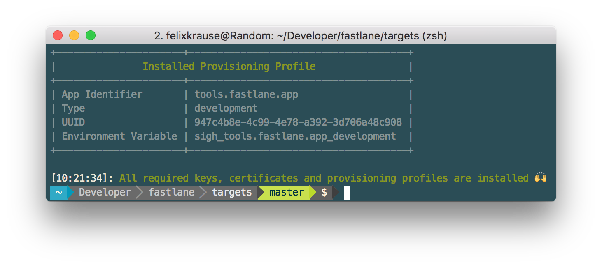
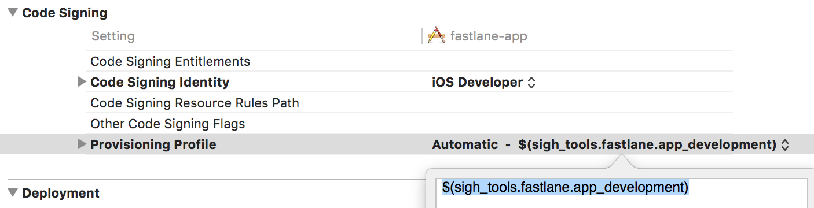
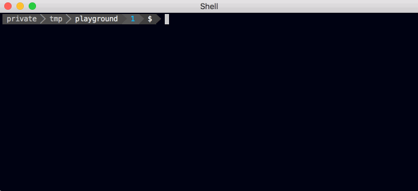

<h3 align="center">
  <a href="https://github.com/fastlane/fastlane">
    
    <br />
    fastlane
  </a>
</h3>
<p align="center">
  <a href="https://github.com/fastlane/deliver">deliver</a> &bull; 
  <a href="https://github.com/fastlane/snapshot">snapshot</a> &bull; 
  <a href="https://github.com/fastlane/frameit">frameit</a> &bull; 
  <a href="https://github.com/fastlane/pem">pem</a> &bull; 
  <a href="https://github.com/fastlane/sigh">sigh</a> &bull; 
  <a href="https://github.com/fastlane/produce">produce</a> &bull;
  <a href="https://github.com/fastlane/cert">cert</a> &bull;
  <a href="https://github.com/fastlane/spaceship">spaceship</a> &bull;
  <a href="https://github.com/fastlane/pilot">pilot</a> &bull;
  <a href="https://github.com/fastlane/boarding">boarding</a> &bull;
  <a href="https://github.com/fastlane/gym">gym</a> &bull;
  <a href="https://github.com/fastlane/scan">scan</a> &bull;
  <b>match</b>
</p>
-------

<p align="center">
  
</p>

match
============

[](https://github.com/fastlane/match/blob/master/LICENSE)
[](http://rubygems.org/gems/match)

###### Easily sync your certificates and profiles across your team using git

A new approach to iOS code signing: Share one code signing identity across your development team to simplify your codesigning setup and prevent code signing issues.

-------
<p align="center">
    <a href="#why-match">Why?</a> &bull; 
    <a href="#installation">Installation</a> &bull; 
    <a href="#usage">Usage</a> &bull; 
    <a href="#is-this-secure">Is this secure?</a> &bull; 
    <a href="#need-help">Need help?</a>
</p>

-------

<h5 align="center"><code>match</code> is part of <a href="https://fastlane.tools">fastlane</a>: connect all deployment tools into one streamlined workflow.</h5>

## Why match?

Before starting to use `match`, make sure to read the [codesigning.guide](https://codesigning.guide) 

> When deploying an app to the App Store, beta testing service or even installing it on a device, most development teams have separate code signing identities for every member. This results in dozens of profiles including a lot of duplicates.

> You have to manually renew and download the latest set of provisioning profiles every time you add a new device or a certificate expires. Additionally this requires spending a lot of time when setting up a new machine that will build your app.

**A new approach**

> Share one code signing identity across your development team to simplify your setup and prevent code signing issues. What if there was a central place where your code signing identity and profiles are kept, so anyone in the team can access them during the build process?

### Why not let Xcode handle all this?

- You have full control over what happens
- You have access to all the certificates and profiles, which are all securely stored in git
- You share one code signing identity across the team to have fewer certificates and profiles
- Xcode sometimes revokes certificates which breaks your setup causing failed builds
- More predictable builds by settings profiles in an explicit way instead of using the `Automatic` setting
- It just works™

### What does `match` do for you?

              |  match
--------------------------|------------------------------------------------------------
:arrows_counterclockwise:  | Automatically sync your iOS keys and profiles across all your team members using git
:package:  | Handle all the heavy lifting of creating and storing your certificates and profiles
:computer:  | Setup codesigning on a new machine in under a minute
:dart:  | Designed to work with apps with multiple targets and bundle identifiers
:lock: | You have full control over your files and Git repo, no third party service involved
:sparkles: | Provisioning profile will always match the correct certificate
:boom:  | Easily reset your existing profiles and certificates if your current account has expired or invalid profiles
:recycle:  | Automatically renew your provisioning profiles to include all your devices using the `--force`
:busts_in_silhouette:  | Support for multiple Apple accounts and multiple teams
:sparkles: | Tightly integrated with [fastlane](https://fastlane.tools) to work seamlessly with [gym](https://github.com/fastlane/gym) and other build tools 

For more information about the concept, visit [codesigning.guide](https://codesigning.guide).

## Installation

```
sudo gem install match
```

Make sure you have the latest version of the Xcode command line tools installed:

    xcode-select --install

## Usage

### Setup

1. Create a **new, private Git repo** (e.g. on [GitHub](https://github.com/new) or [BitBucket](https://bitbucket.org/repo/create)) and name it something like `certificates`. **Important:** Make sure the repository is set to *private*.

2. Optional: Create a **new, shared Apple Developer Portal account**, something like `office@company.com` that will be shared across your team from now on (for more information visit [codesigning.guide](https://codesigning.guide))

3. Run the following in your project folder to start using `match`:

```
match init
```


You'll be asked to enter the URL to your Git repo. This can be either a `https://` or a `git` URL. `match init` won't read or modify your certificates or profiles.

This will create a `Matchfile` in your current directory (or in your `./fastlane/` folder). 

Example content (for more advanced setups check out the [fastlane section](#fastlane)):

```ruby
git_url "https://github.com/fastlane/certificates"

app_identifier "tools.fastlane.app" 
username "user@fastlane.tools"
```

#### Important: Use one git repo per team

`match` was designed to have one git repository per Apple account. If you work in multiple teams, please create one repo for each of them. More information on [codesigning.guide](https://codesigning.guide)

### Run

> Before running `match` for the first time, you should consider clearing your existing profiles and certificates using the [match nuke command](#nuke).

After running `match init` you can run the following to generate new certificates and profiles:

```
match appstore
```
```
match development
```


This will create a new certificate and provisioning profile (if required) and store them in your Git repo. If you previously ran `match` it will automatically install the existing profiles from the Git repo.

The provisioning profiles are installed in `~/Library/MobileDevice/Provisioning Profiles` while the certificates and private keys are installed in your Keychain.

To get a more detailed output of what `match` is doing use

```
match --verbose
```

For a list of all available options run

```
match --help
```

#### Handle multiple targets

If you have several targets with different bundle identifiers, call `match` for each of them:

```
match appstore -a tools.fastlane.app
match appstore -a tools.fastlane.app.watchkitapp
```

#### Passphrase

When running `match` for the first time on a new machine, it will ask you for the passphrase for the Git repository. This is an additional layer of security: each of the files will be encrypted using `openssl`.Make sure to remember the password, as you'll need it when you run match on a different machine

To set the passphrase using an environment variable, use `MATCH_PASSWORD`.

#### New machine

To set up the certificates and provisioning profiles on a new machine, you just run the same command using:

```
match development
```

You can also run `match` in a `readonly` mode to be sure it won't create any new certificates or profiles. 

```
match development --readonly
```

#### Access Control

A benefit of using `match` is that it enables you to give the developers of your team access to the code signing certificates without having to give everyone access to the Developer Portal:

1. Run `match` to store the certificates in a Git repo
2. Grant access to the Git repo to your developers and give them the passphrase
3. The developers can now run `match` which will install the latest code signing profiles so they can build and sign the application without having to have access to the developer portal
4. Every time you run `match` to update the profiles (e.g. add a new device), all your developers will automatically get the latest profiles when running `match`

If you decide to run `match` without access to the developer portal, make sure to use the `--readonly` option so that the commands don't ask you for the password to the developer portal.

The advantage of this approach is that no one in your team will revoke a certificate by mistake. Additionally it is recommended to install the [FixCode Xcode Plugin](https://github.com/neonichu/FixCode) to disable the `Fix Issue` button.

#### Git Repo

After running `match` for the first time, your Git repo will contain 2 directories:

- The `certs` folder contains all certificates with their private keys
- The `profiles` folder contains all provisioning profiles

Additionally, `match` creates a nice repo `README.md` for you, making it easy to onboard new team members:

<p align="center">
  
</p>

#### fastlane

Add `match` to your `Fastfile` to automatically fetch the latest code signing certificates with [fastlane](https://fastlane.tools).

```ruby
match(type: "appstore")

match(git_url: "https://github.com/fastlane/certificates", 
      type: "development")

match(git_url: "https://github.com/fastlane/certificates", 
      type: "adhoc", 
      app_identifier: "tools.fastlane.app")

# `match` should be called before building the app with `gym`
gym
...
```

##### Multiple Targets

If you app has multiple targets (e.g. Today Widget or WatchOS Extension)

```ruby
match(app_identifier: "tools.fastlane.app", type: "appstore")
match(app_identifier: "tools.fastlane.app.today_widget", type: "appstore")
```

`match` can even use the same one Git repository for all bundle identifiers.

### Setup Xcode project

To make sure Xcode is using the right provisioning profile for each target, don't use the `Automatic` feature for the profile selection.

Additionally it is recommended to disable the `Fix Issue` button using the [FixCode Xcode Plugin](https://github.com/neonichu/FixCode). The `Fix Issue` button can revoke your existing certificates, which will invalidate your provisioning profiles.

#### To build from the command line using [fastlane](https://fastlane.tools)

`match` automatically pre-fills environment variables with the UUIDs of the correct provisioning profiles, ready to be used in your Xcode project. 



Open your target settings, open the dropdown for `Provisioning Profile` and select `Other`:



Profile environment variables are named after `$(sigh_<bundle_identifier>_<profile_type>)`

e.g. `$(sigh_tools.fastlane.app_development)`

#### To build from Xcode manually

This is useful when installing your application on your device using the Development profile. 

You can statically select the right provisioning profile in your Xcode project (the name will be `match Development tools.fastlane.app`).

### Nuke

If you never really cared about code signing and have a messy Apple Developer account with a lot of invalid, expired or Xcode managed profiles/certificates, you can use the `match nuke` command to revoke your certificates and provisioning profiles. Don't worry, apps that are already available in the App Store will still work. Builds distributed via TestFlight might be disabled after nuking your account, you'll have to re-upload a new build. After clearing your account you'll start from a clean state, and you can run `match` to generate your certificates and profiles again.

To revoke all certificates and provisioning profiles for a specific environment:

```sh
match nuke development
match nuke distribution
```



You'll have to confirm a list of profiles / certificates that will be deleted.

### Change Password

To change the password of your repo and therefore decrypting and encrypting all files run

```
match change_password
```

You'll be asked for the new password on all your machines on the next run.

### Manual Decrypt

If you want to manually decrypt a file you can.

```
openssl aes-256-cbc -k "<password>" -in "<fileYouWantToDecryptPath>" -out "<decryptedFilePath>" -a -d
```


## Is this secure?

Both your keys and provisioning profiles are encrypted using OpenSSL using a passphrase.

Storing your private keys in a Git repo may sound off-putting at first. We did an in-depth analysis of potential security issues and came to the following conclusions: 

#### What could happen if someone stole a private key?

If attackers would have your certificate and provisioning profile, they could codesign an application with the same bundle identifier. 

What's the worst that could happen for each of the profile types?

##### App Store Profiles

An App Store profile can't be used for anything as long as it's not re-signed by Apple. The only way to get an app resigned is to submit an app for review (which takes around 7 days). Attackers could only submit an app for review, if they also got access to your iTunes Connect credentials (which are not stored in git, but in your local keychain). Additionally you get an email notification every time a build gets uploaded to cancel the submission even before your app gets into the review stage.

##### Development and Ad Hoc Profiles

In general those profiles are harmless as they can only be used to install a signed application on a small subset of devices. To add new devices, the attacker would also need your Apple Developer Portal credentials (which are not stored in git, but in your local keychain). 

##### Enterprise Profiles

Attackers could use an In-House profile to distribute signed application to a potentially unlimited number of devices. All this would run under your company name and it could eventually lead to Apple revoking your In-House account. However it is very easy to revoke a certificate to remotely break the app on all devices.

Because of the potentially dangerous nature of In-House profiles we decided to not allow the use of `match` with enterprise accounts.

##### To sum up

- You have full control over the access list of your Git repo, no third party service involved
- Even if your certificates are leaked, they can't be used to cause any harm without your iTunes Connect login credentials
- `match` does not currently support In-House Enterprise profiles as they are harder to control
- If you use GitHub or Bitbucket we encourage enabling 2 factor authentication for all accounts that have access to the certificates repo
- The complete source code of `match` is fully open source on [GitHub](https://github.com/fastlane/match)

## [`fastlane`](https://fastlane.tools) Toolchain

- [`fastlane`](https://fastlane.tools): Connect all deployment tools into one streamlined workflow
- [`deliver`](https://github.com/fastlane/deliver): Upload screenshots, metadata and your app to the App Store
- [`snapshot`](https://github.com/fastlane/snapshot): Automate taking localized screenshots of your iOS app on every device
- [`frameit`](https://github.com/fastlane/frameit): Quickly put your screenshots into the right device frames
- [`pem`](https://github.com/fastlane/pem): Automatically generate and renew your push notification profiles
- [`produce`](https://github.com/fastlane/produce): Create new iOS apps on iTunes Connect and Dev Portal using the command line
- [`cert`](https://github.com/fastlane/cert): Automatically create and maintain iOS code signing certificates
- [`spaceship`](https://github.com/fastlane/spaceship): Ruby library to access the Apple Dev Center and iTunes Connect
- [`pilot`](https://github.com/fastlane/pilot): The best way to manage your TestFlight testers and builds from your terminal
- [`boarding`](https://github.com/fastlane/boarding): The easiest way to invite your TestFlight beta testers 
- [`gym`](https://github.com/fastlane/gym): Building your iOS apps has never been easier
- [`scan`](https://github.com/fastlane/scan): The easiest way to run tests of your iOS and Mac app

# Need help?
Please submit an issue on GitHub and provide information about your setup

# License
This project is licensed under the terms of the MIT license. See the LICENSE file.

> This project and all fastlane tools are in no way affiliated with Apple Inc. This project is open source under the MIT license, which means you have full access to the source code and can modify it to fit your own needs. All fastlane tools run on your own computer or server, so your credentials or other sensitive information will never leave your own computer. You are responsible for how you use fastlane tools.
