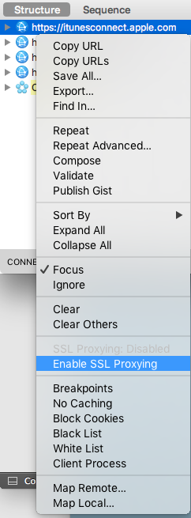
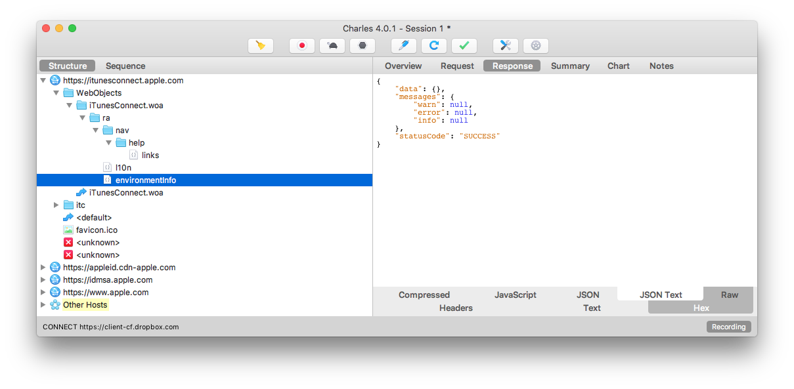

# Tooling and Debugging

For detailed instructions on how to get started with contributing to _fastlane_, first check out [YourFirstPR.md][first-pr]. This guide will focus on more advanced instructions on how to debug _fastlane_ and _spaceship_ issues and work on patches.

## Debug using [pry](http://pryrepl.org/)

Before you’re able to use [pry](http://pryrepl.org/), make sure to have completed the [YourFirstPR.md][first-pr] setup part, as this will install all required development dependencies.

To add a breakpoint anywhere in the _fastlane_ codebase, add the following 2 lines wherever you want to jump in

```ruby
require 'pry'
binding.pry
```

As debugging with pry requires the development dependencies, make sure to execute _fastlane_ using `bundle exec` after running `bundle install` in the project- or _fastlane_ directory.

```
bundle exec fastlane beta --verbose
```

If you need the breakpoint when running tests, make sure to have the `DEBUG` environment variable set, as the default test runner will remove all output from stdout, and therefore not showing the output of `pry`:

```
DEBUG=1 bundle exec rspec
```

You will then jump into an interactive debugger that allows you to print out variables, call methods and [much more](https://github.com/pry/pry/wiki).
To continue running the original script use `control` + `d`


## Test your local _fastlane_ code base with your setup


After introducing some changes to the _fastlane_ source code, you probably want to test the changes for your application. The easiest way to do so it use [bundler](https://bundler.io/).

Copy the Gemfile [.assets/Gemfile](.assets/Gemfile) from your local fastlane clone and drop it into your project's root folder.

Make sure to replace `<PATH_TO_YOUR_LOCAL_FASTLANE_CLONE>` with the path to your _fastlane_ clone, e.g. `~/fastlane`, then you can run
```
bundle update
```
in your project’s root directory. After doing so, you can verify you’re using the local version by running

```
bundle show fastlane
```

which should print out the path to your local development environment.

From now on, every time you introduce a change to your local _fastlane_ code base, you can immediately test it by running `bundle exec fastlane …`

## Debugging and patching _[spaceship](https://spaceship.airforce)_ issues


### Introduction to _spaceship_

_spaceship_ uses [Faraday](https://github.com/lostisland/faraday) to interact with multiple Apple API endpoints:

- `https://idmsa.apple.com`: Used to authenticate to get a valid session
- `https://developerservices2.apple.com`: For provisioning profiles and devices
  - List provisioning profiles
  - Register new devices
- `https://developer.apple.com`:
  - List all devices, certificates, apps and app groups
  - Create new certificates, provisioning profiles and apps
  - Disable/enable services on apps and assign them to app groups
  - Delete certificates and apps
  - Repair provisioning profiles
  - Download provisioning profiles
  - Team selection
- `https://itunesconnect.apple.com`:
  - Managing apps
  - Managing beta testers
  - Submitting updates to review
  - Managing app metadata
- `https://du-itc.itunesconnect.apple.com`:
  - Upload icons, screenshots, trailers ...

_spaceship_ is split into 3 layers:

- `client.rb` which is the client superclass that contains all shared code between iTunes Connect the Developer Portal
- `tunes_client.rb` and `portal_client.rb` which are the implementations for both iTunes Connect and Developer Portal. Those classes include the actual HTTP requests that are being sent:
```ruby
def app_version_data(app_id, version_platform: nil, version_id: nil)
  r = request(:get, "ra/apps/#{app_id}/platforms/#{version_platform}/versions/#{version_id}")
  parse_response(r, 'data')
end
```
- _spaceship_ classes, e.g. `app_version.rb` which contain the API the user works with. These classes usually have some logic on how to handle responses.

Don’t use any custom HTML parsing in _spaceship_, instead try to only use JSON and XML APIs.

### Verify the website works

If _spaceship_ doesn’t work, it’s best to first find out if the actual website (Developer Portal or iTunes Connect) is currently working. Sometimes this might be a temporary server issue that gets resolved quickly. To gather information, make sure to check if other people are having the same issue on [GitHub](https://github.com/fastlane/fastlane/issues).
If it is a server issue, it’s best to [file a radar](https://bugreport.apple.com/) or call the [iTunes Connect hotline](https://developer.apple.com/contact/phone/).

### Setting up [Charles Web Proxy](https://www.charlesproxy.com/)



This section explains how you can set up [Charles Proxy](https://www.charlesproxy.com/) to track local https traffic and inspect the requests and their responses. Charles is a paid application with a free option that’s usually good enough for a quick debugging session limited to 15 minutes.  If you prefer a free open source alternative, check out [mitmproxy](https://mitmproxy.org/).

First, download and install the latest version of [Charles Proxy](https://www.charlesproxy.com/). After the first launch, you’ll have to install its [Root Certificate](https://www.charlesproxy.com/documentation/using-charles/ssl-certificates/).

> In Charles go to the Help menu and choose "SSL Proxying > Install Charles Root Certificate". Keychain Access will open, and prompt you about the certificate. Click the "Always Trust" button. You will then be prompted for your Administrator password to update the system trust settings.

You might have to restart your Mac for the changes to be applied. To see if it works, relaunch Charles and Chrome/Safari and try opening [iTunes Connect](https://itunesconnect.apple.com).

If everything worked, you’ll already see a list of requests in the sidebar of Charles. Take a look at the above list of used API endpoints, and enable `SSL Proxying` and `Focus` on all endpoints you are interested in.
After doing so, refresh the iTunes Connect page. You should be able to see all web requests with their responses.

We’re not using the built-in network tracker of your browser, since we also need a proxy for our local _fastlane_ install, which will be covered in the next section of this document.



### Compare the API requests

They key is to do the same action you want to test on both the website, and in _spaceship_, so you can see how the requests are different.

To pipe _spaceship_ requests through your local proxy, you need to set an environment variable:
```
SPACESHIP_DEBUG=1 bundle exec fastlane spaceship
```

To make it easier to run the same script again, you can temporarily edit the `Rakefile` to look like this:

```ruby
# leave existing code, and append the following

task :debug do
  require 'spaceship'

  # first login
  Spaceship::Tunes.login("apple@fastlane.tools") # use your own test account
  # or
  Spaceship::Portal.login("apple@fastlane.tools") # use your own test account

  # then add code to test whatever part of _spaceship_ needs to be tested
  # e.g.
  apps = Spaceship::Tunes::Application.all
  require 'pry'
  binding.pry
end
```

To run the newly created script, run

```
SPACESHIP_DEBUG=1 bundle exec rake debug
```

<!--Links-->
[first-pr]: YourFirstPR.md
