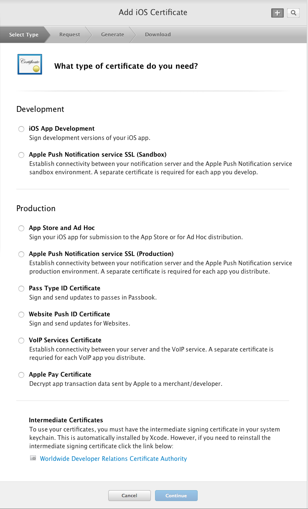
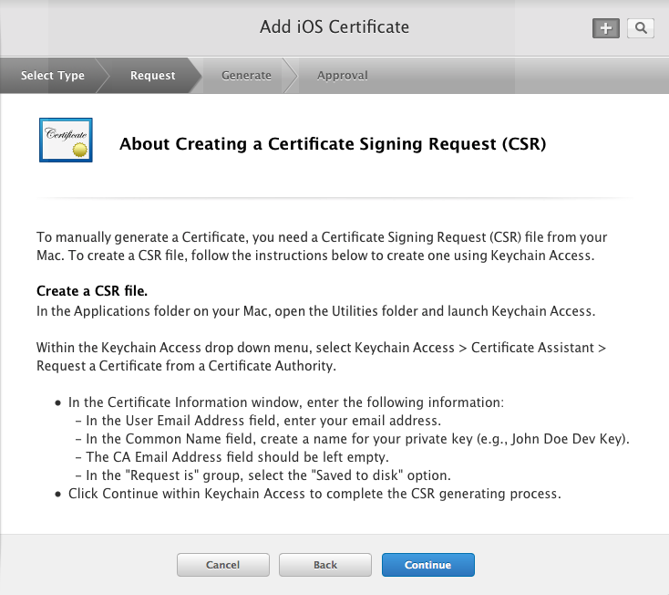
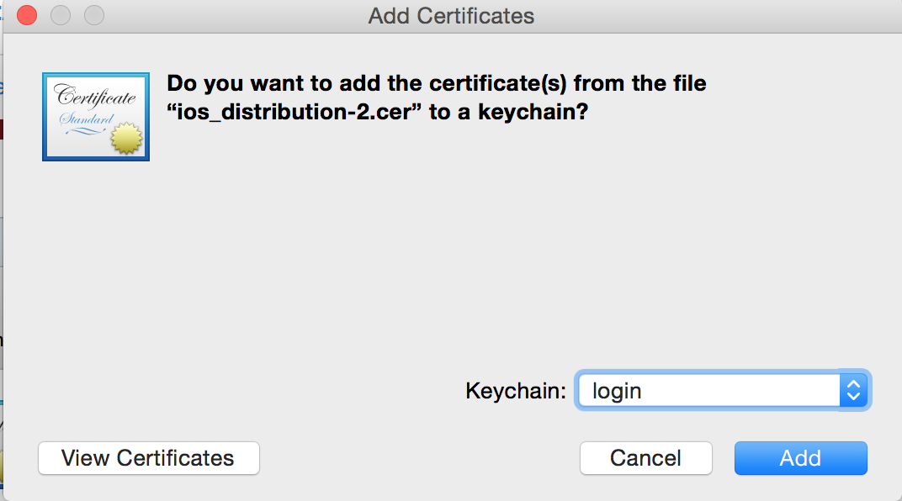
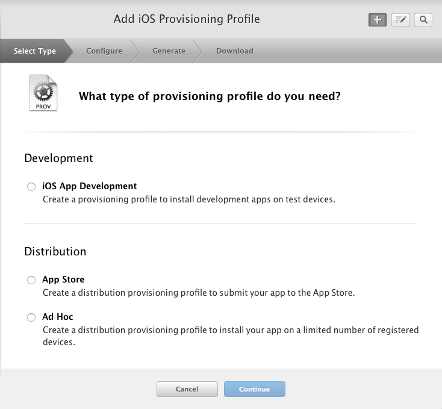
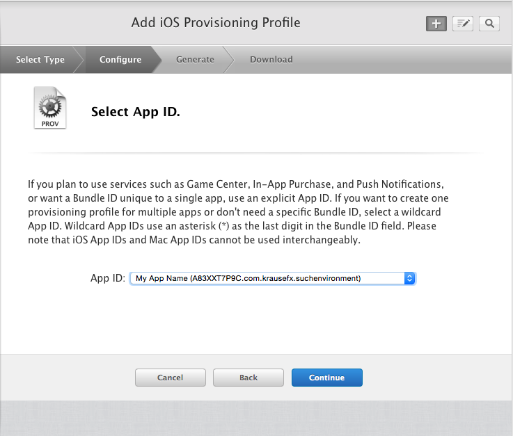
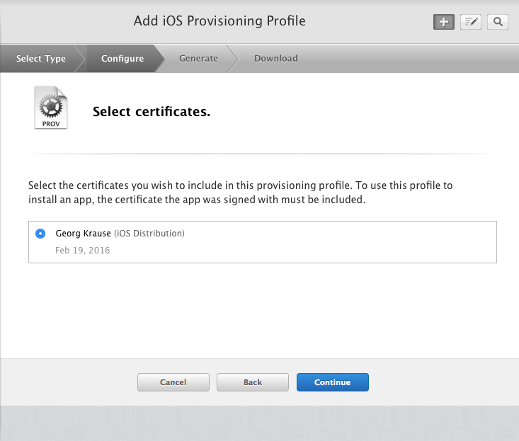
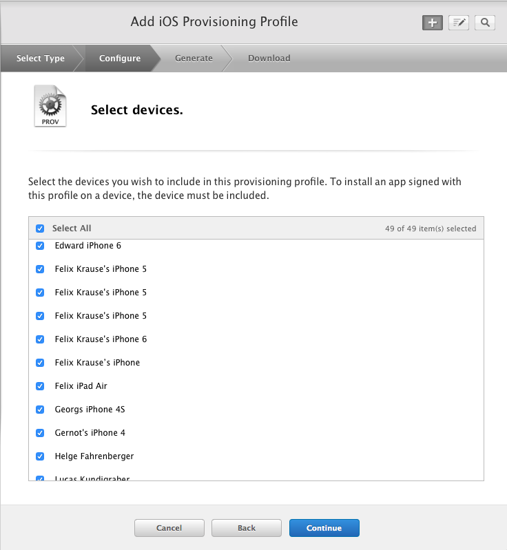
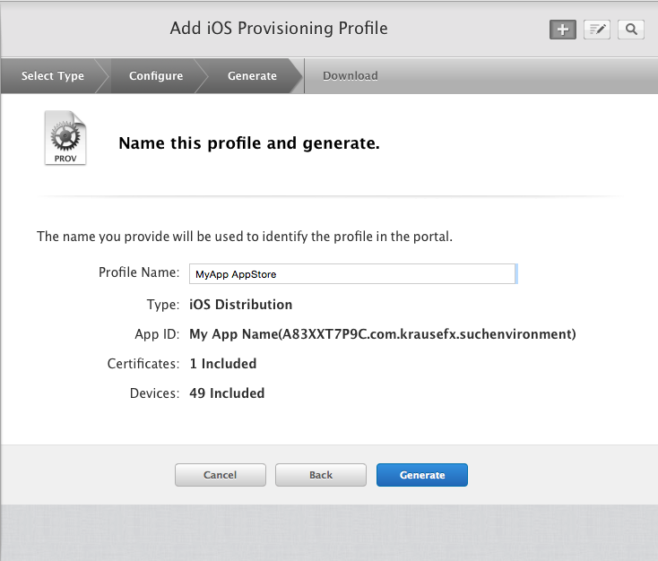

# [cert](https://docs.fastlane.tools/actions/cert/)

#### To create a new certificate and a provisioning profile you have to do the following steps on the Apple Developer Portal

#### Yes, you have to follow all those steps to create a provisiong profile with its certificate
