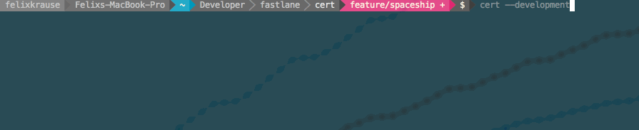

<h3 align="center">
  <a href="https://github.com/fastlane/fastlane/tree/master/fastlane">
    
    <br />
    fastlane
  </a>
</h3>
<p align="center">
  <a href="https://github.com/fastlane/fastlane/tree/master/deliver">deliver</a> &bull;
  <a href="https://github.com/fastlane/fastlane/tree/master/snapshot">snapshot</a> &bull;
  <a href="https://github.com/fastlane/fastlane/tree/master/frameit">frameit</a> &bull;
  <a href="https://github.com/fastlane/fastlane/tree/master/pem">pem</a> &bull;
  <a href="https://github.com/fastlane/fastlane/tree/master/sigh">sigh</a> &bull;
  <a href="https://github.com/fastlane/fastlane/tree/master/produce">produce</a> &bull;
  <b>cert</b> &bull;
  <a href="https://github.com/fastlane/fastlane/tree/master/spaceship">spaceship</a> &bull;
  <a href="https://github.com/fastlane/fastlane/tree/master/pilot">pilot</a> &bull;
  <a href="https://github.com/fastlane/boarding">boarding</a> &bull;
  <a href="https://github.com/fastlane/fastlane/tree/master/gym">gym</a> &bull;
  <a href="https://github.com/fastlane/fastlane/tree/master/scan">scan</a> &bull;
  <a href="https://github.com/fastlane/fastlane/tree/master/match">match</a>
</p>
-------

<p align="center">
  
</p>

cert
============

[](https://twitter.com/fastlanetools)
[](https://github.com/fastlane/fastlane/blob/master/cert/LICENSE)
[](https://rubygems.org/gems/cert)

###### Automatically create and maintain iOS code signing certificates.

`cert` is focused exclusively on code signing. You can create new code signing identities for different environments (development and distribution) and use any existing valid certificates installed locally.

Get in contact with the developers on Twitter: [@FastlaneTools](https://twitter.com/FastlaneTools)

-------
<p align="center">
    <a href="#installation">Installation</a> &bull;
    <a href="#why">Why?</a> &bull;
    <a href="#usage">Usage</a> &bull;
    <a href="#how-does-it-work">How does it work?</a> &bull;
    <a href="#tips">Tips</a> &bull;
    <a href="#need-help">Need help?</a>
</p>

-------

<h5 align="center"><code>cert</code> is part of <a href="https://fastlane.tools">fastlane</a>: The easiest way to automate beta deployments and releases for your iOS and Android apps.</h5>


# Installation

**Note**: It is recommended to use [match](https://github.com/fastlane/fastlane/tree/master/match) according to the [codesigning.guide](https://codesigning.guide) for generating and maintaining your certificates. Use `cert` directly only if you want full control over what's going on and know more about codesigning.

    sudo gem install fastlane

Make sure, you have the latest version of the Xcode command line tools installed:

    xcode-select --install

# Why?

Please check out [this guide](https://github.com/fastlane/fastlane/blob/master/cert/ManualSteps.md) which shows how to manually create an iOS code signing profile and a provisioning profile using the Apple Developer Portal.

**After** checking out the [guide](https://github.com/fastlane/fastlane/blob/master/cert/ManualSteps.md), take a look how `cert` and [`sigh`](https://github.com/fastlane/fastlane/tree/master/sigh) do all that for you.



In the gif I used `cert && sigh`, which will first create an iOS code signing certificate and then a provisioning profile for your app if `cert` succeeded.

##### [Like this tool? Be the first to know about updates and new fastlane tools](https://tinyletter.com/krausefx)

# Usage

    fastlane cert

This will check if any of the available signing certificates is installed on your local machine.

Only if a new certificate needs to be created, `cert` will

- Create a new private key
- Create a new signing request
- Generate, downloads and installs the certificate
- Import all the generated files into your Keychain


`cert` will never revoke your existing certificates. If you can't create any more certificates, `cert` will raise an exception, which means, you have to revoke one of the existing certificates to make room for a new one.


You can pass your Apple ID:

    fastlane cert -u cert@krausefx.com

For a list of available commands run

    fastlane cert --help

Keep in mind, there is no way for `cert` to download existing certificates + private keys from the Apple Developer Portal, as the private key never leaves your computer.

## Environment Variables

Run `fastlane cert --help` to get a list of all available environment variables.

## Use with [`sigh`](https://github.com/fastlane/fastlane/tree/master/sigh)

`cert` becomes really interesting when used in [`fastlane`](https://github.com/fastlane/fastlane/tree/master/fastlane) in combination with [`sigh`](https://github.com/fastlane/fastlane/tree/master/sigh).

Update your `Fastfile` to contain the following code:

```ruby
lane :beta do
  cert
  sigh(force: true)
end
```

`force: true` will make sure to re-generate the provisioning profile on each run.
This will result in `sigh` always using the correct signing certificate, which is installed on the local machine.


## How is my password stored?
`cert` uses the [password manager](https://github.com/fastlane/fastlane/tree/master/credentials_manager) from `fastlane`. Take a look the [CredentialsManager README](https://github.com/fastlane/fastlane/blob/master/credentials_manager/README.md) for more information.

# Tips

## [`fastlane`](https://fastlane.tools) Toolchain

- [`fastlane`](https://fastlane.tools): The easiest way to automate beta deployments and releases for your iOS and Android apps
- [`deliver`](https://github.com/fastlane/fastlane/tree/master/deliver): Upload screenshots, metadata and your app to the App Store
- [`snapshot`](https://github.com/fastlane/fastlane/tree/master/snapshot): Automate taking localized screenshots of your iOS app on every device
- [`frameit`](https://github.com/fastlane/fastlane/tree/master/frameit): Quickly put your screenshots into the right device frames
- [`pem`](https://github.com/fastlane/fastlane/tree/master/pem): Automatically generate and renew your push notification profiles
- [`sigh`](https://github.com/fastlane/fastlane/tree/master/sigh): Because you would rather spend your time building stuff than fighting provisioning
- [`produce`](https://github.com/fastlane/fastlane/tree/master/produce): Create new iOS apps on iTunes Connect and Dev Portal using the command line
- [`spaceship`](https://github.com/fastlane/fastlane/tree/master/spaceship): Ruby library to access the Apple Dev Center and iTunes Connect
- [`pilot`](https://github.com/fastlane/fastlane/tree/master/pilot): The best way to manage your TestFlight testers and builds from your terminal
- [`boarding`](https://github.com/fastlane/boarding): The easiest way to invite your TestFlight beta testers
- [`gym`](https://github.com/fastlane/fastlane/tree/master/gym): Building your iOS apps has never been easier
- [`scan`](https://github.com/fastlane/fastlane/tree/master/scan): The easiest way to run tests of your iOS and Mac app
- [`match`](https://github.com/fastlane/fastlane/tree/master/match): Easily sync your certificates and profiles across your team using git

##### [Like this tool? Be the first to know about updates and new fastlane tools](https://tinyletter.com/krausefx)

## Use the 'Provisioning Quicklook plugin'
Download and install the [Provisioning Plugin](https://github.com/chockenberry/Provisioning) to easily preview provisioning profile files and certificates.

# Need help?
Please submit an issue on GitHub and provide information about your setup

# Code of Conduct
Help us keep `cert` open and inclusive. Please read and follow our [Code of Conduct](https://github.com/fastlane/fastlane/blob/master/CODE_OF_CONDUCT.md).

# License
This project is licensed under the terms of the MIT license. See the LICENSE file.

> This project and all fastlane tools are in no way affiliated with Apple Inc. This project is open source under the MIT license, which means you have full access to the source code and can modify it to fit your own needs. All fastlane tools run on your own computer or server, so your credentials or other sensitive information will never leave your own computer. You are responsible for how you use fastlane tools.
