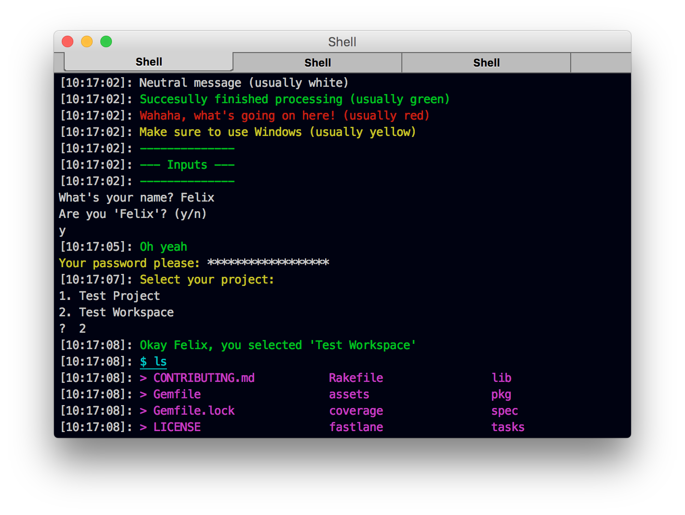

<h3 align="center">
  <a href="https://github.com/fastlane/fastlane/tree/master/fastlane">
    
    <br />
    countdown
  </a>
</h3>

<p align="center">
  <a href="https://github.com/fastlane/fastlane/tree/master/deliver">deliver</a> &bull; 
  <a href="https://github.com/fastlane/fastlane/tree/master/snapshot">snapshot</a> &bull; 
  <a href="https://github.com/fastlane/fastlane/tree/master/frameit">frameit</a> &bull; 
  <a href="https://github.com/fastlane/fastlane/tree/master/pem">pem</a> &bull; 
  <a href="https://github.com/fastlane/fastlane/tree/master/sigh">sigh</a> &bull; 
  <a href="https://github.com/fastlane/fastlane/tree/master/produce">produce</a> &bull;
  <a href="https://github.com/fastlane/fastlane/tree/master/cert">cert</a> &bull;
  <a href="https://github.com/fastlane/fastlane/tree/master/spaceship">spaceship</a> &bull;
  <a href="https://github.com/fastlane/fastlane/tree/master/pilot">pilot</a> &bull;
  <a href="https://github.com/fastlane/boarding">boarding</a> &bull;
  <a href="https://github.com/fastlane/fastlane/tree/master/gym">gym</a> &bull;
  <a href="https://github.com/fastlane/fastlane/tree/master/scan">scan</a> &bull;
  <a href="https://github.com/fastlane/fastlane/tree/master/match">match</a> &bull;
</p>
-------

countdown
============

[](https://twitter.com/FastlaneTools)
[](https://github.com/fastlane/fastlane/blob/master/LICENSE)

###### Get started with fastlane development the fast way

Get in contact with the developers on Twitter: [@FastlaneTools](https://twitter.com/FastlaneTools)

<h5 align="center"><code>countdown</code> is part of <a href="https://fastlane.tools">fastlane</a>: connect all deployment tools into one streamlined workflow.</h5>

# Getting started

Make sure you have `bundler` installed using `gem install bundler`

Clone the `countdown` repo

```
git clone https://github.com/fastlane/countdown
```

Clone all `fastlane` repos and install development dependencies

```
cd countdown
[sudo] rake bootstrap
```

If you don't use [rbenv](https://github.com/rbenv/rbenv) or [rvm](https://rvm.io/) you might need to run `sudo rake bootstrap` to not run into a permission error.

Before working on something, make sure to have pulled the latest changes. To pull the changes of all repos, go to the `countdown` directory and run

```
rake pull
```

# Developing

When working on something, directly edit the Ruby files in the project folders. Make sure to switch to 2 spaces in your text editor.

To run the modified version of the tool, run the following in the project directory

```
./bin/[tool_name]
```

# Debugging

I personally use a plain Sublime Text with a terminal. Debugging is pretty easy, just insert the following code to where you want to jump in:

```ruby
require 'pry'
binding.pry
```

You then jump into an interactive debugger that allows you to print out variables, call methods and much more. Continue running the original script using `control` + `d`

# Interacting with the user

You'll see some old code still using `puts` or `Helper.log.info` to print out values. From now, please only use the new `UI` class to interact with the user (both input and output)

```ruby
UI.message "Neutral message (usually white)"
UI.success "Succesully finished processing (usually green)"
UI.error "Wahaha, what's going on here! (usually red)"
UI.important "Make sure to use Windows (usually yellow)"

UI.header "Inputs" # a big box

name = UI.input("What's your name? ")
if UI.confirm("Are you '#{name}'?")
  UI.success "Oh yeah"
else
  UI.error "Wups, invalid"
end

UI.password("Your password please: ") # password inputs are hidden

# A "Dropdown" for the user
project = UI.select("Select your project: ", ["Test Project", "Test Workspace"])

UI.success("Okay #{name}, you selected '#{project}'")

# To run a command use
FastlaneCore::CommandExecutor.execute(command: "ls",
                                    print_all: true,
                                        error: proc do |error_output|
                                          # handle error here
                                        end)

# or if you just want to receive a simple value 
# use this only if the command doesn't take long
diff = Helper.backticks("git diff")

# fastlane "crash" because of a user error
# everything that is caused by the user and is not unexpected
UI.user_error!("You don't have a project in the current directory")

# an actual crash when something unexpected happened
UI.crash!("Network timeout")
```

The output will look like this



# Running tests

In the directory of one project, run the tests using

`rake test`

This will do a few things:

- Runs the tests (you can run them via `rspec` too)
- Makes sure no debug code (like `pry`) is still there
- The `--help` command works as expected

The tests are executed using `fastlane` :rocket:

To run only a subset of the tests, you can add the `now: true` keyword to the test

```ruby
it "raises an exception if it rains", now: true do
  ...
end
```

and then run these tests only using

```sh
rspec -t now
```

# Running the local code

Run your local copy using

```
./bin/[gem]
```

or install the local copy (might require `sudo`)

```
bundle install && rake install
```

# rubocop validation

The `fastlane` repos use [rubocop](https://github.com/bbatsov/rubocop) to validate the code style.

The style validation is automatically done when running `rake test`.

To automatically fix common code style issues (e.g. wrong spacing), run `rubocop -a`

To sync the latest `rubocop` rules to all repos, run `rake fetch_rubocop` in the `countdown` directory. Use `rake rubocop` to fetch the latest config and run the rubocop validation for all repos.

The configuration is always directly taken from the local `fastlane` repository..

# Submit a pull request

To submit the changes to the fastlane main repo, you have to do the following:

- Open the GitHub page of the repository you changed (e.g. [https://github.com/fastlane/fastlane/tree/master/gym](https://github.com/fastlane/fastlane/tree/master/gym))
- Click on `Fork` on the top right
- On your terminal, navigate to the project you modified and run `git remote add upstream https://github.com/[my_user]/[tool_name]` (or use the `git` URL if you use private key auth)
- Squash your commits into one. For example,  to squash three commits into one, do the following: `$ git rebase -i HEAD~3`. In the text editor that comes up, replace the words "pick" with "squash" next to the commits you want to squash. Save and close the editor. For more information, take a look at [7.6 Git Tools - Rewriting History](http://git-scm.com/book/en/v2/Git-Tools-Rewriting-History) 
- Run `git push upstream master`. If you pushed before squashing, go back and do the previous step, and then run `git push upstream master --force`
- Open `https://github.com/fastlane/[tool_name]` in your browser and click the green "Create Pull Request" button

# Need help?
Please submit an issue on GitHub and provide information about your setup

# Code of Conduct
Help us keep `fastlane` open and inclusive. Please read and follow our [Code of Conduct](https://github.com/fastlane/code-of-conduct).

# License
This project is licensed under the terms of the MIT license. See the LICENSE file.

> This project and all fastlane tools are in no way affiliated with Apple Inc. This project is open source under the MIT license, which means you have full access to the source code and can modify it to fit your own needs. All fastlane tools run on your own computer or server, so your credentials or other sensitive information will never leave your own computer. You are responsible for how you use fastlane tools.
