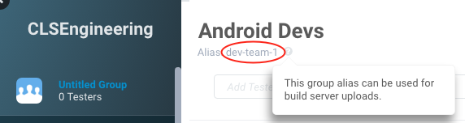

# Actions

There are lots of predefined `fastlane` actions you can use. If you have ideas for more, please [let me know](https://github.com/fastlane/fastlane/issues/new).

To get the most up-to-date information from the command line on your current version you can also run:

```sh
fastlane actions: List all available fastlane actions
fastlane action [action_name]:
```

You can import another `Fastfile` by using the `import` action. This is useful if you have shared lanes across multiple apps and you want to store a `Fastfile` in a separate folder. The path must be relative to the `Fastfile` this is called from.

```ruby
import './path/to/other/Fastfile'
```

- [Building](#building)
- [Testing](#testing)
- [Deploying](#deploying)
- [Modifying Project](#modifying-project)
- [Developer Portal](#developer-portal)
- [Using git](#using-git)
- [Using mercurial](#using-mercurial)
- [Notifications](#notifications)
- [Misc](#misc)

## Building

### [Bundler](http://bundler.io/)

This will install your Gemfile by executing `bundle install`

```ruby
bundle_install
```

### [CocoaPods](http://cocoapods.org)

If you use [CocoaPods](http://cocoapods.org) you can use the `cocoapods` integration to run `pod install` before building your app.

```ruby
cocoapods # this will run pod install
```

### [Carthage](https://github.com/Carthage/Carthage)

This will execute `carthage bootstrap`

```ruby
carthage
```

More options are available:

```ruby
carthage(
  command: "bootstrap"                            # One of: build, bootstrap, update, archive. (default: bootstrap)
  dependencies: ['Alamofire', 'Notice'],          # Specify which dependencies to update (only for the update command)
  use_ssh: false,                                 # Use SSH for downloading GitHub repositories.
  use_submodules: false,                          # Add dependencies as Git submodules.
  use_binaries: true,                             # Check out dependency repositories even when prebuilt frameworks exist
  no_build: false,                                # When bootstrapping Carthage do not build
  no_skip_current: false,                         # Don't skip building the current project (only for frameworks)
  verbose: false,                                 # Print xcodebuild output inline
  platform: "all",                                # Define which platform to build for (one of ‘all’, ‘Mac’, ‘iOS’, ‘watchOS’, 'tvOS', or comma-separated values of the formers except for ‘all’)
  configuration: "Release",                       # Build configuration to use when building
  toolchain: "com.apple.dt.toolchain.Swift_2_3"   # Specify the xcodebuild toolchain
)
```

### [gym](https://github.com/fastlane/fastlane/tree/master/gym)

`gym` builds and packages iOS apps for you. It takes care of all the heavy lifting and makes it super easy to generate a signed `ipa` file.

```ruby
gym(scheme: "MyApp", workspace: "MyApp.xcworkspace")
```

There are many more options available, you can use `gym --help` to get the latest list of available options.

```ruby
gym(
  workspace: "MyApp.xcworkspace",
  configuration: "Debug",
  scheme: "MyApp",
  silent: true,
  clean: true,
  output_directory: "path/to/dir", # Destination directory. Defaults to current directory.
  output_name: "my-app.ipa",       # specify the name of the .ipa file to generate (including file extension)
  sdk: "10.0"                     # use SDK as the name or path of the base SDK when building the project.
)
```

Use `gym --help` to get all available options.

The alternative to `gym` is [`ipa`](#ipa) which uses [shenzhen](https://github.com/nomad/shenzhen) under the hood.

### gradle

You can use the `gradle` action to integrate your gradle tasks into `fastlane`.

Simple usage:
```ruby
gradle(
  task: 'assemble',
  flavor: 'WorldDomination',
  build_type: 'Release'
)
```

In case of an `assemble` task, the signed apk path is accessible in: `lane_context[Actions::SharedValues::GRADLE_APK_OUTPUT_PATH]`


You can pass [gradle properties](https://docs.gradle.org/current/userguide/build_environment.html):
```ruby
gradle(
  # ...

  properties: {
    'versionCode' => 100,
    'versionName' => '1.0.0',
    # ...
  }
)
```

If you need to pass sensitive information through the `gradle` action, and don't want the generated command to be printed before it is run, you can suppress that:
```ruby
gradle(
  # ...
  print_command: false
)
```

You can also suppress printing the output generated by running the generated Gradle command:
```ruby
gradle(
  # ...
  print_command_output: false
)
```

To pass any other CLI flags to gradle use:
```ruby
gradle(
  # ...

  flags: "--exitcode --xml file.xml"
)
```

### verify_xcode

Verifies that the Xcode installation is properly signed by Apple. This is relevant after recent [attacks targeting Xcode](http://researchcenter.paloaltonetworks.com/2015/09/novel-malware-xcodeghost-modifies-xcode-infects-apple-ios-apps-and-hits-app-store/).

Add this action to your `appstore` lane. Keep in mind this action might take several minutes to be completed.

```ruby
verify_xcode
```

### [screengrab](https://github.com/fastlane/fastlane/tree/master/screengrab)

`screengrab` automates taking localized screenshots of your Android app on every device

```ruby
screengrab
```

Other options (`screengrab --help`)

```ruby
screengrab(
  locales: ['en-US', 'fr-FR', 'ja-JP'],
  clear_previous_screenshots: true,
  app_apk_path: 'build/outputs/apk/example-debug.apk',
  tests_apk_path: 'build/outputs/apk/example-debug-androidTest-unaligned.apk'
)
```

### [snapshot](https://github.com/fastlane/fastlane/tree/master/snapshot)

```ruby
snapshot
```

Other options (`snapshot --help`)

```ruby
snapshot(
  skip_open_summary: true,
  clean: true
)
```

Take a look at the [prefilling data guide](https://github.com/fastlane/fastlane/tree/master/snapshot#prefilling) on the `snapshot` documentation.

### clear_derived_data

Clears the Xcode Derived Data at path `~/Library/Developer/Xcode/DerivedData`

```ruby
clear_derived_data
```

### ipa

**Note**: This action is deprecated, use [gym](https://github.com/fastlane/fastlane/tree/master/gym) instead.

Build your app right inside `fastlane` and the path to the resulting ipa is automatically available to all other actions.

You should check out the [code signing guide](https://github.com/fastlane/fastlane/tree/master/fastlane/docs/Codesigning).

```ruby
ipa(
  workspace: "MyApp.xcworkspace",
  configuration: "Debug",
  scheme: "MyApp",
  # (optionals)
  clean: true,                     # This means 'Do Clean'. Cleans project before building (the default if not specified).
  destination: "path/to/dir",      # Destination directory. Defaults to current directory.
  ipa: "my-app.ipa",               # specify the name of the .ipa file to generate (including file extension)
  xcargs: "MY_ADHOC=0",            # pass additional arguments to xcodebuild when building the app.
  embed: "my.mobileprovision",     # Sign .ipa file with .mobileprovision
  identity: "MyIdentity",          # Identity to be used along with --embed
  sdk: "10.0",                     # use SDK as the name or path of the base SDK when building the project.
  archive: true                    # this means 'Do Archive'. Archive project after building (the default if not specified).
)
```

The `ipa` action uses [shenzhen](https://github.com/nomad/shenzhen) under the hood.

The path to the `ipa` is automatically used by `Crashlytics`, `Hockey` and `DeployGate`.

**Important:**

To also use it in `deliver`, update your `Deliverfile` and remove all code in the `Building and Testing` section, in particular all `ipa` and `beta_ipa` blocks.

See how [Product Hunt](https://github.com/fastlane/examples/blob/master/ProductHunt/Fastfile) uses the `ipa` action.


### update_project_provisioning

You should check out the [code signing guide](https://github.com/fastlane/fastlane/tree/master/fastlane/docs/Codesigning) before using this action.

Updates your Xcode project to use a specific provisioning profile for code signing, so that you can properly build and sign the .ipa file using the [ipa](#ipa) action or a CI service.

Since you have to use different provisioning profiles for various targets (WatchKit, Extension, etc.) and configurations (Debug, Release) you can use the `target_filter` and `build_configuration` options:

```ruby
update_project_provisioning(
  xcodeproj: "Project.xcodeproj",
  profile: "./watch_app_store.mobileprovision", # optional if you use sigh
  target_filter: ".*WatchKit Extension.*", # matches name or type of a target
  build_configuration: "Release"
)
```

The `target_filter` and `build_configuration` options use standard regex, so if you want an exact match for a target, use `^MyTargetName$` to prevent a match for the `Pods - MyTargetName` target, for instance.

**[Example Usage at MindNode](https://github.com/fastlane/examples/blob/4fea7d2f16b095e09af409beb4da8a264be2301e/MindNode/Fastfile#L5-L47)**

### update_app_group_identifiers
Updates the App Group Identifiers in the given Entitlements file, so you can have app groups for the app store build and app groups for an enterprise build.

```ruby
update_app_group_identifiers(
	entitlements_file: '/path/to/entitlements_file.entitlements',
	app_group_identifiers: ['group.your.app.group.identifier'])
```

### update_icloud_container_identifiers
Updates the iCloud Container Identifiers in the given Entitlements file, so you can use different iCloud containers for different builds like Adhoc, App Store, etc.

```ruby
update_icloud_container_identifiers(
  entitlements_file: '/path/to/entitlements_file.entitlements',
  icloud_container_identifiers: ['iCloud.com.companyname.appname']
)
```

### ensure_xcode_version

Makes sure a specific version of Xcode is selected to be used to build.
You can use `ensure_xcode_version` to ensure that a beta version of Xcode is not accidentally selected to build, which would make uploading to TestFlight fail.

```ruby
ensure_xcode_version(version: "7.2")
```

### [xcode_install](https://github.com/neonichu/xcode-install)

Makes sure a specific version of Xcode is installed. If that's not the case, it will automatically be downloaded by the [xcode_install](https://github.com/neonichu/xcode-install) gem.

This will make sure to use the correct Xcode for later actions.

```ruby
xcode_install(version: "7.1")
```

### xcversion

Finds and selects a version of an installed Xcode that best matches the provided [`Gem::Version` requirement specifier](http://www.rubydoc.info/github/rubygems/rubygems/Gem/Version).

```ruby
xcversion version: "7.1" # Selects Xcode 7.1.0
xcversion version: "~> 7.1.0" # Selects the latest installed version from the 7.1.x set
```

### [xcode_select](https://developer.apple.com/library/mac/documentation/Darwin/Reference/ManPages/man1/xcode-select.1.html)
Select and build with the Xcode installed at the provided path. Use the `xcversion` action if you want to select an Xcode based on a version specifier or you don't have known, stable paths as may happen in a CI environment.

```ruby
xcode_select "/Applications/Xcode6.1.app"
```

### [resign](https://github.com/fastlane/fastlane/tree/master/sigh#resign)
This will resign an ipa with another signing identity and provisioning profile.

If you have used the `ipa` and `sigh` actions, then this action automatically gets the `ipa` and `provisioning_profile` values respectively from those actions and you don't need to manually set them (although you can always override them).

```ruby
resign(
  ipa: 'path/to/ipa', # can omit if using the `ipa` action
  signing_identity: 'iPhone Distribution: Luka Mirosevic (0123456789)',
  provisioning_profile: 'path/to/profile', # can omit if using the `sigh` action
)
```

You may provide multiple provisioning profiles if the application contains nested applications or app extensions, which need their own provisioning profile. You can do so by passing an array of provisioning profile strings or a hash that associates provisioning profile values to bundle identifier keys.

```ruby
resign(
  ipa: 'path/to/ipa', # can omit if using the `ipa` action
  signing_identity: 'iPhone Distribution: Luka Mirosevic (0123456789)',
  provisioning_profile: {
  	'com.example.awesome-app' => 'path/to/profile',
  	'com.example.awesome-app.app-extension' => 'path/to/app-extension/profile'
  }
)
```

### `create_keychain`

Create a new keychain, which can then be used to import certificates.

```ruby
create_keychain(
  name: "KeychainName",
  default_keychain: true,
  unlock: true,
  timeout: 3600,
  lock_when_sleeps: true
)
```

### `unlock_keychain`

Unlock an existing keychain and add it to the keychain search list.

```ruby
unlock_keychain(
  path: "/path/to/KeychainName.keychain",
  password: "mysecret"
)
```

By default the keychain is added to the existing. To replace them with the selected keychain you may use `:replace`.

```ruby
unlock_keychain(
  path: "/path/to/KeychainName.keychain",
  password: "mysecret",
  add_to_search_list: :replace # To only add a keychain use `true` or `:add`.
)
```

In addition, the keychain can be selected as a default keychain.

```ruby
unlock_keychain(
  path: "/path/to/KeychainName.keychain",
  password: "mysecret",
  set_default: true
)
```

If the keychain file is located in the standard location `~/Library/Keychains`, then it is sufficient to provide the keychain file name, or file name with its suffix.

```ruby
unlock_keychain(
  path: "KeychainName",
  password: "mysecret"
)
```

### `get_ipa_info_plist_value`

Returns a value from Info.plist inside a .ipa file

```ruby
get_ipa_info_plist_value(ipa: "path.ipa", key: "KEY_YOU_READ")
```

### `delete_keychain`

Delete a keychain, can be used after creating one with `create_keychain`.

```ruby
delete_keychain(name: "KeychainName")
```

### `import_certificate`

Import certificates into the current default keychain. Use `create_keychain` to create a new keychain.

```ruby
import_certificate certificate_path: "certs/AppleWWDRCA.cer"
import_certificate certificate_path: "certs/dist.p12", certificate_password: ENV['CERT_PASSWORD']
```

### [xcodebuild](https://developer.apple.com/library/mac/documentation/Darwin/Reference/ManPages/man1/xcodebuild.1.html)

**Note**: `xcodebuild` is a complex command, so it is recommended to use [gym](https://github.com/fastlane/fastlane/tree/master/gym) for building your ipa file and [scan](https://github.com/fastlane/fastlane/tree/master/scan) for testing your app instead.

Make sure to also read the [code signing guide](https://github.com/fastlane/fastlane/tree/master/fastlane/docs/Codesigning).

```ruby
# Create an archive. (./build-dir/MyApp.xcarchive)
xcodebuild(
  archive: true,
  archive_path: './build-dir/MyApp.xcarchive',
  scheme: 'MyApp',
  workspace: 'MyApp.xcworkspace'
)
```

`build_settings` are variables which are exposed inside the build process as ENV variables, and can be used to override project settings, or dynamically set values inside a Plist.

`output_style` sets the output format of the console output. Supported options are: 1) `:standard`, this is the default and will output pretty colored UTF8, and 2) `:basic`, which will output monochrome ASCII, useful for a CI environment like TeamCity that doesn't support color/UTF8.

```ruby
xcodebuild(
  workspace: "...",
  scheme: "...",
  build_settings: {
    "CODE_SIGN_IDENTITY" => "iPhone Developer: ...",
    "PROVISIONING_PROFILE" => "...",
    "JOBS" => 16
  },
  output_style: :basic
)
```

To keep your Fastfile lightweight, there are also alias actions available for
the most common `xcodebuild` operations: `xcarchive`, `xcbuild`, `xcclean`, `xctest` & `xcexport`.

To export the IPA files using `xcodebuild` you can provide `:export_options_plist` as a path to plist file or as a hash of values. To get the list of available keys and values please read help page: `xcodebuild --help`:

```ruby
xcexport(
  archive_path: "...",
  export_options_plist: "/path/to/export_options.plist"
)

# or
xcexport(
  archive_path: "...",
  export_options_plist: {
    method: "ad-hoc",
    thinning: "<thin-for-all-variants>",
    manifest: {
      appURL: "https://example.com/path/MyApp Name.ipa",
      displayImageURL: "https://example.com/display image.png",
      fullSizeImageURL: "https://example.com/fullSize image.png",
    }
  }
)
```

When using `:export_options_plist` as hash, the `:teamID` is read from `Appfile`. `:appURL`, `:displayImageURL`, `:fullSizeImageURL`, `:assetPackManifestURL` and `:onDemandResourcesAssetPacksBaseURL` are URI escaped to prevent Xcode errors.

Environment variables may be added to a .env file in place of some parameters:

```
XCODE_PROJECT="./MyApp.xcodeproj"
XCODE_WORKSPACE="./MyApp.xcworkspace"
XCODE_SCHEME="MyApp"
XCODE_BUILD_PATH="./build"
```

More usage examples (assumes the above .env setup is being used):
```ruby
  # Clean the project
  xcclean

  # Build the project
  xcbuild

  # Run tests in given simulator
  xctest(
    destination: "name=iPhone 5s,OS=8.1"
  )

  # Create an archive (./build-dir/MyApp.xcarchive)
  xcarchive

  # Export a signed binary (./build-dir/MyApp.ipa)
  xcexport
```

See how [Wikipedia](https://github.com/fastlane/examples/blob/master/Wikipedia/Fastfile) uses the `xctest` action to test their app.

**Note**: `xcodebuild` is a complex command, so it is recommended to use [gym](https://github.com/fastlane/fastlane/tree/master/gym) for building your ipa file and [scan](https://github.com/fastlane/fastlane/tree/master/scan) for testing your app instead.

### copy_artifacts
This action copies artifacs to a target directory. It's useful if you have a CI that will pick up these artifacts and attach them to the build. Useful e.g. for storing your `.ipa`s, `.dSYM.zip`s, `.mobileprovision`s, `.cert`s

Make sure your target_path is gitignored, and if you use `reset_git_repo`, make sure the artifacts are added to the exclude list

Example in conjunction with reset_git_repo
```ruby
# Move our artifacts to a safe location so TeamCity can pick them up
copy_artifacts(
  target_path: 'artifacts',
  artifacts: ['*.cer', '*.mobileprovision', '*.ipa', '*.dSYM.zip']
)

# Reset the git repo to a clean state, but leave our artifacts in place
reset_git_repo(
  exclude: 'artifacts'
)
```

### clean_build_artifacts
This action deletes the files that get created in your repo as a result of running the `ipa` and `sigh` commands. It doesn't delete the `fastlane/report.xml` though, this is probably more suited for the .gitignore.

Useful if you quickly want to send out a test build by dropping down to the command line and typing something like `fastlane beta`, without leaving your repo in a messy state afterwards.

```ruby
clean_build_artifacts
```

See how [Artsy](https://github.com/fastlane/examples/blob/master/Artsy/eidolon/Fastfile) cleans their build artifacts after building and distributing their app.

### [frameit](https://github.com/fastlane/fastlane/tree/master/frameit)
By default, the device color will be black
```ruby
frameit
```

To use white (sorry, silver) device frames
```ruby
frameit :silver
```

See how [MindNode](https://github.com/fastlane/examples/blob/master/MindNode/Fastfile) uses `frameit` to not only frame the screenshots, but also add a title and a background around the screenshots. More information available in their [Fastfile](https://github.com/fastlane/examples/blob/master/MindNode/Fastfile) and the [screenshots folder](https://github.com/fastlane/examples/tree/master/MindNode/screenshots) ([Framefile.json](https://github.com/fastlane/examples/blob/master/MindNode/screenshots/Framefile.json))

### dsym_zip

Create a zipped dSYM file from your `.xcarchive`, useful if you use the `xcodebuild` action in combination with `crashlytics` or `hockey`.

```ruby
dsym_zip
```

You can manually specify the path to the xcarchive (not needed if you use `xcodebuild`/`xcarchive` to build your archive):

```ruby
dsym_zip(
  archive_path: 'MyApp.xcarchive'
)
```

### splunkmint

Uploads dSYM.zip file to [Splunk MINT](https://mint.splunk.com) for crash symbolication.

```ruby
splunkmint(
	dsym: "My.app.dSYM.zip",
	api_key: "43564d3a",
	api_token: "e05456234c4869fb7e0b61"
)
```

If you use `gym` the `dsym` parameter is optional.

### recreate_schemes

Recreate shared Xcode project schemes if the `Shared` checkbox was not enabled.

```ruby
recreate_schemes(
  project: './path/to/MyApp.xcodeproj'
)
```

## Testing

### [scan](https://github.com/fastlane/fastlane/tree/master/scan)

`scan` makes it super easy to run tests of your iOS and Mac applications

```ruby
scan
```

You can define all options that are available in `scan --help`

```ruby
scan(
  workspace: "App.xcworkspace",
  scheme: "MyTests",
  clean: false
)
```

### xctest

Use the `xctest` command to run unit tests.

When running tests, coverage reports can be generated via [xcpretty](https://github.com/supermarin/xcpretty) reporters:
```ruby
  # Run tests in given simulator
  xctest(
    destination: "name=iPhone 5s,OS=8.1",
    destination_timeout: 120, # increase device/simulator timeout, usually used on slow CI boxes
    reports: [{
      report: 'html',
      output: './build-dir/test-report.html',  # will use XCODE_BUILD_PATH/report, if output is not provided
      screenshots: 1
    },
    {
      report: 'junit',
      output: './build-dir/test-report.xml'
    }]
  )
```

### [xctool](https://github.com/facebook/xctool)

You can run any `xctool` action. This will require having [xctool](https://github.com/facebook/xctool) installed through [homebrew](http://brew.sh/).

```ruby
xctool :test
```

It is recommended to have the `xctool` configuration stored in a [`.xctool-args`](https://github.com/facebook/xctool#configuration-xctool-args) file.

If you prefer to have the build configuration stored in the `Fastfile`:

```ruby
xctool :test, [
      "--workspace", "'AwesomeApp.xcworkspace'",
      "--scheme", "'Schema Name'",
      "--configuration", "Debug",
      "--sdk", "iphonesimulator",
      "--arch", "i386"
    ].join(" ")
```

### [slather](https://github.com/venmo/slather)

> Generate test coverage reports for Xcode projects & hook it into CI.

```ruby
slather(
  build_directory: 'foo',
  input_format: 'bah',
  scheme: 'Foo',
  proj: 'foo.xcodeproj'
)
```

### [gcovr](http://gcovr.com/)
Generate summarized code coverage reports.

```ruby
gcovr(
  html: true,
  html_details: true,
  output: "./code-coverage/report.html"
)
```

### [lcov](http://ltp.sourceforge.net/coverage/lcov.php)
Generate code coverage reports based on lcov.

```ruby
lcov(
  project_name: "yourProjectName",
  scheme: "yourScheme",
  output_dir: "cov_reports" # This value is optional. Default is coverage_reports
)
```

### [xcov](https://github.com/nakiostudio/xcov)
Create nice code coverage reports and post coverage summaries on Slack *(xcov gem is required)*.

```ruby
xcov(
  workspace: "YourWorkspace.xcworkspace",
  scheme: "YourScheme",
  output_directory: "xcov_output"
)
```

### [OCLint](http://oclint.org)
Run the static analyzer tool [OCLint](http://oclint.org) for your project. You need to have a `compile_commands.json` file in your `fastlane` directory or pass a path to your file.

```ruby
oclint(
  compile_commands: 'commands.json',    # The JSON compilation database, use xctool reporter 'json-compilation-database'
  select_regex: /ViewController.m/,     # Select all files matching this regex
  exclude_regex: /Test.m/,              # Exclude all files matching this regex
  report_type: 'pmd',                   # The type of the report (default: html)
  max_priority_1: 10,                   # The max allowed number of priority 1 violations
  max_priority_2: 100,                  # The max allowed number of priority 2 violations
  max_priority_3: 1000,                 # The max allowed number of priority 3 violations
  thresholds: [                         # Override the default behavior of rules
    'LONG_LINE=200',
    'LONG_METHOD=200'
  ],
  enable_rules: [                       # List of rules to pick explicitly
    'DoubleNegative',
    "SwitchStatementsDon'TNeedDefaultWhenFullyCovered"
  ],
  disable_rules: ["GotoStatement"],     # List of rules to disable
  list_enabled_rules: true,             # List enabled rules
  enable_clang_static_analyzer: true,   # Enable Clang Static Analyzer, and integrate results into OCLint report
  enable_global_analysis: true,         # Compile every source, and analyze across global contexts (depends on number of source files, could results in high memory load)
  allow_duplicated_violations: true     # Allow duplicated violations in the OCLint report
)
```

### [SwiftLint](https://github.com/realm/SwiftLint)
Run SwiftLint for your project.

```
swiftlint(
  mode: :lint,                          # SwiftLint mode: :lint (default) or :autocorrect
  output_file: 'swiftlint.result.json', # The path of the output file (optional)
  config_file: '.swiftlint-ci.yml',     # The path of the configuration file (optional)
  files: [                              # List of files to process (optional)
    'AppDelegate.swift',
    'path/to/project/Model.swift'
  ],
  ignore_exit_status: true              # Allow fastlane to continue even if SwiftLint returns a non-zero exit status
)
```

### `ensure_no_debug_code`

You don't want any debug code to slip into production. You can use the `ensure_no_debug_code` action to make sure no debug code is in your code base before deploying it:

```ruby
ensure_no_debug_code(text: "// TODO")
```

```ruby
ensure_no_debug_code(text: "NSLog",
                     path: "./lib",
                extension: "m")
```

```ruby
ensure_no_debug_code(text: "(^#define DEBUG|NSLog)",
                     path: "./lib",
                extension: "m")
```

```ruby
ensure_no_debug_code(text: "<<<<<<",
                     path: "./lib",
               extensions: ["m", "swift"])
```

### [Appium](http://appium.io/)

Run UI testing by `Appium::Driver` with RSpec.

```ruby
appium(
  app_path:  "appium/apps/TargetApp.app",
  spec_path: "appium/spec",
  platform:  "iOS",
  caps: {
    versionNumber: "9.1",
    deviceName:    "iPhone 6"
  }
)
```

## Deploying

### [pilot](https://github.com/fastlane/fastlane/tree/master/pilot)

```ruby
pilot
```

#### Options

If your account is on multiple teams and you need to tell the `iTMSTransporter` which "provider" to use, you can set the `itc_provider` option to pass this info.

```ruby
pilot(
  username: "felix@krausefx.com",
  app_identifier: "com.krausefx.app",
  itc_provider: 'abcde12345' # pass a specific value to the iTMSTransporter -itc_provider option
)
```

More information about the available options `fastlane action pilot` and a more detailed description on the [pilot project page](https://github.com/fastlane/fastlane/tree/master/pilot).

### [deliver](https://github.com/fastlane/fastlane/tree/master/deliver)
```ruby
deliver
```

To upload a new build to TestFlight use `pilot` instead.

#### Options

If you don't want a PDF report for App Store builds, append `:force` to the command. This is useful when running `fastlane` on your Continuous Integration server: `deliver(force: true)`

If your account is on multiple teams and you need to tell the `iTMSTransporter` which "provider" to use, you can set the `itc_provider` option to pass this info.

Other options

```ruby
deliver(
  force: true, # Set to true to skip PDF verification
  email: "itunes@connect.com" # different Apple ID than the dev portal
  itc_provider: 'abcde12345' # pass a specific value to the iTMSTransporter -itc_provider option
)
```

See how [Product Hunt](https://github.com/fastlane/examples/blob/master/ProductHunt/Fastfile) automated the building and distributing of a beta version over TestFlight in their [Fastfile](https://github.com/fastlane/examples/blob/master/ProductHunt/Fastfile).

**Note:** There is an action named `appstore` which is a convenience alias to `deliver`.

### TestFlight

To upload a new binary to Apple TestFlight use the `testflight` action:

```ruby
testflight
```

This will use [deliver](https://github.com/fastlane/fastlane/tree/master/deliver) under the hood.

Additionally you can skip the submission of the new binary to the testers to only upload the build:

```ruby
testflight(skip_deploy: true)
```

### `latest_testflight_build_number`

Fetches most recent build number from TestFlight based on the version number. Provides a way to have `increment_build_number` be based on the latest build you uploaded to iTC.

```ruby
latest_testflight_build_number(version: "1.3")
```

can be used in combination with `increment_build_number`

```ruby
increment_build_number({
  build_number: latest_testflight_build_number + 1
})
```

### Local Device

### `install_on_device`

Installs the ipa on the device, if no id is given, the first found iOS device will be used, works via USB or Wi-Fi.
this requires `ios-deploy` to be installed please have a look at [ios-deploy](https://github.com/phonegap/ios-deploy). to quickly install it, use `npm -g i ios-deploy`

```ruby
install_on_device(
  device_id: "a3be6c9ff7e5c3c6028597513243b0f933b876d4"
  ipa: "./app.ipa"
)
```

### [HockeyApp](http://hockeyapp.net)
```ruby
hockey(
  api_token: '...',
  ipa: './app.ipa',
  notes: "Changelog"
)
```

Symbols will also be uploaded automatically if a `app.dSYM.zip` file is found next to `app.ipa`. In case it is located in a different place you can specify the path explicitly in `:dsym` parameter.

More information about the available options can be found in the [HockeyApp Docs](http://support.hockeyapp.net/kb/api/api-versions#upload-version).

See how [Artsy](https://github.com/fastlane/examples/blob/master/Artsy/eidolon/Fastfile) distributes new builds via Hockey in their [Fastfile](https://github.com/fastlane/examples/blob/master/Artsy/eidolon/Fastfile).

### [Crashlytics Beta](http://try.crashlytics.com/beta/)
```ruby
crashlytics(
  crashlytics_path: './Pods/Crashlytics/', # path to your Crashlytics submit binary.
  api_token: '...',
  build_secret: '...',
  ipa_path: './app.ipa'
)
```

Additionally you can specify `notes`, `emails`, `groups` and `notifications`.

#### Distributing to Groups

When using the `groups` parameter, it's important to use the group **alias** names for each group you'd like to distribute to. A group's alias can be found in the web UI. If you're viewing the Beta page, you can open the groups dialog here:


Each group's alias is then listed here:



There are a couple reasons why aliases exist:

1. They are restricted to a safer set of characters to try to make command line invocations a bit easier
1. They are created once when the group is created, but are not affected by later edits to the group. This allows your scripts to be stable, even if you decide to change the group's name.

So, for the example group above, you should specify

`groups: ["dev-team-1"]` :white_check_mark:

_not_

`groups: ["Android Devs"]` :x:

#### Environment Variables

The following environment variables may be used in place of parameters: `CRASHLYTICS_API_TOKEN`, `CRASHLYTICS_BUILD_SECRET`, and `CRASHLYTICS_FRAMEWORK_PATH`.

### Apteligent

Uploads dSYM.zip file to [Apteligent](https://apteligent.com) for crash symbolication.

```ruby
apteligent(
  app_id: '...',
  api_key: '...'
)
```

If you use `gym` the `dsym` parameter is optional.

### `download_dsyms`

This action downloads dSYM files from Apple iTunes Connect after the ipa got re-compiled by Apple. Useful if you have Bitcode enabled.

```ruby
lane :refresh_dsyms do
  download_dsyms                  # Download dSYM files from iTC
  upload_symbols_to_crashlytics   # Upload them to Crashlytics
  clean_build_artifacts           # Delete the local dSYM files
end
```

### `upload_symbols_to_crashlytics`

This action allows you to upload symbolication files to Crashlytics. It's extra useful if you use it to download the latest dSYM files from Apple when you use Bitcode.

```ruby
upload_symbols_to_crashlytics(dsym_path: "./App.dSYM.zip")
```

### [upload_symbols_to_sentry](https://getsentry.com)

This action allows you to upload symbolication files to Sentry.

```ruby
upload_symbols_to_sentry(
  auth_token: '...',
  org_slug: '...',
  project_slug: '...',
  dsym_path: './App.dSYM.zip'
)
```

The following environment variables may be used in place of parameters: `SENTRY_AUTH_TOKEN`, `SENTRY_ORG_SLUG`, `SENTRY_PROJECT_SLUG`, and `SENTRY_DSYM_PATH`.


### AWS S3 Distribution

Upload a new build to Amazon S3 to distribute the build to beta testers. Works for both Ad Hoc and Enterprise signed applications. This step will generate the necessary HTML, plist, and version files for you.

Add the `s3` action after the `ipa` step:

```ruby
s3
```

You can also customize a lot of options:
```ruby
s3(
  # All of these are used to make Shenzhen's `ipa distribute:s3` command
  access_key: ENV['S3_ACCESS_KEY'],               # Required from user.
  secret_access_key: ENV['S3_SECRET_ACCESS_KEY'], # Required from user.
  bucket: ENV['S3_BUCKET'],                       # Required from user.
  ipa: 'AppName.ipa',                             # Optional is you use `ipa` to build
  dsym: 'AppName.app.dSYM.zip',                   # Optional is you use `ipa` to build
  path: 'v{CFBundleShortVersionString}_b{CFBundleVersion}/', # This is actually the default.
  upload_metadata: true,                          # Upload version.json, plist and HTML. Set to false to skip uploading of these files.
  version_file_name: 'app_version.json',          # Name of the file to upload to S3. Defaults to 'version.json'
  version_template_path: 'path/to/erb'            # Path to an ERB to configure the structure of the version JSON file
)
```

It is recommended to **not** store the AWS access keys in the `Fastfile`.

The uploaded `version.json` file provides an easy way for apps to poll if a new update is available. The JSON looks like:

```json
{
    "latestVersion": "<%= full_version %>",
    "updateUrl": "itms-services://?action=download-manifest&url=<%= url %>"
}
```

### [DeployGate](https://deploygate.com/)

You can retrieve your username and API token on [your settings page](https://deploygate.com/settings).

```ruby
deploygate(
  api_token: '...',
  user: 'target username or organization name',
  ipa: './ipa_file.ipa',
  message: "Build #{lane_context[SharedValues::BUILD_NUMBER]}",
  distribution_key: '(Optional) Target Distribution Key'
)
```

If you put `deploygate` after `ipa` action, you don't have to specify IPA file path, as it is extracted from the lane context automatically.

More information about the available options can be found in the [DeployGate Push API document](https://deploygate.com/docs/api).

### [Xcode Server](https://www.apple.com/uk/support/osxserver/xcodeserver/)

This action retrieves integration assets (`.xcarchive`, logs etc) from your Xcode Server instance over HTTPS.

```ruby
xcode_server_get_assets(
    host: '10.99.0.59', # Specify Xcode Server's Host or IP Address
    bot_name: 'release-1.3.4' # Specify the particular Bot
  )
```

This allows you to use Xcode Server for building and testing, which can be useful when your build takes a long time and requires connected iOS devices for testing. This action only requires you specify the `host` and the `bot_name` and it will go and download, unzip and return a path to the downloaded folder. Then you can export an IPA from the archive and upload it with `deliver`.

Run `fastlane action xcode_server_get_assets` for the full list of options.

### set_changelog

To easily set the changelog of an app on iTunes Connect for all languages

```ruby
set_changelog(app_identifier: "com.krausefx.app", version: "1.0", changelog: "All Languages")
```

You can store the changelog in `./fastlane/changelog.txt` and it will automatically get loaded from there. This integration is useful if you support e.g. 10 languages and want to use the same "What's new"-text for all languages.

### make_changelog_from_jenkins

Generate a changelog using the Changes section the running Jenkins job.

```ruby
make_changelog_from_jenkins(
  # Optional, lets you set a changelog in the case is not generated on Jenkins or if ran outside of Jenkins
  fallback_changelog: "Bug fixes and performance enhancements"
)
```

### [GitHub Releases](https://github.com)

This action creates a new release for your repository on GitHub and can also upload specified assets like `.ipa`s and `.app`s, binary files, changelogs etc.

```ruby
github_release = set_github_release(
  repository_name: "fastlane/fastlane",
  api_token: ENV['GITHUB_TOKEN'],
  name: "Super New actions",
  tag_name: "v1.22.0",
  description: File.read("changelog"),
  commitish: "master",
  upload_assets: ["example_integration.ipa", "./pkg/built.gem"]
)
```

### [artifactory](http://www.jfrog.com/artifactory/)

This allows you to upload your ipa, or any other file you want, to artifactory.

```ruby
artifactory(
  username: "username",
  password: "password",
  endpoint: "https://artifactory.example.com/artifactory/",
  file: 'example.ipa',                                # File to upload
  repo: 'mobile_artifacts',                           # Artifactory repo
  repo_path: '/ios/appname/example-major.minor.ipa'   # Path to place the artifact including its filename
)
```

To get a list of all available parameters run `fastlane action artifactory`

### [nexus_upload](http://www.sonatype.com/nexus/)

Upload your ipa, or any other file you want, to Sonatype Nexus platform.

```ruby
nexus_upload(
  file: "/path/to/file.ipa",
  repo_id: "artefacts",
  repo_group_id: "com.fastlane",
  repo_project_name: "ipa",
  repo_project_version: "1.13",
  repo_classifier: "dSYM", # Optional
  endpoint: "http://localhost:8081",
  username: "admin",
  password: "admin123"
)
```

### [Appetize.io](https://appetize.io/)

Upload your zipped app to Appetize.io to stream your app in the browser.

```ruby
appetize(
  path: './MyApp.zip',
  api_token: 'yourapitoken', # get it from https://appetize.io/docs#request-api-token
  public_key: 'your_public_key' # get it from https://appetize.io/dashboard
)
```

If you provide a `public_key`, this will overwrite an existing application. If you want to have this build as a new app version, you shouldn't provide this value.

#### `device_grid` for your Pull Requests


Follow [this guide](https://github.com/fastlane/fastlane/blob/master/fastlane/lib/fastlane/actions/device_grid/README.md) to get a grid of devices every time you submit a pull request. The app will be uploaded to [appetize.io](https://appetize.io/) so you can stream and try them right in your browser.

[Open the Guide](https://github.com/fastlane/fastlane/blob/master/fastlane/lib/fastlane/actions/device_grid/README.md)

From within your app, you can check it is currently running on [Appetize.io](https://appetize.io/) using

```objective-c
[[NSUserDefaults standardUserDefaults] objectForKey:@"isAppetize"]
```

### [Appaloosa](https://www.appaloosa-store.com)

Upload your ipa or apk to your private store on Appaloosa.

Add the `appaloosa` action after the `gym` step or use it with your existing `apk`.

You can add some options:
```ruby
appaloosa(
  # Path tor your IPA or APK
  binary: '/path/to/binary.ipa',
  # You can find your store’s id at the bottom of the “Settings” page of your store
  store_id: 'your_store_id',
  # You can find your api_token at the bottom of the “Settings” page of your store
  api_token: 'your_api_key',
  # User group_ids visibility, if it's not specified we'll publish the app for all users in your store'
  group_ids: '112, 232, 387',
  # You can use fastlane/snapshot or specify your own screenshots folder.
  # If you use snapshot please specify a local and a device to upload your screenshots from.
  # When multiple values are specified in the Snapfile, we default to 'en-US'
  locale: 'en-US',
  # By default, the screenshots from the last device will be used
  device: 'iPhone6',
  # Screenshots' filenames should start with device's name like "iphone6-s1.png" if device specified
  screenshots: '/path/to_your/screenshots'
  )
```

### [Tryouts.io](https://tryouts.io/)

Upload your Android or iOS build to [Tryouts.io](https://tryouts.io/)

```ruby
tryouts(
  api_token: "...",
  app_id: "application-id",
  build_file: "test.ipa",
)
```

For more information about the available options, run `fastlane action tryouts` or check out the [Tryouts Documentation](http://tryouts.readthedocs.org/en/latest/releases.html#create-release).

### [Installr](https://www.installrapp.com)

Upload your iOS build to [Installr](https://www.installrapp.com)

```ruby
installr(
  api_token: "...",
  ipa: "test.ipa",
  notes: "The next great version of the app!",
  notify: "dev,qa",
  add: "exec,ops"
)
```

For more information about the available options, run `fastlane action installr` or check out the [Installr Documentation](http://help.installrapp.com/api/).

### [TestFairy](https://testfairy.com/)

Upload your iOS build to [TestFairy](https://testfairy.com/)

You can retrieve your API key on [your settings page](https://free.testfairy.com/settings/).

```ruby
testfairy(
  api_key: '...',
  ipa: './ipa_file.ipa',
  comment: "Build #{lane_context[SharedValues::BUILD_NUMBER]}",
)
```

## Modifying Project

### [increment_build_number](https://developer.apple.com/library/ios/qa/qa1827/_index.html)
This method will increment the **build number**, not the app version. Usually this is just an auto incremented number. You first have to [set up your Xcode project](https://developer.apple.com/library/ios/qa/qa1827/_index.html), if you haven't done it already.

```ruby
increment_build_number # automatically increment by one
increment_build_number(
  build_number: '75' # set a specific number
)

increment_build_number(
  build_number: 75, # specify specific build number (optional, omitting it increments by one)
  xcodeproj: './path/to/MyApp.xcodeproj' # (optional, you must specify the path to your main Xcode project if it is not in the project root directory)
)
```

See how [Wikpedia](https://github.com/fastlane/examples/blob/master/Wikipedia/Fastfile) uses the `increment_build_number` action.

You can also only receive the build number without modifying it

```ruby
build_number = get_build_number(xcodeproj: "Project.xcodeproj")
```

### [increment_version_number](https://developer.apple.com/library/ios/qa/qa1827/_index.html)
This action will increment the **version number**. You first have to [set up your Xcode project](https://developer.apple.com/library/ios/qa/qa1827/_index.html), if you haven't done it already.

```ruby
increment_version_number # Automatically increment patch version number.
increment_version_number(
  bump_type: "patch" # Automatically increment patch version number
)
increment_version_number(
  bump_type: "minor" # Automatically increment minor version number
)
increment_version_number(
  bump_type: "major" # Automatically increment major version number
)
increment_version_number(
  version_number: '2.1.1' # Set a specific version number
)

increment_version_number(
  version_number: '2.1.1',                # specify specific version number (optional, omitting it increments patch version number)
  xcodeproj: './path/to/MyApp.xcodeproj'  # (optional, you must specify the path to your main Xcode project if it is not in the project root directory)
)
```

See how [Wikpedia](https://github.com/fastlane/examples/blob/master/Wikipedia/Fastfile) uses the `increment_version_number` action.

You can also only receive the version number without modifying it

```ruby
version = get_version_number(xcodeproj: "Project.xcodeproj")
```

### get_build_number_repository
```ruby
get_build_number_repository
```

This action will get the **build number** according to what the SCM HEAD reports.
Currently supported SCMs are svn (uses root revision), git-svn (uses svn revision) and git (uses short hash) and mercurial (uses short hash or revision number).

There is an option, `:use_hg_revision_number`, which allows to use mercurial revision number instead of hash.

### set_build_number_repository
```ruby
set_build_number_repository
```

This action will set the **build number** according to what the SCM HEAD reports.
Currently supported SCMs are svn (uses root revision), git-svn (uses svn revision) and git (uses short hash) and mercurial (uses short hash or revision number).

There is an option, `:use_hg_revision_number`, which allows to use mercurial revision number instead of hash.

### update_project_team
This action allows you to modify the developer team. This may be useful if you want to use a different team for alpha, beta or distribution.

```ruby
update_project_team(
  path: "Example.xcodeproj",
  teamid: "A3ZZVJ7CNY"
)
```

## update_info_plist

This action allows you to modify your `Info.plist` file before building. This may be useful if you want a separate build for alpha, beta or nightly builds, but don't want a separate target.

```ruby
# update app identifier string
update_info_plist(
  plist_path: "path/to/Info.plist",
  app_identifier: "com.example.newappidentifier"
)

# Change the Display Name of your app
update_info_plist(
  plist_path: "path/to/Info.plist",
  display_name: "MyApp-Beta"
)

# Target a specific `xcodeproj` rather than finding the first available one
update_info_plist(
  xcodeproj: "path/to/Example.proj",
  plist_path: "path/to/Info.plist",
  display_name: "MyApp-Beta"
)

# Advanced processing: find URL scheme for particular key and replace value
update_info_plist(
  xcodeproj: "path/to/Example.proj",
  plist_path: "path/to/Info.plist",
  block: lambda { |plist|
    urlScheme = plist['CFBundleURLTypes'].find{|scheme| scheme['CFBundleURLName'] == 'com.acme.default-url-handler'}
    urlScheme[:CFBundleURLSchemes] = ['acme-production']
  }
)
```

## update_url_schemes

This action allows you to update the URL schemes of the app before building it.
For example, you can use this to set a different url scheme for the alpha
or beta version of the app.

```ruby
update_url_schemes(path: "path/to/Info.plist",
            url_schemes: ["com.myapp"])
```

### update_app_identifier

Update an app identifier by either setting `CFBundleIdentifier` or `PRODUCT_BUNDLE_IDENTIFIER`, depending on which is already in use.

```ruby
update_app_identifier(
  xcodeproj: 'Example.xcodeproj', # Optional path to xcodeproj, will use the first .xcodeproj if not set
  plist_path: 'Example/Info.plist', # Path to info plist file, relative to xcodeproj
  app_identifier: 'com.test.example' # The App Identifier
)
```

### [badge](https://github.com/HazAT/badge)

Modify your app icon and add a badge to it. For more info how to use it see repo.

```ruby
badge(dark: true) # or
badge(alpha: true) # or
badge(custom: "/Users/xxx/Desktop/badge.png") # or
badge(shield: "Version-0.0.3-blue", no_badge: true)
```

**Note** If you want to reset the badge back to default you can use `sh "git checkout -- <path>/Assets.xcassets/"`

### update_urban_airship_configuration

Easily update the AirshipConfig.plist for different deployment targets.

```ruby
update_urban_airship_configuration(
  plist_path: "AirshipConfig.plist",
  production_app_key: "PRODKEY",
  production_app_secret: "PRODSECRET"
)
```

## Developer Portal

### [match](https://github.com/fastlane/fastlane/tree/master/match)

Check out [codesigning.guide](https://codesigning.guide) for more information about the concept of [match](https://github.com/fastlane/fastlane/tree/master/match).

`match` allows you to easily sync your certificates and profiles across your team using git. More information on [GitHub](https://github.com/fastlane/fastlane/tree/master/match).

```ruby
match(type: "appstore", app_identifier: "tools.fastlane.app")
match(type: "development", readonly: true)
```

### [sigh](https://github.com/fastlane/fastlane/tree/master/sigh)

**Note**: It is recommended to use [match](https://github.com/fastlane/fastlane/tree/master/match) according to the [codesigning.guide](https://codesigning.guide) for generating and maintaining your provisioning profiles. Use `sigh` directly only if you want full control over what's going on and know more about codesigning.

This will generate and download your App Store provisioning profile. `sigh` will store the generated profile in the current folder.

```ruby
sigh
```

You can pass all options listed in `sigh --help` in `fastlane`:

```ruby
sigh(
  adhoc: true,
  force: true,
  filename: "myFile.mobileprovision"
)
```

See how [Wikpedia](https://github.com/fastlane/examples/blob/master/Wikipedia/Fastfile) uses `sigh` to automatically retrieve the latest provisioning profile.

### [PEM](https://github.com/fastlane/fastlane/tree/master/PEM)

This will generate a new push profile if necessary (the old one is about to expire).

Use it like this:

```ruby
pem
```

```ruby
pem(
  force: true, # create a new profile, even if the old one is still valid
  app_identifier: 'net.sunapps.9', # optional app identifier,
  save_private_key: true,
  new_profile: proc do |profile_path| # this block gets called when a new profile was generated
    puts profile_path # the absolute path to the new PEM file
    # insert the code to upload the PEM file to the server
  end
)
```

Use the `fastlane action pem` command to view all available options.

[Product Hunt](https://github.com/fastlane/examples/blob/master/ProductHunt/Fastfile) uses `PEM` to automatically create a new push profile for Parse.com if necessary before a release.

### [cert](https://github.com/fastlane/fastlane/tree/master/cert)

**Note**: It is recommended to use [match](https://github.com/fastlane/fastlane/tree/master/match) according to the [codesigning.guide](https://codesigning.guide) for generating and maintaining your certificates. Use `cert` directly only if you want full control over what's going on and know more about codesigning.

The `cert` action can be used to make sure to have the latest signing certificate installed. More information on the [`cert` project page](https://github.com/fastlane/fastlane/tree/master/cert).

```ruby
cert
```

`fastlane` will automatically pass the signing certificate to use to `sigh`.

You can pass all options listed in `sigh --help` in `fastlane`:

```ruby
cert(
  development: true,
  username: "user@email.com"
)
```

### [produce](https://github.com/fastlane/fastlane/tree/master/produce)

Create new apps on iTunes Connect and Apple Developer Portal. If the app already exists, `produce` will not do anything.

```ruby
produce(
  username: 'felix@krausefx.com',
  app_identifier: 'com.krausefx.app',
  app_name: 'MyApp',
  language: 'English',
  version: '1.0',
  sku: 123,
  team_name: 'SunApps GmbH' # Only necessary when in multiple teams.
)
```

[SunApps](https://github.com/fastlane/examples/blob/master/SunApps/Fastfile#L41-L49) uses `produce` to automatically generate new apps for new customers.

### register_devices
This will register iOS devices with the Developer Portal so that you can include them in your provisioning profiles.

This is an optimistic action, in that it will only ever add new devices to the member center, and never remove devices. If a device which has already been registered within the member center is not passed to this action, it will be left alone in the member center and continue to work.

The action will connect to the Apple Developer Portal using the username you specified in your `Appfile` with `apple_id`, but you can override it using the `username` option, or by setting the env variable `ENV['DELIVER_USER']`.

```ruby
# Simply provide a list of devices as a Hash
register_devices(
  devices: {
    'Luka iPhone 6' => '1234567890123456789012345678901234567890',
    'Felix iPad Air 2' => 'abcdefghijklmnopqrstvuwxyzabcdefghijklmn',
  }
)

# Alternatively provide a standard UDID export .txt file, see the Apple Sample (https://devimages.apple.com.edgekey.net/downloads/devices/Multiple-Upload-Samples.zip)
register_devices(
  devices_file: './devices.txt'
)

# Advanced
register_devices(
  devices_file: './devices.txt', # You must pass in either `devices_file` or `devices`.
  team_id: 'XXXXXXXXXX',         # Optional, if you're a member of multiple teams, then you need to pass the team ID here.
  username: 'luka@goonbee.com'   # Optional, lets you override the Apple Member Center username.
)
```

## Using git

### changelog_from_git_commits
This action turns your git commit history into formatted changelog text.

```ruby
# Collects commits since your last tag and returns a concatenation of their subjects and bodies
changelog_from_git_commits

# Advanced options
changelog_from_git_commits(
  between: ['7b092b3', 'HEAD'], # Optional, lets you specify a revision/tag range between which to collect commit info
  pretty: '- (%ae) %s', # Optional, lets you provide a custom format to apply to each commit when generating the changelog text
  tag_match_pattern: nil, # Optional, lets you search for a tag name that matches a glob(7) pattern
  match_lightweight_tag: false, # Optional, lets you ignore lightweight (non-annotated) tags when searching for the last tag
  include_merges: true # Optional, lets you filter out merge commits
)
```

### ensure_git_branch
This action will check if your git repo is checked out to a specific branch. You may only want to make releases from a specific branch, so `ensure_git_branch` will stop a lane if it was accidentally executed on an incorrect branch.

```ruby
ensure_git_branch # defaults to `master` branch

ensure_git_branch(
  branch: 'develop'
)
```

### last_git_tag

Simple action to get the latest git tag

```ruby
last_git_tag
```

If you are using this action on a **shallow clone**, *the default with some CI systems like Bamboo*, you need to ensure that you have also have pulled all the git tags appropriately.  Assuming your git repo has the correct remote set you can issue `sh("git fetch --tags")`

```ruby
  #Only fetch tags if a remote is set
  remote_count = sh("git remote show | wc -l")
  if remote_count > 0.to_s
    sh("git fetch --tags")
    last_git_tag
  end
```


### git_branch

Quickly get the name of the branch you're currently in

```ruby
git_branch
```


### git_tag_exists

Checks whether the given tag exists in the repo

```ruby
if git_tag_exists(tag: "1.1.0")
  UI.message("Found it 🚀")
end
```


### git_add

To simply add one file before commit use

```ruby
git_add(path: "./version.txt")
```

To add several files before commit use

```ruby
git_add(path: ["./version.txt", "./changelog.txt"])
```


### git_commit

To simply commit one file with a certain commit message use

```ruby
git_commit(path: "./version.txt",
        message: "Version Bump")
```

To commit several files with a certain commit message use

```ruby
git_commit(path: ["./version.txt", "./changelog.txt"]
        message: "Version Bump")
```

### ensure_git_status_clean
A sanity check to make sure you are working in a repo that is clean. Especially useful to put at the beginning of your Fastfile in the `before_all` block, if some of your other actions will touch your filesystem, do things to your git repo, or just as a general reminder to save your work. Also needed as a prerequisite for some other actions like `reset_git_repo`.

```ruby
ensure_git_status_clean
```

[Wikipedia](https://github.com/fastlane/examples/blob/master/Wikipedia/Fastfile) uses `ensure_git_status_clean` to make sure, no uncommited changes are deployed by `fastlane.

### commit_version_bump
This action will create a "Version Bump" commit in your repo. Useful in conjunction with `increment_build_number`.

It checks the repo to make sure that only the relevant files have changed, these are the files that `increment_build_number` (`agvtool`) touches:
- All .plist files
- The `.xcodeproj/project.pbxproj` file

Then commits those files to the repo.

Customise the message with the `:message` option, defaults to "Version Bump"

If you have other uncommitted changes in your repo, this action will fail. If you started off in a clean repo, and used the `ipa` and or `sigh` actions, then you can use the `clean_build_artifacts` action to clean those temporary files up before running this action.

```ruby
commit_version_bump

commit_version_bump(
  message: 'Version Bump',                    # create a commit with a custom message
  xcodeproj: './path/to/MyProject.xcodeproj', # optional, if you have multiple Xcode project files, you must specify your main project here
)
```

[Artsy](https://github.com/fastlane/examples/blob/master/Artsy/eidolon/Fastfile) uses `fastlane` to automatically commit the version bump, add a new git tag and push everything back to `master`.

### number_of_commits

You can use this action to get the number of commits of this repo. This is useful if you want to set the build number to the number of commits.

```ruby
build_number = number_of_commits
increment_build_number(build_number: build_number)
```

### add_git_tag
This will automatically tag your build with the following format: `<grouping>/<lane>/<prefix><build_number>`, where:

- `grouping` is just to keep your tags organised under one "folder", defaults to 'builds'
- `lane` is the name of the current fastlane lane
- `prefix` is anything you want to stick in front of the version number, e.g. "v"
- `build_number` is the build number, which defaults to the value emitted by the `increment_build_number` action

For example for build 1234 in the "appstore" lane it will tag the commit with `builds/appstore/1234`

```ruby
add_git_tag # simple tag with default values

add_git_tag(
  grouping: 'fastlane-builds',
  prefix: 'v',
  build_number: 123
)
```

Alternatively, you can specify your own tag. Note that if you do specify a tag, all other arguments are ignored.

```ruby
add_git_tag(
  tag: 'my_custom_tag'
)
```

[Artsy](https://github.com/fastlane/examples/blob/master/Artsy/eidolon/Fastfile#L105) uses `fastlane` to automatically commit the version bump, add a new git tag and push everything back to `master`.

### git_pull

Executes a simple `git pull --tags` command

### push_to_git_remote
Lets you push your local commits to a remote git repo. Useful if you make local changes such as adding a version bump commit (using `commit_version_bump`) or a git tag (using 'add_git_tag') on a CI server, and you want to push those changes back to your canonical/main repo.

Tags will be pushed as well by default, except when setting the option 'tags' to false.

```ruby
push_to_git_remote # simple version. pushes 'master' branch to 'origin' remote

push_to_git_remote(
  remote: 'origin',         # optional, default: 'origin'
  local_branch: 'develop',  # optional, aliased by 'branch', default: 'master'
  remote_branch: 'develop', # optional, default is set to local_branch
  force: true,              # optional, default: false
  tags: false               # optional, default: true
)
```

[Artsy](https://github.com/fastlane/examples/blob/master/Artsy/eidolon/Fastfile) uses `fastlane` to automatically commit the version bump, add a new git tag and push everything back to `master`.

### push_git_tags

If you only want to push the tags and nothing else, you can use the `push_git_tags` action:

```ruby
push_git_tags
```

### reset_git_repo
This action will reset your git repo to a clean state, discarding any uncommitted and untracked changes. Useful in case you need to revert the repo back to a clean state, e.g. after the fastlane run.
Untracked files like `.env` will also be deleted, unless `:skip_clean` is true.

It's a pretty drastic action so it comes with a sort of safety latch. It will only proceed with the reset if either of these conditions are met:

- You have called the `ensure_git_status_clean` action prior to calling this action. This ensures that your repo started off in a clean state, so the only things that will get destroyed by this action are files that are created as a byproduct of the fastlane run.
- You call it with the `force: true` option, in which case "you have been warned".

Also useful for putting in your `error` block, to bring things back to a pristine state (again with the caveat that you have called `ensure_git_status_clean` before)

```ruby
reset_git_repo
reset_git_repo(force: true) # If you don't care about warnings and are absolutely sure that you want to discard all changes. This will reset the repo even if you have valuable uncommitted changes, so use with care!
reset_git_repo(skip_clean: true) # If you want 'git clean' to be skipped, thus NOT deleting untracked files like '.env'. Optional, defaults to false.

# You can also specify a list of files that should be reset.
reset_git_repo(
  force: true,
  files: [
    "./file.txt"
  ])
```

[MindNode](https://github.com/fastlane/examples/blob/master/MindNode/Fastfile) uses this action to reset temporary changes of the project configuration after successfully building it.

### get_github_release

You can easily receive information about a specific release from GitHub.com

```ruby
release = get_github_release(url: "fastlane/fastlane", version: "1.0.0")
puts release['name']
```

To get a list of all available values run `fastlane action get_github_release`.

### import_from_git

Import another Fastfile from a remote git repository to use its lanes.

This is useful if you have shared lanes across multiple apps and you want to store the Fastfile in a remote git repository.

```ruby
import_from_git(
  url: 'git@github.com:fastlane/fastlane.git', # The url of the repository to import the Fastfile from.
  branch: 'HEAD', # The branch to checkout on the repository. Defaults to `HEAD`.
  path: 'fastlane/Fastfile' # The path of the Fastfile in the repository. Defaults to `fastlane/Fastfile`.
)
```

### last_git_commit

Get information about the last git commit, returns the commit hash, the abbreviated commit hash, the author and the git message.

```ruby
commit = last_git_commit
crashlytics(notes: commit[:message]) # message of commit
author = commit[:author] # author of the commit
hash = commit[:commit_hash] # long sha of commit
short_hash = commit[:abbreviated_commit_hash] # short sha of commit
```

### create_pull_request

Create a new pull request.

```ruby
create_pull_request(
  api_token: ENV['GITHUB_TOKEN'],
  repo: 'fastlane/fastlane',
  title: 'Amazing new feature',
  head: 'my-feature',                 # optional, defaults to current branch name.
  base: 'master',                     # optional, defaults to 'master'.
  body: 'Please pull this in!',       # optional
  api_url: 'http://yourdomain/api/v3' # optional, for Github Enterprise, defaults to 'https://api.github.com'.
)
```

## Using mercurial

### hg_ensure_clean_status
Along the same lines as the [`ensure_git_status_clean`](#ensure_git_status_clean) action, this is a sanity check to ensure the working mercurial repo is clean. Especially useful to put at the beginning of your Fastfile in the `before_all` block.

```ruby
hg_ensure_clean_status
```

### hg_commit_version_bump
The mercurial equivalent of the [`commit_version_bump`](#commit_version_bump) git action. Like the git version, it is useful in conjunction with [`increment_build_number`](#increment_build_number).

It checks the repo to make sure that only the relevant files have changed, these are the files that `increment_build_number` (`agvtool`) touches:
- All .plist files
- The `.xcodeproj/project.pbxproj` file

Then commits those files to the repo.

Customise the message with the `:message` option, defaults to "Version Bump"

If you have other uncommitted changes in your repo, this action will fail. If you started off in a clean repo, and used the `ipa` and or `sigh` actions, then you can use the [`clean_build_artifacts`](#clean_build_artifacts) action to clean those temporary files up before running this action.

```ruby
hg_commit_version_bump

hg_commit_version_bump(
  message: 'Version Bump',                    # create a commit with a custom message
  xcodeproj: './path/to/MyProject.xcodeproj', # optional, if you have multiple Xcode project files, you must specify your main project here
)
```

### hg_add_tag
A simplified version of git action [`add_git_tag`](#add_git_tag). It adds a given tag to the mercurial repo.

Specify the tag name with the `:tag` option.

```ruby
hg_add_tag tag: version_number
```

### hg_push
The mercurial equivalent of [`push_to_git_remote`](#push_to_git_remote) — pushes your local commits to a remote mercurial repo. Useful when local changes such as adding a version bump commit or adding a tag are part of your lane’s actions.

```ruby
hg_push # simple version. pushes commits from current branch to default destination

hg_push(
  destination: 'ssh://hg@repohost.com/owner/repo', # optional
  force: true,                                     # optional, default: false
)
```

## Notifications

### [Slack](http://slack.com)
Create an Incoming WebHook and export this as `SLACK_URL`. Can send a message to **#channel** (by default), a direct message to **@username** or a message to a private group **group** with success (green) or failure (red) status.

```ruby
slack(
  message: "App successfully released!"
)

slack(
  message: "App successfully released!",
  channel: "#channel",  # Optional, by default will post to the default channel configured for the POST URL.
  success: true,        # Optional, defaults to true.
  payload: {            # Optional, lets you specify any number of your own Slack attachments.
    'Build Date' => Time.new.to_s,
    'Built by' => 'Jenkins',
  },
  default_payloads: [:git_branch, :git_author], # Optional, lets you specify a whitelist of default payloads to include. Pass an empty array to suppress all the default payloads. Don't add this key, or pass nil, if you want all the default payloads. The available default payloads are: `lane`, `test_result`, `git_branch`, `git_author`, `last_git_commit_message`.
  attachment_properties: { # Optional, lets you specify any other properties available for attachments in the slack API (see https://api.slack.com/docs/attachments). This hash is deep merged with the existing properties set using the other properties above. This allows your own fields properties to be appended to the existing fields that were created using the `payload` property for instance.
    thumb_url: 'http://example.com/path/to/thumb.png',
    fields: [{
      title: 'My Field',
      value: 'My Value',
      short: true
    }]
  }
)
```

Take a look at the [example projects](https://github.com/fastlane/examples) of how you can use the slack action, for example the [MindNode configuration](https://github.com/fastlane/examples/blob/master/MindNode/Fastfile).

### [Mailgun](http://www.mailgun.com)
Send email notifications right from `fastlane` using [Mailgun](http://www.mailgun.com).

```ruby
ENV['MAILGUN_SANDBOX_POSTMASTER'] ||= "MY_POSTMASTER"
ENV['MAILGUN_APIKEY'] = "MY_API_KEY"
ENV['MAILGUN_APP_LINK'] = "MY_APP_LINK"

mailgun(
  to: "fastlane@krausefx.com",
  success: true,
  message: "This is the mail's content"
)

or

mailgun(
  postmaster: "MY_POSTMASTER",
  apikey: "MY_API_KEY",
  to: "DESTINATION_EMAIL",
  from: "EMAIL_FROM_NAME",
  success: true,
  message: "Mail Body",
  app_link: "http://www.myapplink.com",
  ci_build_link: "http://www.mycibuildlink.com",
  template_path: "HTML_TEMPLATE_PATH"
)
```

### [HipChat](http://www.hipchat.com/)
Send a message to **room** (by default) or a direct message to **@username** with success (green) or failure (red) status.

```ruby
  ENV["HIPCHAT_API_TOKEN"] = "Your API token"
  ENV["HIPCHAT_API_VERSION"] = "1 for API version 1 or 2 for API version 2"

  hipchat(
    message: "App successfully released!",
    message_format: "html", # or "text", defaults to "html"
    channel: "Room or @username",
    success: true
  )
```

### [Typetalk](https://typetalk.in/)
Send a message to **topic** with success (:smile:) or failure (:rage:) status.
[Using Bot's Typetalk Token](https://developer.nulab-inc.com/docs/typetalk/auth#tttoken)

```ruby
  typetalk(
    message: "App successfully released!",
    note_path: 'ChangeLog.md',
    topicId: 1,
    success: true,
    typetalk_token: 'Your Typetalk Token'
  )
```


### [ChatWork](http://www.chatwork.com/)
Post a message to a **group chat**.

[How to authenticate ChatWork API](http://developer.chatwork.com/ja/authenticate.html)

```ruby
  ENV["CHATWORK_API_TOKEN"] = "Your API token"

  chatwork(
    message: "App successfully released!",
    roomid: 12345,
    success: true
  )
```

### Notification
Display a notification using the macOS notification center. Uses [terminal-notifier](https://github.com/alloy/terminal-notifier).

```ruby
  notification(subtitle: "Finished Building", message: "Ready to upload...")
```

[ByMyEyes](https://github.com/fastlane/examples/blob/master/BeMyEyes/Fastfile) uses the `notify` action to show a success message after `fastlane` finished executing.

### [Testmunk](http://testmunk.com)
Run your functional tests on real iOS devices over the cloud (for free on an iPod). With this simple [testcase](https://github.com/testmunk/TMSample/blob/master/testcases/smoke/smoke_features.zip) you can ensure your app launches and there is no crash at launch. Tests can be extended with [Testmunk's library](http://docs.testmunk.com/en/latest/steps.html) or custom steps. More details about this action can be found in [`testmunk.rb`](https://github.com/fastlane/fastlane/blob/master/lib/fastlane/actions/testmunk.rb).

```ruby
ENV['TESTMUNK_EMAIL'] = 'email@email.com'
# Additionally, you have to set TESTMUNK_API, TESTMUNK_APP and TESTMUNK_IPA
testmunk
```

### [Podio](http://podio.com)
Creates an item within your Podio app. In case an item with the given identifying value already exists within your Podio app, it updates that item. To find out how to get your authentication credentials see [Podio API documentation](https://developers.podio.com). To find out how to get your identifying field (external ID) and general info about Podio item see [tutorials](https://developers.podio.com/examples/items).

```ruby
ENV["PODIO_ITEM_IDENTIFYING_FIELD"] = "String specifying the field key used for identification of an item"

podio_item(
  identifying_value: "Your unique value",
  other_fields: {
    "field1" => "fieldValue",
    "field2" => "fieldValue2"
  }
)
```
To see all environment values, please run ```fastlane action podio_item```.

### [OneSignal](https://onesignal.com)
Create a onesignal app for managing push notifications

```ruby
ENV["ONE_SIGNAL_APP_ID"] = "Resulting OneSignal app ID"
ENV["ONE_SIGNAL_APP_AUTH_KEY"] = "Auth key for the created App"

onesignal(
  auth_token: "Your OneSignal Auth Token",
  app_name: "Name for OneSignal App",
  android_token: "Your Android GCM key (optional)",
  apns_p12: "Path to Apple .p12 file (optional)"
  apns_p12_password: "Password for .p12 file (optional)"
  apns_env: "production/sandbox (defaults to production)"
)
```

### [Flock](http://flock.co)

Send a text message to a Flock group.

```ruby
flock(
  message: "Hello"
  token: "xxx"
)
```

To obtain the token, create a new
[incoming message webhook](https://dev.flock.co/wiki/display/FlockAPI/Incoming+Webhooks)
in your Flock admin panel.

### [JIRA](https://www.atlassian.com/software/jira)
Leave a comment on a JIRA ticket.

```ruby
jira(
  url: "https://bugs.yourdomain.com",
  username: "Your username",
  password: "Your password",
  ticket_id: "Ticket ID, i.e. IOS-123",
  comment_text: "Text to post as a comment"
)
```

## Other

### update_fastlane

This action will look at all installed fastlane tools and update them to the next available minor version - major version updates will not be performed automatically, as they might include breaking changes. If an update was performed, fastlane will be restarted before the run continues.

If you are using rbenv or rvm, everything should be good to go. However, if you are using the system's default ruby, some additional setup is needed for this action to work correctly. In short, fastlane needs to be able to access your gem library without running in `sudo` mode.

The simplest possible fix for this is putting the following lines into your `~/.bashrc` or `~/.zshrc` file:

```bash
export GEM_HOME=~/.gems
export PATH=$PATH:~/.gems/bin
```

After the above changes, restart your terminal, then run `mkdir $GEM_HOME` to create the new gem directory. After this, you're good to go!

Recommended usage of the `update_fastlane` action is at the top of the `before_all` block, before running any other action:

```ruby
before_all do
  update_fastlane

  cocoapods
  increment_build_number
  ...
end
```

### sonar

This action will execute `sonar-runner` to run SonarQube analysis on your source code.

```ruby
sonar(
  project_key: "name.gretzki.awesomeApp",
  project_version: "1.0",
  project_name: "iOS - AwesomeApp",
  sources_path: File.expand_path("../AwesomeApp")
)
```
It can process unit test results if formatted as junit report as shown in [xctest](#xctest) action. It can also integrate coverage reports in Cobertura format, which can be transformed into by [slather](#slather) action.

### setup_jenkins

This action helps with Jenkins integration. Creates own derived data for each job. All build results like IPA files and archives will be stored in the `./output` directory. The action also works with [Keychains and Provisioning Profiles Plugin](https://wiki.jenkins-ci.org/display/JENKINS/Keychains+and+Provisioning+Profiles+Plugin), selected keychain will be automatically unlocked and the selected code signing identity will be used. By default this action will only work when fastlane is executed on a CI system.

```ruby
setup_jenkins
```

## Misc

### adb

Lets you execute adb commands.

```ruby
adb(
  command: "shell ls",
)
```

### adb_devices

Returns an array of all currently connected android devices.
e.g.: run an adb command on all connected devices.

```
adb_devices.each  do | device |
  model = adb(command: "shell getprop ro.product.model",
              serial: device.serial
             ).strip
  puts "Model #{model} is connected"
end
```

### twitter

Post a tweet on twitter. Requires you to setup an app on twitter.com and obtain consumer and access_token.

```ruby
twitter(
  access_token: "XXXX",
  access_token_secret: "xxx",
  consumer_key: "xxx",
  consumer_secret: "xxx",
  message: "You rock!"
)
```

### erb

Parses a given ERB template file (passes `placeholders` as a binding), and saves the rendered output to destination. If no destination is given, it returns the rendered output as a string.

Example `erb` template:

```
Variable1 <%= var1 %>
Variable2 <%= var2 %>
<% for item in var3 %>
        <%= item %>
<% end %>
```

```ruby
erb(
  template: "1.erb",
  destination: "/tmp/rendered.out",
  placeholders: {
    :var1 => 123,
    :var2 => "string",
    :var3 => ["element1", "element2"]
  }
)
```

### appledoc

Generate Apple-like source code documentation from specially formatted source code comments.

```ruby
appledoc(
  project_name: "MyProjectName",
  project_company: "Company Name",
  input: "MyProjectSources",
  ignore: [
    'ignore/path/1',
    'ingore/path/2'
  ],
  options: "--keep-intermediate-files --search-undocumented-doc",
  warnings: "--warn-missing-output-path --warn-missing-company-id"
)
```
Use `appledoc --help` to see the list of all command line options.

### download

Download a file from a remote server (e.g. JSON file)

```ruby
data = download(url: "https://host.com/api.json")

# Print information
puts data["users"].first["name"]

# Iterate
data["users"].each do |user|
  puts user["name"]
end
```

### version_get_podspec

To receive the current version number from your `.podspec` file use

```ruby
version = version_get_podspec(path: "TSMessages.podspec")
```

### version_bump_podspec

To increment the version number of your `.podspec` use

```ruby
version = version_bump_podspec(path: "TSMessages.podspec", bump_type: "patch")
# or
version = version_bump_podspec(path: "TSMessages.podspec", version_number: "1.4")
```

### get_info_plist_value

Get a value from a plist file, which can be used to fetch the app identifier and more information about your app

```ruby
identifier = get_info_plist_value(path: './Info.plist', key: 'CFBundleIdentifier')
puts identifier # => com.krausefx.app
```

### set_info_plist_value

Set a value of a plist file. You can use this action to update the bundle identifier of your app

```ruby
set_info_plist_value(path: './Info.plist', key: 'CFBundleIdentifier', value: "com.krausefx.app.beta")
```

### say

To speak out a text

```ruby
say "I can speak"
```

### clipboard

You can store a string in the clipboard running

```ruby
clipboard(value: "https://github.com/fastlane/fastlane/tree/master/fastlane")
```

This can be used to store some generated URL or value for easy copy & paste (e.g. the download link):

```ruby
clipboard(value: lane_context[SharedValues::HOCKEY_DOWNLOAD_LINK])
```

### [CLOC](https://github.com/AlDanial/cloc)

You can generate a Line Count (that is readable by Jenkins - see the [SLOCCount Plugin](https://wiki.jenkins-ci.org/display/JENKINS/SLOCCount+Plugin) for more details).  This action is a wrapper around the cloc tool:

```ruby
# Result will be an XML report file: reports/cloc.xml
cloc(exclude_dir: 'ThirdParty,Resources', output_directory: 'reports', source_directory: 'MyCoolApp')
```

### is_ci?

Is the current run being executed on a CI system, like Jenkins or Travis?

```ruby
if is_ci?
  puts "I'm a computer"
else
  say "Hi Human!"
end
```

### verify_build

Verifies that the built app was built using the expected build resources. This is relevant for people who build on machines that are used to build apps with different profiles, certificates and/or bundle identifiers to guard against configuration mistakes.

Add this action to appropriate lanes and assign some values to verify, like:

```ruby
verify_build(
  provisioning_type: 'distribution',
  bundle_identifier: 'com.example.myapp'
)
```

You can verify the following items:
- app_name
- bundle_identifier
- provisioning_type
- provisioning_uuid
- team_identifier
- team_name

### verify_pod_keys

Runs a check against all keys specified in your Podfile to make sure they're more than a single character long. This is to ensure you don't deploy with stubbed keys.

```ruby
verify_pod_keys
```

Will raise an error if any key is empty or a single character.

### read_podspec

Loads the specified (or the first found) podspec in the folder as JSON, so that you can inspect its `version`, `files` etc. This can be useful when basing your release process on the version string only stored in one place - in the podspec. As one of the first steps you'd read the podspec and its version and the rest of the workflow can use that version string (when e.g. creating a new git tag or a GitHub Release).

```ruby
spec = read_podspec
version = spec['version']
puts "Using Version #{version}"
```

This will find the first podspec in the folder. You can also pass in the specific podspec path.

```ruby
spec = read_podspec(path: "./XcodeServerSDK.podspec")
```

### pod_push

Push a Podspec to Trunk or a private repository

```ruby
# If no path is supplied then Trunk will attempt to find the first Podspec in the current directory.
pod_push

# Alternatively, supply the Podspec file path
pod_push(path: 'TSMessages.podspec')

# You may also push to a private repo instead of Trunk
pod_push(path: 'TSMessages.podspec', repo: 'MyRepo')

# If the podspec has a dependency on another private pod, then you will have to supply the sources you want the podspec to lint with for pod_push to succeed. Read more here - https://github.com/CocoaPods/CocoaPods/issues/2543.
pod_push(path: 'TMessages.podspec', repo: 'MyRepo', sources: ['https://github.com/MyGithubPage/Specs', 'https://github.com/CocoaPods/Specs'])
```

### clean_cocoapods_cache

Cleanup the Cocoapods cache.

```ruby
# Clean entire cocoapods cache.
clean_cocoapods_cache

# Alternatively, supply the name of pod to be removed from cache.
clean_cocoapods_cache(name: 'CACHED POD')
```

### prompt

You can use `prompt` to ask the user for a value or to just let the user confirm the next step.
This action also supports multi-line inputs using the `multi_line_end_keyword` option.

```ruby
changelog = prompt(text: "Changelog: ")
```

```ruby
changelog = prompt(
  text: "Changelog: ",
  multi_line_end_keyword: "END"
)

hockey(notes: changelog)
```

### backup_file

This action backs up your file to `[path].back`.

```ruby
# copies `file` to `/path/to/file.back`
backup_file(path: '/path/to/file')
```

### restore_file

This action restores a file previously backed up by the `backup_file` action.

```ruby
# copies `file.back` to '/path/to/file'
restore_file(path: '/path/to/file')
```

### backup_xcarchive

Save your [zipped] xcarchive elsewhere from default path.

```ruby
backup_xcarchive(
  xcarchive: '/path/to/file.xcarchive', # Optional if you use the `xcodebuild` action
  destination: '/somewhere/else/file.xcarchive', # Where the backup should be created
  zip: false, # Enable compression of the archive. Defaults to `true`.
  versioned: true # Create a versioned (date and app version) subfolder where to put the archive. Default value `true`
)
```

### debug

Print out an overview of the lane context values.

```ruby
debug
```

### dotgpg_environment

Reads in production secrets set in a dotgpg file and puts them in ENV.

```ruby
dotgpg_environment(dotgpg_file: './path/to/gpgfile')
```

### [Jazzy](https://github.com/Realm/jazzy)

Generate docs using [Jazzy](https://github.com/Realm/jazzy)

```ruby
jazzy
```

### update_info_plist

Update an `Info.plist` with a bundle identifier and display name.

```ruby
update_info_plist(
  xcodeproj: '/path/to/Project.xcodeproj', # Optional. Will pick the first `xcodeproj` in the directory if left blank
  plist_path: '/path/to/Info.plist', # Path to the info plist file
  app_identifier: 'com.example.newapp', # Optional. The new App Identifier of your app
  display_name: 'MyNewApp' # Optional. The new Display Name of your app
)
```

### fastlane_version

Add this to your `Fastfile` to require a certain version of `fastlane`. Use it if you use an action that just recently came out and you need it

```ruby
fastlane_version "1.50.0"
```

### install_xcode_plugin

Install an Xcode plugin for the current user

```ruby
install_xcode_plugin(url: 'https://example.com/clubmate/plugin.zip')
```

You can also let `fastlane` pick the latest version of a plugin automatically, if it is hosted on GitHub

```ruby
install_xcode_plugin(github: 'https://github.com/contentful/ContentfulXcodePlugin')
```

### opt_out_usage

Add this your `Fastfile` to not send any data to the fastlane web service. You can also use the `FASTLANE_OPT_OUT_USAGE` environment variable. No personal data is shared, more information on [https://github.com/fastlane/enhancer](https://github.com/fastlane/enhancer)

```
opt_out_usage
```

### rocket

Print an ascii Rocket :rocket:. Useful after using `crashlytics` or `pilot` to indicate that your new build has been shipped to outer-space.

### skip_docs

Tell `fastlane` to not automatically create a `fastlane/README.md` when running `fastlane`. You can always trigger the creation of this file manually by running `fastlane docs`


### ssh

Lets you execute a series of commands on a remote host, if one of the commands in command-array returns non 0 - it fails.

```ruby
ssh(
  host: "dev.januschka.com",
  username: "root",
  commands: [
    "date",
    "echo 1 > /tmp/file1"
  ]
)

```

If one of the commands fails an exception is raised


ssh(
  host: "dev.januschka.com",
  username: "root",
  commands: [
    "date",
    "false",
    "echo 'i wont be executed'"
  ]
)


### scp

Allows SCP file transfer.

**Upload file/folder:**

```ruby
scp(
  host: "dev.januschka.com",
  username: "root",
  upload: {
    src: "/root/dir1",
    dst: "/tmp/new_dir"
  }
)
```

**Download file/folder:**

```ruby
scp(
  host: "dev.januschka.com",
  username: "root",
  download: {
    src: "/root/dir1",
    dst: "/tmp/new_dir"
  }
)
```

### rsync

a wrapper around rsync, rsync is a tool that lets you synchronize files, including permissions and so on for a more detailed information about rsync please see ***rsync(1)*** manpage.


```ruby
rsync(
  source: "root@host:/tmp/1.txt",
  destination: "/tmp/local_file.txt"
)
```

### zip

Compress a file or directory

```ruby
zip(path: "MyApp.app")

zip(path: "MyApp.app", output_path: "Latest.app.zip")
```

### ifttt

Connect to the IFTTT [Maker Channel](https://ifttt.com/maker). An IFTTT Recipe has two components: a Trigger and an Action. In this case, the Trigger will fire every time the Maker Channel receives a web request (made by this `fastlane` action) to notify it of an event. The Action can be anything that IFTTT supports: email, SMS, etc.

```ruby
ifttt(
  api_key: "...",
  event_name: "...",
  value1: "foo",
  value2: "bar",
  value3: "baz"
)
```

### reset_simulators

Reset all the iOS simulators. Useful with test actions to ensure a clean simulator.

```ruby
reset_simulators
```

### [danger](https://github.com/danger/danger)

To run [danger](https://github.com/danger/danger) add this to your `Fastfile`

```ruby
lane :danger do
  danger
end
```

### pod_lib_lint

Execute pod lib lint command

```ruby
pod_lib_lint

# Allow ouput detail in console
pod_lib_lint(verbose: true)

# Allow warnings during pod lint
pod_lib_lint(allow_warnings: true)

# If the podspec has a dependency on another private pod, then you will have to supply the sources
pod_lib_lint(sources: ['https://github.com/MyGithubPage/Specs', 'https://github.com/CocoaPods/Specs'])
```

### set_pod_key

Adds a key to [cocoapods-keys](https://github.com/orta/cocoapods-keys).

```ruby
set_pod_key(
  key: 'APIToken',
  value: '1234',
  project: 'MyProject'
)
```
