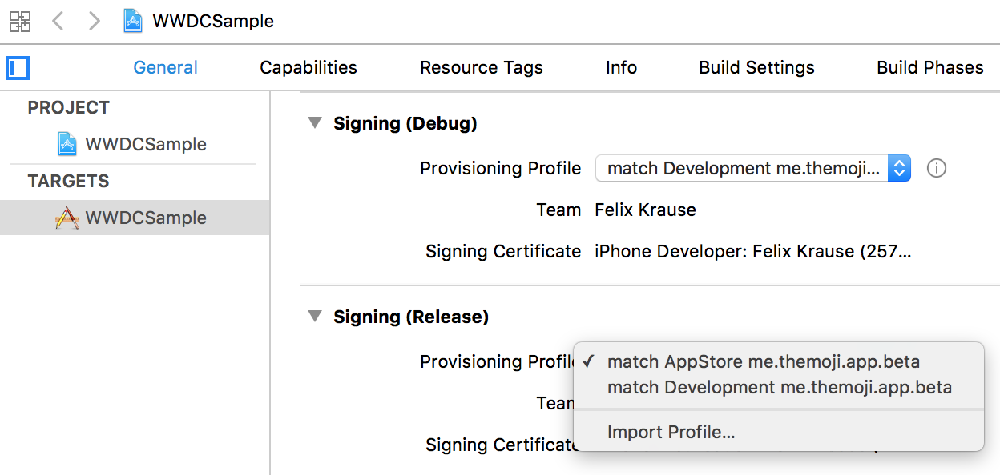
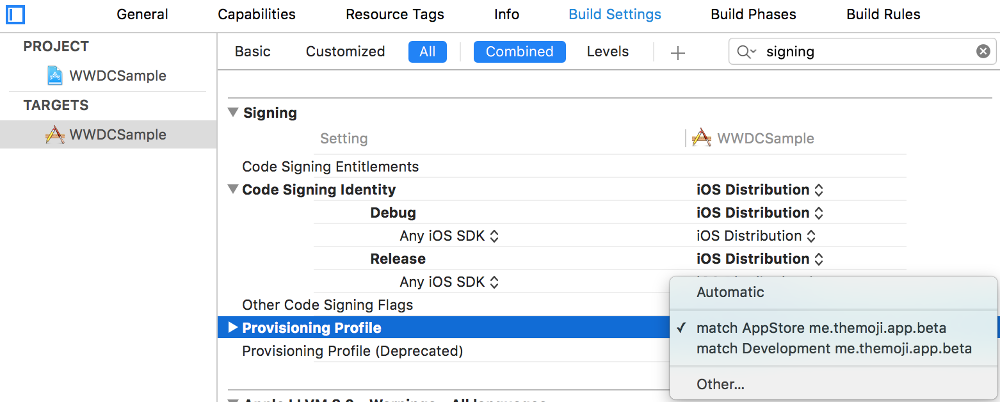

# Setting up your Xcode Project

## Xcode 8 and up

With Xcode 8 you can set a provisioning profile name for each of your targets instead of a provisioning profile UUID. By doing so, Xcode automatically selects the latest provisioning profile matching its name. This way you don't have to update your Xcode project, every time you re-generate your provisioning profile (e.g. when adding a new device)

You can now specify which provisioning profile to use in the `General` tab after disabling `Automatically manage signing`.



Alternatively you can also specify the provisioning profile in the `Build Settings` tab.



If your provisioning profile is not listed in the drop down, there might be a few reasons:

- It doesn't match the bundle identifier of the target
- The associated certificate or its private key is not installed on the local machine
- The provisioning profile is not installed on the local machine

Check out [Troubleshooting.md](Troubleshooting.md) for more information on how to debug signing issues.

### Build settings / Environment variables

Previously you could specify the UUID of the provisioning profile using the `PROVISIONING_PROFILE` Xcode settings property, with Xcode 8 you specify it using the `PROVISIONING_PROFILE_SPECIFIER` instead:

```
PROVISIONING_PROFILE_SPECIFIER = "5AA97AAHK2/Themoji_AppStore";
PROVISIONING_PROFILE_SPECIFIER = "[team_id]/[profile_name]";
````

You could pass the profile specifier via environment variables too (See Xcode 7 approach below), however in most cases it's enough to define it statically in your project, per target, since usually neither your Team ID, nor the provisioning profile change.

## Xcode 7 and lower

**Note**: This approach is deprecated with Xcode 8

If you use `Automatic` value for your provisioning profile, Xcode sometimes selects the wrong profile, resulting in code signing errors at a later point.

Instead it is recommended to specify a specific provisioning profile, which can only be done using the UUID (in Xcode 7).

Since it is not recommended to update the project file, every time you update your provisioning profile, you can pass the UUID via environment variables.

To do so, open your target settings, open the dropdown for `Provisioning Profile` and select `Other`:


Using the `$(...)` notation, Xcode will use the provisioning profile matching the UUID, and fallback to `Automatic` if it's not provided. 

If you use [fastlane](https://fastlane.tools) you don't have to do any extra work, since the environment variable for the latest profile are automatically set by [match](https://fastlane.tools/match)

```ruby
lane :beta do
  match(type: "adhoc")
  gym
end
```

You can also manually set the environment variable using

```ruby
lane :beta do
  ENV["PROVISIONING_PROFILE_TARGET1"] = "b01c39c9-1b4a-412e-9ae2-3087ee9ea9d3"
  gym
end
```
