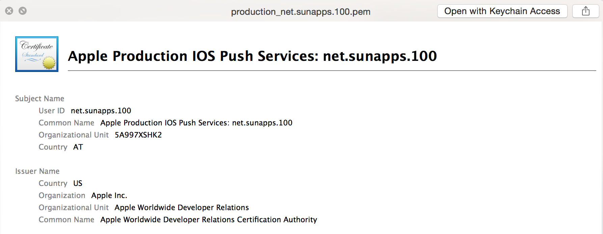

<h3 align="center">
  <a href="https://github.com/fastlane/fastlane/tree/master/fastlane">
    
    <br />
    fastlane
  </a>
</h3>
<p align="center">
  <a href="https://github.com/fastlane/fastlane/tree/master/deliver">deliver</a> &bull;
  <a href="https://github.com/fastlane/fastlane/tree/master/snapshot">snapshot</a> &bull;
  <a href="https://github.com/fastlane/fastlane/tree/master/frameit">frameit</a> &bull;
  <b>pem</b> &bull;
  <a href="https://github.com/fastlane/fastlane/tree/master/sigh">sigh</a> &bull;
  <a href="https://github.com/fastlane/fastlane/tree/master/produce">produce</a> &bull;
  <a href="https://github.com/fastlane/fastlane/tree/master/cert">cert</a> &bull;
  <a href="https://github.com/fastlane/fastlane/tree/master/spaceship">spaceship</a> &bull;
  <a href="https://github.com/fastlane/fastlane/tree/master/pilot">pilot</a> &bull;
  <a href="https://github.com/fastlane/boarding">boarding</a> &bull;
  <a href="https://github.com/fastlane/fastlane/tree/master/gym">gym</a> &bull;
  <a href="https://github.com/fastlane/fastlane/tree/master/scan">scan</a> &bull;
  <a href="https://github.com/fastlane/fastlane/tree/master/match">match</a>
</p>
-------

<p align="center">
  
</p>

pem
============

[](https://twitter.com/FastlaneTools)
[](https://github.com/fastlane/fastlane/blob/master/pem/LICENSE)
[](https://rubygems.org/gems/pem)

###### Automatically generate and renew your push notification profiles

Tired of manually creating and maintaining your push notification profiles for your iOS apps? Tired of generating a `pem` file for your server?

`pem` does all that for, just by simply running `pem`.

`pem` creates new .pem, .cer, and .p12 files to be uploaded to your push server if a valid push notification profile is needed. `pem` does not cover uploading the file to your server.

To automate iOS Provisioning profiles you can use [match](https://github.com/fastlane/fastlane/tree/master/match).

-------
<p align="center">
    <a href="#features">Features</a> &bull;
    <a href="#installation">Installation</a> &bull;
    <a href="#usage">Usage</a> &bull;
    <a href="#how-does-it-work">How does it work?</a> &bull;
    <a href="#tips">Tips</a> &bull;
    <a href="#need-help">Need help?</a>
</p>

-------

<h5 align="center"><code>pem</code> is part of <a href="https://fastlane.tools">fastlane</a>: The easiest way to automate beta deployments and releases for your iOS and Android apps.</h5>

# Features
Well, it's actually just one: Generate the ```pem``` file for your server.

Check out this gif:


# Installation
    sudo gem install fastlane

Make sure, you have the latest version of the Xcode command line tools installed:

    xcode-select --install

# Usage

    fastlane pem

Yes, that's the whole command!

This does the following:

- Create a new signing request
- Create a new push certification
- Downloads the certificate
- Generates a new ```.pem``` file in the current working directory, which you can upload to your server

Note that ```pem``` will never revoke your existing certificates. `pem` can't download any of your existing push certificates, as the private key is only available on the machine it was created on. 

If you already have a push certificate enabled, which is active for at least 30 more days, `pem` will not create a new certificate. If you still want to create one, use the `force`:

    fastlane pem --force

You can pass parameters like this:

    fastlane pem -a com.krausefx.app -u username

If you want to generate a development certificate instead:

    fastlane pem --development

Set a password for your `p12` file:

    fastlane pem -p "MyPass"

You can specify a name for the output file:

    fastlane pem -o my.pem

To get a list of available options run:

    fastlane pem --help


### Note about empty `p12` passwords and Keychain Access.app

`pem` will produce a valid `p12` without specifying a password, or using the empty-string as the password.
While the file is valid, the Mac's Keychain Access will not allow you to open the file without specifying a passphrase.

Instead, you may verify the file is valid using OpenSSL:

    openssl pkcs12 -info -in my.p12

##### [Like this tool? Be the first to know about updates and new fastlane tools](https://tinyletter.com/krausefx)

## Environment Variables

Run `fastlane pem --help` to get a list of available environment variables.

# How does it work?

`pem` uses [spaceship](https://spaceship.airforce) to communicate with the Apple Developer Portal to request a new push certificate for you.

## How is my password stored?
```pem``` uses the [password manager](https://github.com/fastlane/fastlane/tree/master/credentials_manager) from `fastlane`. Take a look the [CredentialsManager README](https://github.com/fastlane/fastlane/tree/master/credentials_manager) for more information.

# Tips

## [`fastlane`](https://fastlane.tools) Toolchain

- [`fastlane`](https://fastlane.tools): The easiest way to automate beta deployments and releases for your iOS and Android apps
- [`deliver`](https://github.com/fastlane/fastlane/tree/master/deliver): Upload screenshots, metadata and your app to the App Store
- [`snapshot`](https://github.com/fastlane/fastlane/tree/master/snapshot): Automate taking localized screenshots of your iOS app on every device
- [`frameit`](https://github.com/fastlane/fastlane/tree/master/frameit): Quickly put your screenshots into the right device frames
- [`sigh`](https://github.com/fastlane/fastlane/tree/master/sigh): Because you would rather spend your time building stuff than fighting provisioning
- [`produce`](https://github.com/fastlane/fastlane/tree/master/produce): Create new iOS apps on iTunes Connect and Dev Portal using the command line
- [`cert`](https://github.com/fastlane/fastlane/tree/master/cert): Automatically create and maintain iOS code signing certificates
- [`spaceship`](https://github.com/fastlane/fastlane/tree/master/spaceship): Ruby library to access the Apple Dev Center and iTunes Connect
- [`pilot`](https://github.com/fastlane/fastlane/tree/master/pilot): The best way to manage your TestFlight testers and builds from your terminal
- [`boarding`](https://github.com/fastlane/boarding): The easiest way to invite your TestFlight beta testers
- [`gym`](https://github.com/fastlane/fastlane/tree/master/gym): Building your iOS app has never been easier
- [`scan`](https://github.com/fastlane/fastlane/tree/master/scan): The easiest way to run tests of your iOS and Mac app
- [`match`](https://github.com/fastlane/fastlane/tree/master/match): Easily sync your certificates and profiles across your team using git

##### [Like this tool? Be the first to know about updates and new fastlane tools](https://tinyletter.com/krausefx)

## Use the 'Provisioning Quicklook plugin'
Download and install the [Provisioning Plugin](https://github.com/chockenberry/Provisioning).

It will show you the ```pem``` files like this:



# Need help?
Please submit an issue on GitHub and provide information about your setup

# Code of Conduct
Help us keep `pem` open and inclusive. Please read and follow our [Code of Conduct](https://github.com/fastlane/fastlane/blob/master/CODE_OF_CONDUCT.md).

# License
This project is licensed under the terms of the MIT license. See the LICENSE file.

> This project and all fastlane tools are in no way affiliated with Apple Inc. This project is open source under the MIT license, which means you have full access to the source code and can modify it to fit your own needs. All fastlane tools run on your own computer or server, so your credentials or other sensitive information will never leave your own computer. You are responsible for how you use fastlane tools.
