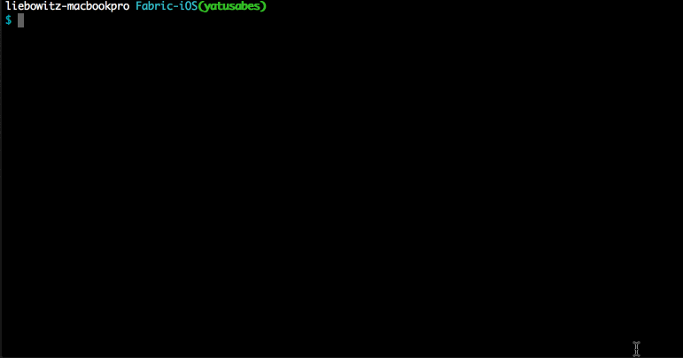

<h3 align="center">
  <a href="https://github.com/fastlane/fastlane/tree/master/fastlane">
    
    <br />
    fastlane
  </a>
</h3>
<p align="center">
  <a href="https://github.com/fastlane/fastlane/tree/master/deliver">deliver</a> &bull;
  <a href="https://github.com/fastlane/fastlane/tree/master/snapshot">snapshot</a> &bull;
  <a href="https://github.com/fastlane/fastlane/tree/master/frameit">frameit</a> &bull;
  <a href="https://github.com/fastlane/fastlane/tree/master/pem">pem</a> &bull;
  <a href="https://github.com/fastlane/fastlane/tree/master/sigh">sigh</a> &bull;
  <a href="https://github.com/fastlane/fastlane/tree/master/produce">produce</a> &bull;
  <a href="https://github.com/fastlane/fastlane/tree/master/cert">cert</a> &bull;
  <a href="https://github.com/fastlane/fastlane/tree/master/spaceship">spaceship</a> &bull;
  <a href="https://github.com/fastlane/fastlane/tree/master/pilot">pilot</a> &bull;
  <a href="https://github.com/fastlane/boarding">boarding</a> &bull;
  <a href="https://github.com/fastlane/fastlane/tree/master/gym">gym</a> &bull;
  <a href="https://github.com/fastlane/fastlane/tree/master/scan">scan</a> &bull;
  <a href="https://github.com/fastlane/fastlane/tree/master/match">match</a> &bull;
  <b>precheck</b>
</p>

-------

<p align="center">
  
</p>

Precheck
============

[](https://twitter.com/FastlaneTools)
[](https://github.com/fastlane/fastlane/blob/master/LICENSE)

###### Check your app using a community driven set of App Store review rules to avoid being rejected

Apple rejects builds for many avoidable metadata issues like including swear words 😮, other companies’ trademarks, or even mentioning an iOS bug 🐛. _fastlane precheck_ takes a lot of the guess work out by scanning your app’s details in iTunes Connect for avoidable problems. fastlane precheck helps you get your app through app review without rejections so you can ship faster 🚀


Get in contact with the developers on Twitter: [@FastlaneTools](https://twitter.com/FastlaneTools)

-------

<p align="center">
    <a href="#features">Features</a> &bull;
    <a href="#quick-start">Quick Start</a> &bull;
    <a href="#usage">Usage</a> &bull;
    <a href="#example">Example</a> &bull;
    <a href="#how-does-it-work">How does it work?</a> &bull;
    <a href="#tips">Tips</a> &bull;
    <a href="#need-help">Need help?</a>
</p>

-------

<h5 align="center"><code>precheck</code> is part of <a href="https://fastlane.tools">fastlane</a>: The easiest way to automate beta deployments and releases for your iOS and Android apps.</h5>

# Features


|          |  precheck Features  |
|----------|-----------------|
|🐛|  product bug mentions|
|🙅‍♂️|Swear word checker|
|🤖|Mentioning other platforms|
|😵|URL reachability checker|
|📝|Placeholder/test words/mentioning future features|
|📅|Copyright date checking|
|🙈|Customizable word list checking|
|📢|You can decide if you want to warn  about potential problems and continue or have _fastlane_ show an error and stop after all scans are done.|

##### [Do you like fastlane? Be the first to know about updates and new fastlane tools](https://tinyletter.com/fastlane-tools)

# Quick Start

    sudo gem install fastlane

# Usage
Run _fastlane precheck_ to check the app metadata from iTunes Connect

    fastlane precheck

To get a list of available options run
    
    fastlane precheck --help


    
# Example

Since you might want to manually trigger _precheck_ but don't want to specify all the parameters every time, you can store your defaults in a so called `Precheckfile`.

Run `fastlane precheck init` to create a new configuration file. Example:

```ruby
# indicates that your metadata will not be checked by this rule
negative_apple_sentiment(level: :skip)

# when triggered, this rule will warn you of a potential problem
curse_words(level: :warn)

# show error and prevent any further commands from running after fastlane precheck finishes
unreachable_urls(level: :error)

# pass in whatever words you want to check for
custom_text(data: ["chrome", "webos"], 
           level: :warn)
``` 

### Use with [_fastlane_](https://github.com/fastlane/fastlane/tree/master/fastlane)

_precheck_ is fully integrated with [_deliver_](https://github.com/fastlane/fastlane/tree/master/deliver) another [_fastlane_](https://github.com/fastlane/fastlane/tree/master/fastlane) tool.

Update your `Fastfile` to contain the following code:

```ruby
lane :production do
  ...
  # by default deliver will call precheck and warn you of any problems
  # if you want precheck to halt submitting to app review, you can pass
  # precheck_default_rule_level: :error
  deliver(precheck_default_rule_level: :error)
  ...
end

# or if you prefer, you can run precheck alone
lane :check_metadata do
  precheck
end

```

# How does it work?

`precheck` will access `iTunes Connect` to download your app's metadata. It uses [spaceship](https://spaceship.airforce) to communicate with Apple's web services.


# Tips
## [`fastlane`](https://fastlane.tools) Toolchain

- [`fastlane`](https://fastlane.tools): The easiest way to automate beta deployments and releases for your iOS and Android apps
- [`deliver`](https://github.com/fastlane/fastlane/tree/master/deliver): Upload screenshots, metadata and your app to the App Store
- [`snapshot`](https://github.com/fastlane/fastlane/tree/master/snapshot): Automate taking localized screenshots of your iOS app on every device
- [`frameit`](https://github.com/fastlane/fastlane/tree/master/frameit): Quickly put your screenshots into the right device frames
- [`pem`](https://github.com/fastlane/fastlane/tree/master/pem): Automatically generate and renew your push notification profiles
- [`sigh`](https://github.com/fastlane/fastlane/tree/master/sigh): Because you would rather spend your time building stuff than fighting provisioning
- [`produce`](https://github.com/fastlane/fastlane/tree/master/produce): Create new iOS apps on iTunes Connect and Dev Portal using the command line
- [`cert`](https://github.com/fastlane/fastlane/tree/master/cert): Automatically create and maintain iOS code signing certificates
- [`spaceship`](https://github.com/fastlane/fastlane/tree/master/spaceship): Ruby library to access the Apple Dev Center and iTunes Connect
- [`pilot`](https://github.com/fastlane/fastlane/tree/master/pilot): The best way to manage your TestFlight testers and builds from your terminal
- [`boarding`](https://github.com/fastlane/boarding): The easiest way to invite your TestFlight beta testers
- [`gym`](https://github.com/fastlane/fastlane/tree/master/gym): Building your iOS apps has never been easier
- [`scan`](https://github.com/fastlane/fastlane/tree/master/scan): The easiest way to run tests of your iOS and Mac app
- [`match`](https://github.com/fastlane/fastlane/tree/master/match): Easily sync your certificates and profiles across your team using git

##### [Do you like fastlane? Be the first to know about updates and new fastlane tools](https://tinyletter.com/fastlane-tools)

# Need help?

Before submitting a new GitHub issue, please make sure to

- Check out [docs.fastlane.tools](https://docs.fastlane.tools)
- Check out the README pages on [this repo](https://github.com/fastlane/fastlane)
- Search for [existing GitHub issues](https://github.com/fastlane/fastlane/issues)

If the above doesn't help, please [submit an issue](https://github.com/fastlane/fastlane/issues) on GitHub and provide information about your setup, in particular the output of the `fastlane env` command.

# Want to improve precheck's rules?
Please submit an issue on GitHub and provide information about your App Store rejection! Make sure you scrub out any personally identifiable information since this will be public.

# Code of Conduct
Help us keep _precheck_ open and inclusive. Please read and follow our [Code of Conduct](https://github.com/fastlane/fastlane/blob/master/CODE_OF_CONDUCT.md).

# License
This project is licensed under the terms of the MIT license. See the LICENSE file.

> This project and all fastlane tools are in no way affiliated with Apple Inc. This project is open source under the MIT license, which means you have full access to the source code and can modify it to fit your own needs. All fastlane tools run on your own computer or server, so your credentials or other sensitive information will never leave your own computer. You are responsible for how you use fastlane tools.


