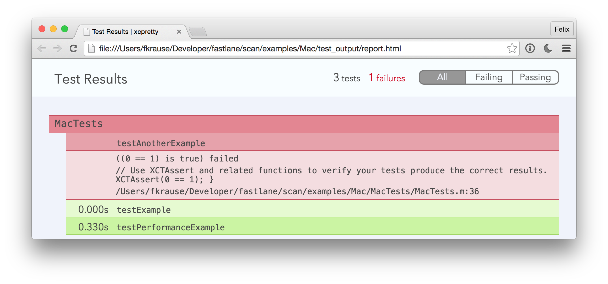

<h3 align="center">
  <a href="https://github.com/fastlane/fastlane/tree/master/fastlane">
    
    <br />
    fastlane
  </a>
</h3>
<p align="center">
  <a href="https://github.com/fastlane/fastlane/tree/master/deliver">deliver</a> &bull;
  <a href="https://github.com/fastlane/fastlane/tree/master/snapshot">snapshot</a> &bull;
  <a href="https://github.com/fastlane/fastlane/tree/master/frameit">frameit</a> &bull;
  <a href="https://github.com/fastlane/fastlane/tree/master/pem">pem</a> &bull;
  <a href="https://github.com/fastlane/fastlane/tree/master/sigh">sigh</a> &bull;
  <a href="https://github.com/fastlane/fastlane/tree/master/produce">produce</a> &bull;
  <a href="https://github.com/fastlane/fastlane/tree/master/cert">cert</a> &bull;
  <a href="https://github.com/fastlane/fastlane/tree/master/spaceship">spaceship</a> &bull;
  <a href="https://github.com/fastlane/fastlane/tree/master/pilot">pilot</a> &bull;
  <a href="https://github.com/fastlane/boarding">boarding</a> &bull;
  <a href="https://github.com/fastlane/fastlane/tree/master/gym">gym</a> &bull;
  <b>scan</b> &bull;
  <a href="https://github.com/fastlane/fastlane/tree/master/match">match</a>
</p>
-------

<p align="center">
  
</p>

scan
============

[](https://twitter.com/FastlaneTools)
[](https://github.com/fastlane/fastlane/blob/master/scan/LICENSE)
[](https://rubygems.org/gems/scan)

###### The easiest way to run tests of your iOS and Mac app

`scan` makes it easy to run tests of your iOS and Mac app on a simulator or connected device.

Get in contact with the developer on Twitter: [@FastlaneTools](https://twitter.com/FastlaneTools)

-------
<p align="center">
    <a href="#whats-scan">Features</a> &bull;
    <a href="#installation">Installation</a> &bull;
    <a href="#usage">Usage</a> &bull;
    <a href="#tips">Tips</a> &bull;
    <a href="#need-help">Need help?</a>
</p>

-------

<h5 align="center"><code>scan</code> is part of <a href="https://fastlane.tools">fastlane</a>: The easiest way to automate beta deployments and releases for your iOS and Android apps.</h5>

# What's scan?


### Before `scan`

```sh
xcodebuild \
  -workspace MyApp.xcworkspace \
  -scheme "MyApp" \
  -sdk iphonesimulator \
  -destination 'platform=iOS Simulator,name=iPhone 6,OS=8.1' \
  test
```

As the output will look like this

```
/Users/felixkrause/Library/Developer/Xcode/DerivedData/Example-fhlmxikmujknefgidqwqvtbatohi/Build/Intermediates/ArchiveIntermediates/Example/IntermediateBuildFilesPath/Example.build/Release-iphoneos/Example.build/Objects-normal/arm64/main.o Example/main.m normal arm64 objective-c com.apple.compilers.llvm.clang.1_0.compiler
    cd /Users/felixkrause/Developer/fastlane/gym/example/cocoapods
    export LANG=en_US.US-ASCII
    export PATH="/Applications/Xcode-beta.app/Contents/Developer/Platforms/iPhoneOS.platform/Developer/usr/bin:/Applications/Xcode-beta.app/Contents/Developer/usr/bin:/Users/felixkrause/.rvm/gems/ruby-2.2.0/bin:/Users/felixkrause/.rvm/gems/ruby-2.2.0@global/bin:/Users/felixkrause/.rvm/rubies/ruby-2.2.0/bin:/Users/felixkrause/.rvm/bin:/usr/local/heroku/bin:/usr/local/bin:/usr/bin:/bin:/usr/sbin:/sbin"
    /Applications/Xcode-beta.app/Contents/Developer/Toolchains/XcodeDefault.xctoolchain/usr/bin/clang -x objective-c -arch arm64 -fmessage-length=126 -fdiagnostics-show-note-include-stack -fmacro-backtrace-limit=0 -fcolor-diagnostics -std=gnu99 -fobjc-arc -fmodules -gmodules -fmodules-cache-path=/Users/felixkrause/Library/Developer/Xcode/DerivedData/ModuleCache -fmodules-prune-interval=86400 -fmodules-prune-after=345600 -fbuild-session-file=/Users/felixkrause/Library/Developer/Xcode/DerivedData/ModuleCache/Session.modulevalidation -fmodules-validate-once-per-build-session -Wnon-modular-include-in-framework-module -Werror=non-modular-include-in-framework-module -Wno-trigraphs -fpascal-strings -Os -fno-common -Wno-missing-field-initializers -Wno-missing-prototypes -Werror=return-type -Wunreachable-code -Wno-implicit-atomic-properties -Werror=deprecated-objc-isa-usage -Werror=objc-root-class -Wno-arc-repeated-use-of-weak -Wduplicate-method-match -Wno-missing-braces -Wparentheses -Wswitch -Wunused-function -Wno-unused-label -Wno-unused-parameter -Wunused-variable -Wunused-value -Wempty-body -Wconditional-uninitialized -Wno-unknown-pragmas -Wno-shadow -Wno-four-char-constants -Wno-conversion -Wconstant-conversion -Wint-conversion -Wbool-conversion -Wenum-conversion -Wshorten-64-to-32 -Wpointer-sign -Wno-newline-eof -Wno-selector -Wno-strict-selector-match -Wundeclared-selector -Wno-deprecated-implementations -DCOCOAPODS=1 -DNS_BLOCK_ASSERTIONS=1 -DOBJC_OLD_DISPATCH_PROTOTYPES=0 -isysroot /Applications/Xcode-beta.app/Contents/Developer/Platforms/iPhoneOS.platform/Developer/SDKs/iPhoneOS9.0.sdk -fstrict-aliasing -Wprotocol -Wdeprecated-declarations -miphoneos-version-min=9.0 -g -fvisibility=hidden -Wno-sign-conversion -fembed-bitcode -iquote /Users/felixkrause/Library/Developer/Xcode/DerivedData/Example-fhlmxikmujknefgidqwqvtbatohi/Build/Intermediates/ArchiveIntermediates/Example/IntermediateBuildFilesPath/Example.build/Release-iphoneos/Example.build/ExampleProductName-generated-files.hmap -I/Users/felixkrause/Library/Developer/Xcode/DerivedData/Example-fhlmxikmujknefgidqwqvtbatohi/Build/Intermediates/ArchiveIntermediates/Example/IntermediateBuildFilesPath/Example.build/Release-iphoneos/Example.build/ExampleProductName-own-target-headers.hmap -I/Users/felixkrause/Library/Developer/Xcode/DerivedData/Example-fhlmxikmujknefgidqwqvtbatohi/Build/Intermediates/ArchiveIntermediates/Example/IntermediateBuildFilesPath/Example.build/Release-iphoneos/Example.build/ExampleProductName-all-target-headers.hmap -iquote /Users/felixkrause/Library/Developer/Xcode/DerivedData/Example-fhlmxikmujknefgidqwqvtbatohi/Build/Intermediates/ArchiveIntermediates/Example/IntermediateBuildFilesPath/Example.build/Release-iphoneos/Example.build/ExampleProductName-project-headers.hmap -I/Users/felixkrause/Library/Developer/Xcode/DerivedData/Example-fhlmxikmujknefgidqwqvtbatohi/Build/Intermediates/ArchiveIntermediates/Example/BuildProductsPath/Release-iphoneos/include -I/Users/felixkrause/Developer/fastlane/gym/example/cocoapods/Pods/Headers/Public -I/Users/felixkrause/Developer/fastlane/gym/example/cocoapods/Pods/Headers/Public/HexColors -I/Users/felixkrause/Library/Developer/Xcode/DerivedData/Example-fhlmxikmujknefgidqwqvtbatohi/Build/Intermediates/ArchiveIntermediates/Example/IntermediateBuildFilesPath/Example.build/Release-iphoneos/Example.build/DerivedSources/arm64 -I/Users/felixkrause/Library/Developer/Xcode/DerivedData/Example-fhlmxikmujknefgidqwqvtbatohi/Build/Intermediates/ArchiveIntermediates/Example/IntermediateBuildFilesPath/Example.build/Release-iphoneos/Example.build/DerivedSources -F/Users/felixkrause/Library/Developer/Xcode/DerivedData/Example-fhlmxikmujknefgidqwqvtbatohi/Build/Intermediates/ArchiveIntermediates/Example/BuildProductsPath/Release-iphoneos -isystem /Users/felixkrause/Developer/fastlane/gym/example/cocoapods/Pods/Headers/Public -isystem /Users/felixkrause/Developer/fastlane/gym/example/cocoapods/Pods/Headers/Public/HexColors -MMD -MT dependencies -MF /Users/felixkrause/Library/Developer/Xcode/DerivedData/Example-fhlmxikmujknefgidqwqvtbatohi/Build/Intermediates/ArchiveIntermediates/Example/IntermediateBuildFilesPath/Example.build/Release-iphoneos/Example.build/Objects-normal/arm64/main.d --serialize-diagnostics /Users/felixkrause/Library/Developer/Xcode/DerivedData/Example-fhlmxikmujknefgidqwqvtbatohi/Build/Intermediates/ArchiveIntermediates/Example/IntermediateBuildFilesPath/Example.build/Release-iphoneos/Example.build/Objects-normal/arm64/main.dia -c /Users/felixkrause/Developer/fastlane/gym/example/cocoapods/Example/main.m -o /Users/felixkrause/Library/Developer/Xcode/DerivedData/Example-fhlmxikmujknefgidqwqvtbatohi/Build/Intermediates/ArchiveIntermediates/Example/IntermediateBuildFilesPath/Example.build/Release-iphoneos/Example.build/Objects-normal/arm64/main.o
```
you'll probably want to use something like [xcpretty](https://github.com/supermarin/xcpretty), which will look like this:

```sh
set -o pipefail &&
  xcodebuild \
    -workspace MyApp.xcworkspace \
    -scheme "MyApp" \
    -sdk iphonesimulator \
    -destination 'platform=iOS Simulator,name=iPhone 6,OS=8.1' \
    test \
  | xcpretty \
    -r "html" \
    -o "tests.html"
```

### With `scan`

```
scan
```

### Why `scan`?

`scan` uses the latest APIs and tools to make running tests plain simple and offer a great integration into your existing workflow, like [fastlane](https://fastlane.tools) or Jenkins.

              |  scan Features
--------------------------|------------------------------------------------------------
:checkered_flag: | Beautiful inline build output while running the tests
:mountain_cableway: | Sensible defaults: Automatically detect the project, schemes and more
:bar_chart: | Support for HTML, JSON and JUnit reports
:mag: | Xcode duplicated your simulators again? `scan` will handle this for you
:link:  | Works perfectly with [fastlane](https://fastlane.tools) and other tools
:bullettrain_side: | Don't remember any complicated build commands, just `scan`
:wrench:  | Easy and dynamic configuration using parameters and environment variables
:loudspeaker: | Beautiful slack notifications of the test results
:floppy_disk:   | Store common build settings in a `Scanfile`
:outbox_tray: | The raw `xcodebuild` outputs are stored in `~/Library/Logs/scan`
:computer: | Supports both iOS and Mac applications
:man:      | Automatically switches to the [travis formatter](https://github.com/kattrali/xcpretty-travis-formatter) when running on Travis
:book:     | Helps you resolve common test errors like simulator not responding

`scan` uses a plain `xcodebuild` command, therefore keeping 100% compatible with `xcodebuild`. To generate the nice output, `scan` uses [xcpretty](https://github.com/supermarin/xcpretty). You can alway access the raw output in `~/Library/Logs/scan`.




# Installation

    sudo gem install fastlane

Make sure, you have the latest version of the Xcode command line tools installed:

    xcode-select --install

# Usage

    fastlane scan

That's all you need to run your tests. If you want more control, here are some available parameters:

    fastlane scan --workspace "Example.xcworkspace" --scheme "AppName" --device "iPhone 6" --clean

If you need to use a different xcode install, use `xcode-select` or define `DEVELOPER_DIR`:

    DEVELOPER_DIR="/Applications/Xcode6.2.app" scan

To run `scan` on multiple devices via [fastlane](https://fastlane.tools), add this to your `Fastfile`:

```ruby
scan(
  workspace: "Example.xcworkspace",
  devices: ["iPhone 6s", "iPad Air"]
)
```

For a list of all available parameters use

    fastlane scan --help

To access the raw `xcodebuild` output open `~/Library/Logs/scan`

# Scanfile

Since you might want to manually trigger the tests but don't want to specify all the parameters every time, you can store your defaults in a so called `Scanfile`.

Run `fastlane scan init` to create a new configuration file. Example:

```ruby
scheme "Example"
devices ["iPhone 6s", "iPad Air"]

clean true

output_types "html"
```

# Automating the whole process

`scan` works great together with [fastlane](https://fastlane.tools), which connects all deployment tools into one streamlined workflow.

Using `fastlane` you can define a configuration like

```ruby
lane :test do
  scan(scheme: "Example")
end
```

For more information visit the [fastlane GitHub page](https://github.com/fastlane/fastlane/tree/master/fastlane).


# Tips
## [`fastlane`](https://fastlane.tools) Toolchain

- [`fastlane`](https://fastlane.tools): The easiest way to automate beta deployments and releases for your iOS and Android apps
- [`deliver`](https://github.com/fastlane/fastlane/tree/master/deliver): Upload screenshots, metadata and your app to the App Store
- [`snapshot`](https://github.com/fastlane/fastlane/tree/master/snapshot): Automate taking localized screenshots of your iOS app on every device
- [`frameit`](https://github.com/fastlane/fastlane/tree/master/frameit): Quickly put your screenshots into the right device frames
- [`pem`](https://github.com/fastlane/fastlane/tree/master/pem): Automatically generate and renew your push notification profiles
- [`produce`](https://github.com/fastlane/fastlane/tree/master/produce): Create new iOS apps on iTunes Connect and Dev Portal using the command line
- [`cert`](https://github.com/fastlane/fastlane/tree/master/cert): Automatically create and maintain iOS code signing certificates
- [`spaceship`](https://github.com/fastlane/fastlane/tree/master/spaceship): Ruby library to access the Apple Dev Center and iTunes Connect
- [`pilot`](https://github.com/fastlane/fastlane/tree/master/pilot): The best way to manage your TestFlight testers and builds from your terminal
- [`boarding`](https://github.com/fastlane/boarding): The easiest way to invite your TestFlight beta testers
- [`gym`](https://github.com/fastlane/fastlane/tree/master/gym): Building your iOS apps has never been easier
- [`match`](https://github.com/fastlane/fastlane/tree/master/match): Easily sync your certificates and profiles across your team using git

##### [Like this tool? Be the first to know about updates and new fastlane tools](https://tinyletter.com/krausefx)

# Need help?
Please submit an issue on GitHub and provide information about your setup

# Code of Conduct
Help us keep `scan` open and inclusive. Please read and follow our [Code of Conduct](https://github.com/fastlane/fastlane/blob/master/CODE_OF_CONDUCT.md).

# License
This project is licensed under the terms of the MIT license. See the LICENSE file.

> This project and all fastlane tools are in no way affiliated with Apple Inc. This project is open source under the MIT license, which means you have full access to the source code and can modify it to fit your own needs. All fastlane tools run on your own computer or server, so your credentials or other sensitive information will never leave your own computer. You are responsible for how you use fastlane tools.
