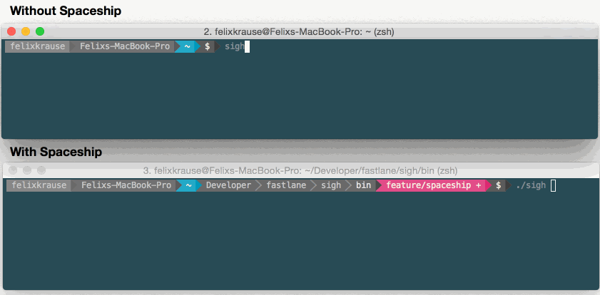

<h3 align="center">
  <a href="https://docs.fastlane.tools">
    
    <br />
    fastlane
  </a>
</h3>
<p align="center">
  <a href="https://docs.fastlane.tools/actions/deliver/">deliver</a> &bull;
  <a href="https://docs.fastlane.tools/actions/snapshot/">snapshot</a> &bull;
  <a href="https://docs.fastlane.tools/actions/frameit/">frameit</a> &bull;
  <a href="https://docs.fastlane.tools/actions/pem/">pem</a> &bull;
  <a href="https://docs.fastlane.tools/actions/sigh/">sigh</a> &bull;
  <a href="https://docs.fastlane.tools/actions/produce/">produce</a> &bull;
  <a href="https://docs.fastlane.tools/actions/cert/">cert</a> &bull;
  <b>spaceship</b> &bull;
  <a href="https://docs.fastlane.tools/actions/pilot/">pilot</a> &bull;
  <a href="https://github.com/fastlane/boarding">boarding</a> &bull;
  <a href="https://docs.fastlane.tools/actions/gym/">gym</a> &bull;
  <a href="https://docs.fastlane.tools/actions/scan/">scan</a> &bull;
  <a href="https://docs.fastlane.tools/actions/match/">match</a> &bull;
  <a href="https://docs.fastlane.tools/actions/precheck/">precheck</a>
</p>

-------

<p align="center">
  
</p>

-------

[](https://twitter.com/FastlaneTools)
[](https://github.com/fastlane/fastlane/blob/master/LICENSE)

_spaceship_ exposes both the Apple Developer Center and the iTunes Connect API. This fast and powerful API powers parts of fastlane, and can be leveraged for more advanced fastlane features. Scripting your Developer Center workflow has never been easier!

Get in contact with the creators on Twitter: [@FastlaneTools](https://twitter.com/fastlanetools)

-------

<p align="center">
    <a href="#whats-spaceship">Why?</a> &bull;
    <a href="#usage">Usage</a> &bull;
    <a href="#installation">Installation</a> &bull;
    <a href="#technical-details">Technical Details</a> &bull;
    <a href="#need-help">Need help?</a>
</p>

-------

<h5 align="center"><code>spaceship</code> is part of <a href="https://fastlane.tools">fastlane</a>: The easiest way to automate beta deployments and releases for your iOS and Android apps.</h5>

# What's spaceship?

Up until now, the [fastlane tools](https://fastlane.tools) used web scraping to interact with Apple's web services. With spaceship it is possible to directly access the underlying APIs using a simple HTTP client only.

Using spaceship, the execution time of [_sigh_](https://docs.fastlane.tools/actions/sigh/) was reduced from over 1 minute to less than 5 seconds.

spaceship uses a combination of 3 different API endpoints, used by the Apple Developer Portal and Xcode. As no API offers everything we need, spaceship combines all APIs for you. [More details about the APIs](#technical-details).

More details about why spaceship is useful on [spaceship.airforce](https://spaceship.airforce).

> No matter how many apps or certificates you have, spaceship **can** handle your scale.

Enough words, here is some code:

```ruby
Spaceship.login

# Create a new app
app = Spaceship.app.create!(bundle_id: "com.krausefx.app", name: "Spaceship App")

# Use an existing certificate
cert = Spaceship.certificate.production.all.first

# Create a new provisioning profile
profile = Spaceship.provisioning_profile.app_store.create!(bundle_id: app.bundle_id,
                                                         certificate: cert)

# Print the name and download the new profile
puts("Created Profile " + profile.name)
profile.download
```

## Speed

How fast are tools using _spaceship_ compared to web scraping?



# Installation

    sudo gem install fastlane

# Usage

## Playground

To try _spaceship_, just run `fastlane spaceship`. It will automatically start the `spaceship playground`. It makes it super easy to try _spaceship_ :rocket:


This requires you to install `pry` using `sudo gem install pry`. `pry` is not installed by default, as most [_fastlane_](https://fastlane.tools) users won't need the `spaceship playground`. You can add the `pry` dependency to your `Gemfile`.

## Apple Developer Portal API

##### Open [DeveloperPortal.md](docs/DeveloperPortal.md) for code samples

## iTunes Connect API

##### Open [iTunesConnect.md](docs/iTunesConnect.md) for code samples

## 2 Step Verification

When your Apple account has 2 factor verification enabled, you'll automatically be asked to verify your identity using your phone. The resulting session will be stored in `~/.fastlane/spaceship/[email]/cookie`. The session should be valid for about one month, however there is no way to test this without actually waiting for over a month.

### Support for CI machines

#### Web sessions

To generate a web session for your CI machine, use

```sh
fastlane spaceauth -u apple@krausefx.com
```

This will authenticate you and provide a string that can be transferred to your CI system:

```
export FASTLANE_SESSION='---\n- !ruby/object:HTTP::Cookie\n  name: DES5c148586dfd451e55afbaaa5f62418f91\n  value: HSARMTKNSRVTWFla1+yO4gVPowH17VaaaxPFnUdMUegQZxqy1Ie1c2v6bM1vSOzIbuOmrl/FNenlScsd/NbF7/Lw4cpnL15jsyg0TOJwP32tC/NguPiyOaaaU+jrj4tf4uKdIywVaaaFSRVT\n  domain: idmsa.apple.com\n  for_domain: true\n  path: "/"\n  secure: true\n  httponly: true\n  expires: 2016-04-27 23:55:56.000000000 Z\n  max_age: \n  created_at: 2016-03-28 16:55:57.032086000 -07:00\n  accessed_at: 2016-03-28 19:11:17.828141000 -07:00\n'
```

Copy everything from `---\n` to your CI server and provide it as environment variable named `FASTLANE_SESSION`.

#### Transporter

If you want to upload builds to TestFlight/iTunes Connect from your CI, you have to generate an application specific password:

1. Visit [appleid.apple.com/account/manage](https://appleid.apple.com/account/manage)
1. Generate a new application specific password
1. Provide the application specific password using an environment variable `FASTLANE_APPLE_APPLICATION_SPECIFIC_PASSWORD`.

Alternatively you can enter the password when you're asked the first time _fastlane_ uploads a build.

### _spaceship_ in use

All [fastlane tools](https://fastlane.tools) that communicate with Apple's web services in some way, use _spaceship_ to do so.

# Technical Details

## HTTP Client

Up until now all [fastlane tools](https://fastlane.tools) used web scraping to interact with Apple's web services. _spaceship_ uses a simple HTTP client only, resulting in much less overhead and extremely improved speed.

Advantages of _spaceship_ (HTTP client) over web scraping:

- Blazing fast :rocket: 90% faster than previous methods
- No more overhead by loading images, HTML, JS and CSS files on each page load
- Great test coverage by stubbing server responses
- Resistant against design changes of the Apple Developer Portal
- Automatic re-trying of requests in case a timeout occurs

## API Endpoints

Overview of the used API endpoints

- `https://idmsa.apple.com`: Used to authenticate to get a valid session
- `https://developerservices2.apple.com`:
  - Get a list of all available provisioning profiles
  - Register new devices
- `https://developer.apple.com`:
  - List all devices, certificates, apps and app groups
  - Create new certificates, provisioning profiles and apps
  - Disable/enable services on apps and assign them to app groups
  - Delete certificates and apps
  - Repair provisioning profiles
  - Download provisioning profiles
  - Team selection
- `https://itunesconnect.apple.com`:
  - Managing apps
  - Managing beta testers
  - Submitting updates to review
  - Managing app metadata
- `https://du-itc.itunesconnect.apple.com`:
  - Upload icons, screenshots, trailers ...

_spaceship_ uses all those API points to offer this seamless experience.

## Magic involved

_spaceship_ does a lot of magic to get everything working so neatly:

- **Sensible Defaults**: You only have to provide the mandatory information (e.g. new provisioning profiles contain all devices by default)
- **Local Validation**: When pushing changes back to the Apple Dev Portal _spaceship_ will make sure only valid data is sent to Apple (e.g. automatic repairing of provisioning profiles)
- **Various request/response types**: When working with the different API endpoints, _spaceship_ has to deal with `JSON`, `XML`, `txt`, `plist` and sometimes even `HTML` responses and requests.
- **Automatic Pagination**: Even if you have thousands of apps, profiles or certificates, _spaceship_ **can** handle your scale. It was heavily tested by first using _spaceship_ to create hundreds of profiles and then accessing them using _spaceship_.
- **Session, Cookie and CSRF token**: All the security aspects are handled by _spaceship_.
- **Profile Magic**: Create and upload code signing requests, all managed by _spaceship_
- **Multiple Spaceship**: You can launch multiple _spaceships_ with different Apple accounts to do things like syncing the registered devices.

# Code of Conduct
Help us keep _fastlane_ open and inclusive. Please read and follow our [Code of Conduct](https://github.com/fastlane/fastlane/blob/master/CODE_OF_CONDUCT.md).

# License
This project is licensed under the terms of the MIT license. See the LICENSE file.

> This project and all fastlane tools are in no way affiliated with Apple Inc. This project is open source under the MIT license, which means you have full access to the source code and can modify it to fit your own needs. All fastlane tools run on your own computer or server, so your credentials or other sensitive information will never leave your own computer. You are responsible for how you use fastlane tools.
