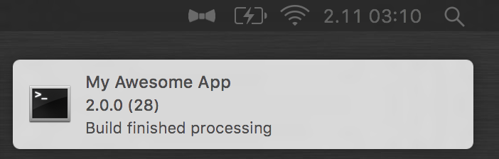
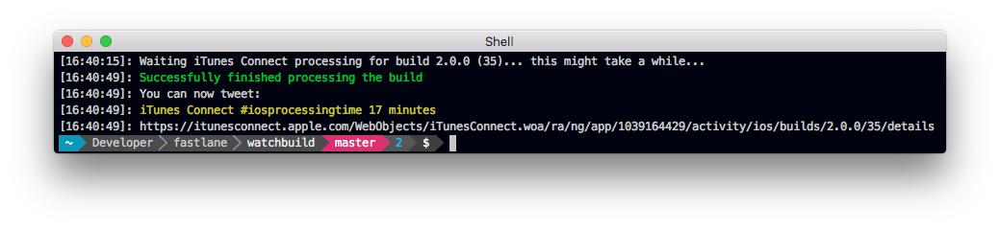

<h3 align="center">
  <a href="https://github.com/fastlane/fastlane/tree/master/fastlane">
    
     
    fastlane
  </a>
</h3>

  <a href="https://github.com/fastlane/fastlane/tree/master/deliver">deliver</a> &bull; 
  <a href="https://github.com/fastlane/fastlane/tree/master/snapshot">snapshot</a> &bull; 
  <a href="https://github.com/fastlane/fastlane/tree/master/frameit">frameit</a> &bull; 
  <a href="https://github.com/fastlane/fastlane/tree/master/pem">pem</a> &bull; 
  <a href="https://github.com/fastlane/fastlane/tree/master/sigh">sigh</a> &bull; 
  <a href="https://github.com/fastlane/fastlane/tree/master/produce">produce</a> &bull;
  <a href="https://github.com/fastlane/fastlane/tree/master/cert">cert</a> &bull;
  <a href="https://github.com/fastlane/fastlane/tree/master/spaceship">spaceship</a> &bull;
  <a href="https://github.com/fastlane/fastlane/tree/master/pilot">pilot</a> &bull;
  <a href="https://github.com/fastlane/boarding">boarding</a> &bull;
  <a href="https://github.com/fastlane/fastlane/tree/master/gym">gym</a> &bull;
  <a href="https://github.com/fastlane/fastlane/tree/master/scan">scan</a> &bull;
  <a href="https://github.com/fastlane/fastlane/tree/master/match">match</a>

-------

WatchBuild
============

###### Get a notification once your iTunes Connect build is finished processing

When you upload a new binary from Xcode to iTunes Connect, you have to wait until it's done processing before you can submit it to the App Store.

As the [#iosprocessingtime](https://twitter.com/search?q=%23iosprocessingtime) varies from a few minutes to multiple hours, it's easy to forget to check iTunes Connect to see if the build is ready. WatchBuild lets you know as soon as it is done.

WatchBuild is a simple standalone tool that shows a notification once your newly uploaded build was successfully processed by iTunes Connect. 

Once the build is ready to be pushed to TestFlight or for review, you get a OS X notification. You can even directly click on the notification to open the build on iTunes Connect.

### Why use WatchBuild?

WatchBuild is a standalone tool and can be used without any of the other [fastlane tools](https://fastlane.tools). This is *big*, since you can use WatchBuild also if you use Xcode to upload your app. 

This tool is not a replacement for [deliver](https://github.com/fastlane/fastlane/tree/master/deliver) (Upload metadata and builds to iTunes Connect) or [pilot](https://github.com/fastlane/fastlane/tree/master/pilot) (Upload and distribute new builds to TestFlight), but is meant as a small helpful utility with the main purpose to wait for the binary processing to be finished.

Get in contact with the developer on Twitter: [@FastlaneTools](https://twitter.com/FastlaneTools)

-------

    <a href="#installation">Installation</a> &bull; 
    <a href="#usage">Usage</a> &bull; 
    <a href="#tips">Tips</a> &bull; 
    <a href="#need-help">Need help?</a>

-------

# Installation

    sudo gem install watchbuild

Make sure, you have the latest version of the Xcode command line tools installed:

    xcode-select --install

# Usage

    watchbuild

You can pass your bundle identifier and username like this:

    watchbuild -a com.krausefx.app -u felix@krausefx.com

For a list of available parameters and commands run

    watchbuild --help

## How is my password stored?

`WatchBuild` uses the secure [CredentialsManager](https://github.com/fastlane/fastlane/tree/master/credentials_manager) from [fastlane](https://fastlane.tools) that stores credentials in your local keychain. 

# Tips
## [`fastlane`](https://fastlane.tools) Toolchain

- [`fastlane`](https://fastlane.tools): Connect all deployment tools into one streamlined workflow
- [`deliver`](https://github.com/fastlane/fastlane/tree/master/deliver): Upload screenshots, metadata and your app to the App Store
- [`snapshot`](https://github.com/fastlane/fastlane/tree/master/snapshot): Automate taking localized screenshots of your iOS app on every device
- [`frameit`](https://github.com/fastlane/fastlane/tree/master/frameit): Quickly put your screenshots into the right device frames
- [`pem`](https://github.com/fastlane/fastlane/tree/master/pem): Automatically generate and renew your push notification profiles
- [`sigh`](https://github.com/fastlane/fastlane/tree/master/sigh): Because you would rather spend your time building stuff than fighting provisioning
- [`produce`](https://github.com/fastlane/fastlane/tree/master/produce): Create new iOS apps on iTunes Connect and Dev Portal using the command line
- [`cert`](https://github.com/fastlane/fastlane/tree/master/cert): Automatically create and maintain iOS code signing certificates
- [`spaceship`](https://github.com/fastlane/fastlane/tree/master/spaceship): Ruby library to access the Apple Dev Center and iTunes Connect
- [`pilot`](https://github.com/fastlane/fastlane/tree/master/pilot): The best way to manage your TestFlight testers and builds from your terminal
- [`boarding`](https://github.com/fastlane/boarding): The easiest way to invite your TestFlight beta testers 
- [`gym`](https://github.com/fastlane/fastlane/tree/master/gym): Building your iOS apps has never been easier
- [`scan`](https://github.com/fastlane/fastlane/tree/master/scan): The easiest way to run tests of your iOS and Mac app
- [`match`](https://github.com/fastlane/fastlane/tree/master/match): Easily sync your certificates and profiles across your team using git

##### [Like this tool? Be the first to know about updates and new fastlane tools](https://tinyletter.com/krausefx)

# Need help?
Please submit an issue on GitHub and provide information about your setup

# Code of Conduct
Help us keep `watchbuild` open and inclusive. Please read and follow our [Code of Conduct](https://github.com/fastlane/code-of-conduct).

# License
This project is licensed under the terms of the MIT license. See the LICENSE file.

> This project and all fastlane tools are in no way affiliated with Apple Inc. This project is open source under the MIT license, which means you have full access to the source code and can modify it to fit your own needs. All fastlane tools run on your own computer or server, so your credentials or other sensitive information will never leave your own computer. You are responsible for how you use fastlane tools.
